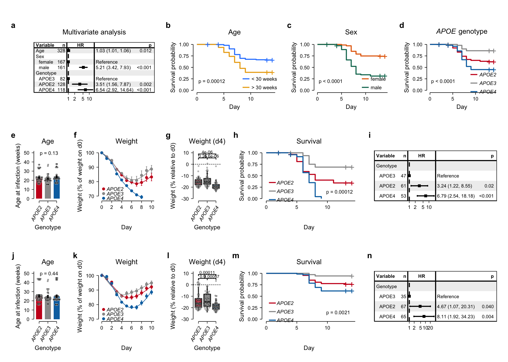
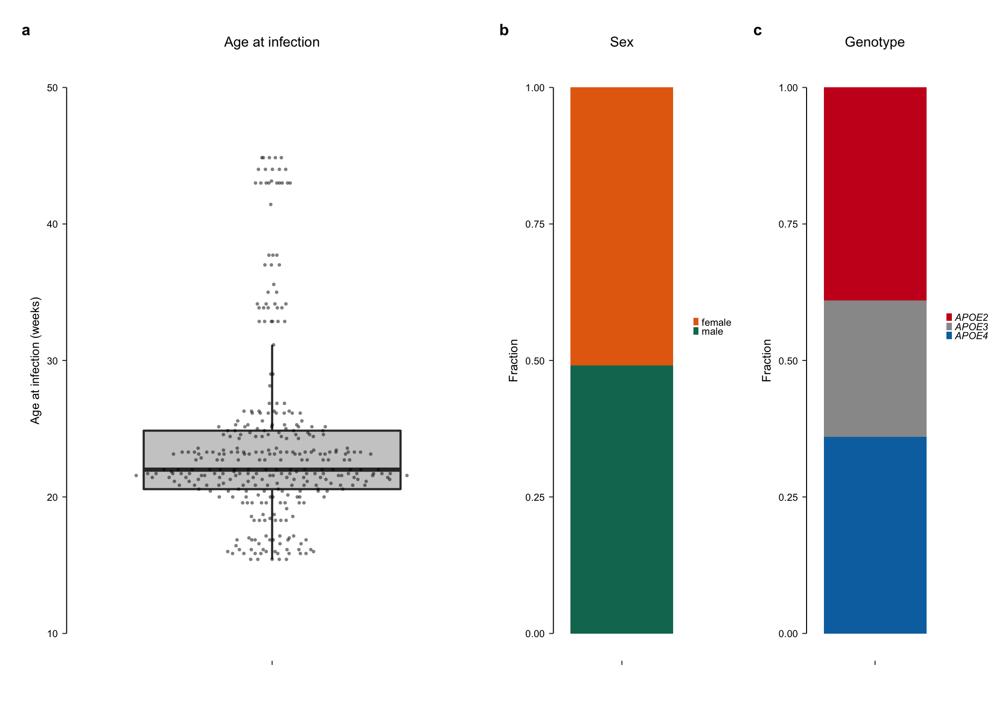
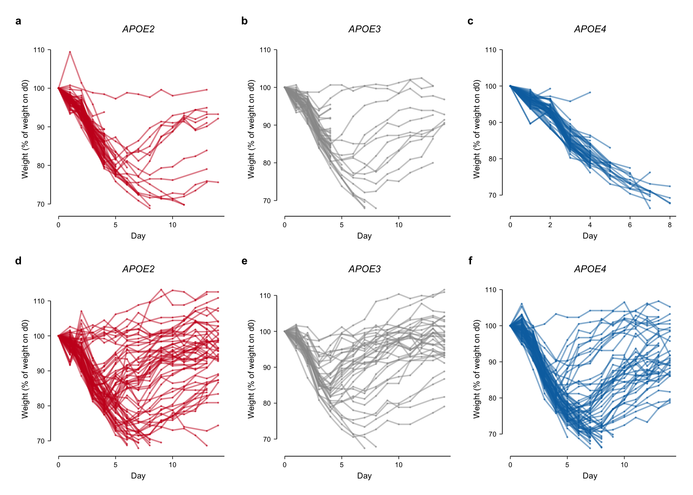
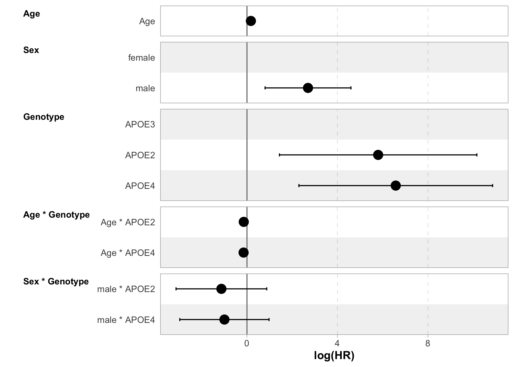
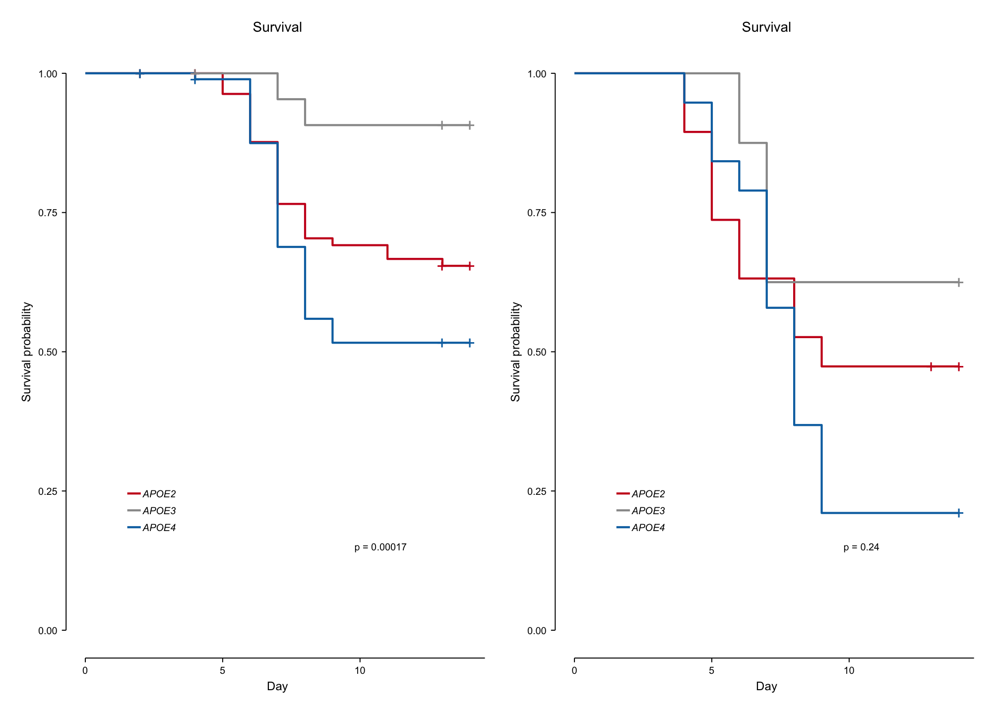
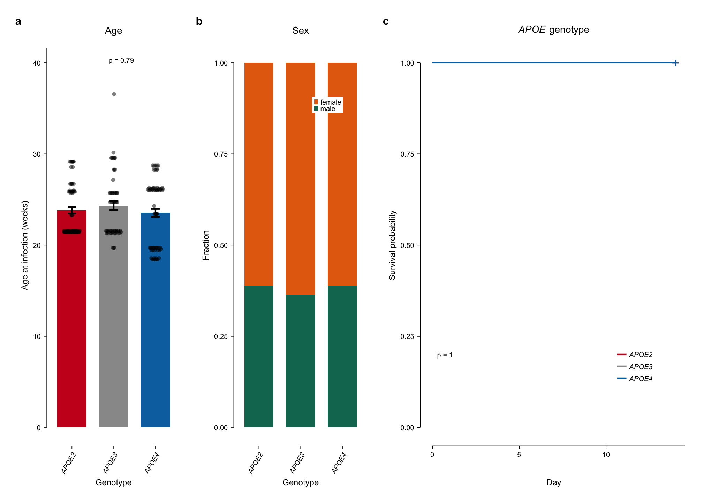

01_Fig01
================
Benjamin Ostendorf
8/8/2022

## Preamble

``` r
library(survival)
library(survminer)
library(survivalAnalysis)
library(forestmodel)
library(ggpubr)
library(RColorBrewer)
library(patchwork)
library(ggbeeswarm)
library(lemon)
library(tidyverse)

source("../auxiliary/helper_functions.R")
knitr::opts_chunk$set(fig.retina = 3)
```

## Import and wrangle

``` r
df_APOE <- read_tsv("../data/murine_COVID19.tsv")
```

    ## 
    ## ── Column specification ────────────────────────────────────────────────────────
    ## cols(
    ##   .default = col_double(),
    ##   genotype = col_character(),
    ##   sex = col_character(),
    ##   age_binary = col_character()
    ## )
    ## ℹ Use `spec()` for the full column specifications.

``` r
df_APOE_males <- 
  df_APOE |>
  filter(sex == "male")

df_APOE_females <- 
  df_APOE |>
  filter(sex == "female")

df_weights <-
  df_APOE |>
  select(-day, -outcome, -age_binary) |>
  pivot_longer(cols = -c(genotype, sex, age_at_inf, UID), 
               names_to = "day", values_to = "rel_weight") |>
  mutate(day = as.double(day))

df_noninf <- read_tsv("../data/murine_noninf.tsv")
```

    ## 
    ## ── Column specification ────────────────────────────────────────────────────────
    ## cols(
    ##   genotype = col_character(),
    ##   sex = col_character(),
    ##   age_at_start = col_double(),
    ##   day = col_double(),
    ##   outcome = col_double(),
    ##   UID = col_double()
    ## )

## Fig 1a-d

``` r
## -----------------------------------------------
## Fig 1a
## -----------------------------------------------
coxph(Surv(day, outcome) ~ genotype + age_at_inf + sex, 
      data = mutate(df_APOE, genotype = relevel(factor(genotype), ref = "APOE3")))
```

    ## Call:
    ## coxph(formula = Surv(day, outcome) ~ genotype + age_at_inf + 
    ##     sex, data = mutate(df_APOE, genotype = relevel(factor(genotype), 
    ##     ref = "APOE3")))
    ## 
    ##                  coef exp(coef) se(coef)     z        p
    ## genotypeAPOE2 1.25464   3.50658  0.41236 3.043  0.00235
    ## genotypeAPOE4 1.87817   6.54149  0.41105 4.569 4.89e-06
    ## age_at_inf    0.03359   1.03416  0.01331 2.524  0.01160
    ## sexmale       1.65052   5.20967  0.21435 7.700 1.36e-14
    ## 
    ## Likelihood ratio test=86.73  on 4 df, p=< 2.2e-16
    ## n= 328, number of events= 94

``` r
fm_APOE_all_df <- 
  df_APOE |>
  mutate(genotype = relevel(factor(genotype), ref = "APOE3")) |> 
  rename(Age = age_at_inf, 
         Sex = sex, 
         Genotype = genotype)

fm_APOE_all <-
  forest_model(
    coxph(Surv(day, outcome) ~ Age + Sex + Genotype, data = fm_APOE_all_df),
    format_options =
      forest_model_format_options(text_size = 1.66, point_size = 1, banded = TRUE), 
    factor_separate_line = TRUE, 
    panels = custom_fm_panels, 
    recalculate_width = FALSE)  +
  theme_custom2 +
  labs(title = "Multivariate analysis") +
  NULL
```

    ## Resized limits to included dashed line in forest panel

``` r
## Extract exact p values for Cox PH model
fm_APOE_all_res <- coxph(Surv(day, outcome) ~ Age + Sex + Genotype, data = fm_APOE_all_df)
p_vals_APOE_all <- as.matrix(coef(summary(fm_APOE_all_res))[,5])
format.pval(p_vals_APOE_all, digits = 2)
```

    ## [1] "0.0116"  "1.4e-14" "0.0023"  "4.9e-06"

``` r
## -----------------------------------------------
## Fig 1b
## -----------------------------------------------
fit_APOE_all_age <- survfit(Surv(day, outcome) ~ age_binary, 
                            data = df_APOE)
surv_APOE_all_age <-
  ggsurvplot(fit_APOE_all_age,
             palette = as.character(yarrr::piratepal("southpark")[1:2]),
             ggtheme = theme_custom2,
             pval = TRUE, pval.size = 1.75, size = 0.5, censor.size = 3, 
             legend.labs = gsub("age_binary=", "", names(fit_APOE_all_age$strata)),
             title = "Age")$plot + 
  labs(x = "Day") +
  scale_x_continuous(breaks = scales::pretty_breaks()) +
  theme(legend.position = c(0.8, 0.2), 
        legend.background = element_blank(),
        legend.key = element_rect(fill = NA, colour = NA, size = 0.1),
        legend.spacing.x = unit(0.1, "char"), 
        legend.spacing.y = unit(0.1, "char")) +
  guides(color = guide_legend(override.aes = list(shape = NA))) +
  coord_capped_cart(left = "both", bottom = "left")
```

    ## Scale for 'x' is already present. Adding another scale for 'x', which will
    ## replace the existing scale.

    ## Coordinate system already present. Adding new coordinate system, which will replace the existing one.

``` r
## Extract exact p value
format.pval(surv_pvalue(fit_APOE_all_age)[2], digits = 2)
```

    ## [1] "0.00012"

``` r
## -----------------------------------------------
## Fig 1c
## -----------------------------------------------
fit_APOE_all_sex <- survfit(Surv(day, outcome) ~ sex, data = df_APOE)

surv_APOE_all_sex <-
  ggsurvplot(fit_APOE_all_sex,
             palette = pal_sex,
             ggtheme = theme_custom2,
             pval = TRUE, pval.size = 1.75, size = 0.5, censor.size = 3, 
             legend.labs = gsub("sex=", "", names(fit_APOE_all_sex$strata)),
             title = "Sex")$plot + 
  labs(x = "Day") +
  scale_x_continuous(breaks= scales::pretty_breaks()) +
  theme(legend.position = c(0.8, 0.2), 
        legend.background = element_blank(),
        legend.key = element_rect(fill = NA, colour = NA, size = 0.1),
        legend.spacing.x = unit(0.1, "char"), 
        legend.spacing.y = unit(0.1, "char")) +
  guides(color = guide_legend(override.aes = list(shape = NA))) +
  coord_capped_cart(left = "both", bottom = "left")
```

    ## Scale for 'x' is already present. Adding another scale for 'x', which will
    ## replace the existing scale.
    ## Coordinate system already present. Adding new coordinate system, which will replace the existing one.

``` r
## Extract exact p value
format.pval(surv_pvalue(fit_APOE_all_sex)[2], digits = 2)
```

    ## [1] "2.6e-13"

``` r
## -----------------------------------------------
## Fig 1d
## -----------------------------------------------
fit_APOE_all_genotype <- survfit(Surv(day, outcome) ~ genotype, 
                            data = df_APOE)
surv_APOE_all_genotype <-
  ggsurvplot(fit_APOE_all_genotype,
             palette = pal_APOE,
             ggtheme = theme_custom2,
             pval = TRUE, pval.size = 1.75, size = 0.5, censor.size = 3, 
             legend.labs = gsub("genotype=", "", names(fit_APOE_all_genotype$strata)),
             title = expression(paste(italic("APOE"), " genotype")))$plot + 
  labs(x = "Day") +
  scale_x_continuous(breaks= scales::pretty_breaks()) +
  theme(legend.position = c(0.8, 0.2), 
        legend.text = element_text(face = "italic"), 
        legend.background = element_blank(),
        legend.key = element_rect(fill = NA, colour = NA, size = 0.1),
        legend.spacing.x = unit(0.1, "char"), 
        legend.spacing.y = unit(0.1, "char")) +
  guides(color = guide_legend(override.aes = list(shape = NA))) +
  coord_capped_cart(left = "both", bottom = "left")
```

    ## Scale for 'x' is already present. Adding another scale for 'x', which will
    ## replace the existing scale.
    ## Coordinate system already present. Adding new coordinate system, which will replace the existing one.

``` r
## Extract exact p value
format.pval(surv_pvalue(fit_APOE_all_genotype)[2], digits = 2)
```

    ## [1] "2.5e-05"

## Fig 1e-n

``` r
for (group in (c("female", "male"))) {
  
  df_filt <- filter(df_APOE, sex == {{group}})
  
  ## -----------------------------------------------
  ## Fig 1e,j
  ## -----------------------------------------------
  assign(paste0("age_APOE_", group), 
    df_filt |>
    ggplot(aes(x = genotype, y = age_at_inf, fill = genotype)) +
    geom_bar(stat = "summary", fun = "mean", width = 0.7) +
    geom_quasirandom(size = 0.75, alpha = 0.4, shape = 21, 
                     color = "white", fill = "black", stroke = 0.2) +
    stat_summary(geom = "errorbar", fun.data = mean_se, width = 0.2) +
    stat_compare_means(method = "kruskal.test", label = "p.format", 
                       size = 1.75, label.x = 1.5, label.y = 48) + 
    scale_fill_manual(values = pal_APOE) +
    scale_color_manual(values = pal_APOE) +
    expand_limits(y = c(0, 50)) +
    labs(y = "Age at infection (weeks)", x = "Genotype", title = "Age") +
    theme(legend.position = "none", 
          axis.text.x = element_text(face = "italic")) +
    guides(x = guide_axis(angle = 60)) +
    theme_custom2 +
    lemon::coord_capped_cart(bottom = 'both', left = 'bottom')
  )
    
  ## -----------------------------------------------
  ## Fig 1f,k
  ## -----------------------------------------------
  assign(paste0("weight_APOE_", group), 
         
         df_weights |>
           filter(sex == {{group}}) |>
           filter(day <= 10) |>
           filter(genotype %in% APOE_groups) |>
           ggplot(aes(x = day, y = rel_weight, color = genotype)) +
           stat_summary(aes(color = genotype), geom = "errorbar",
                        fun.data = "mean_se",
                        size = 0.25, width = 0.25) +
           stat_summary(aes(color = genotype), fun = "mean", size = 0.01) +
           geom_smooth(se = FALSE, size = 0.25) +
           theme_custom2 +
           expand_limits(y = c(70, 100)) +
           scale_color_manual(values =  pal_APOE) +
           scale_x_continuous(breaks = scales::pretty_breaks()) +
           labs(y = "Weight (% of weight on d0)", x = "Day", 
                 title = "Weight") +
           theme(legend.position = c(0.25, 0.2), 
                 legend.background = element_blank(), 
                 legend.key = element_rect(fill = NA, colour = NA, size = 0.25), 
                 legend.text = element_text(face = "italic"), 
                 legend.spacing.x = unit(0.1, "char")) +
           lemon::coord_capped_cart(bottom = 'left', left = 'both')
         )
  
  ## -----------------------------------------------
  ## Fig 1g,l
  ## -----------------------------------------------
  assign(paste0("bar_APOE_", group), 
    df_weights |>
    filter(genotype %in% APOE_groups & day == 4 & sex == {{group}}) |>
    ggplot(aes(x = genotype, y = rel_weight - 100, fill = genotype)) +
    geom_boxplot(outlier.shape = NA) +
    geom_quasirandom(size = 0.75, alpha = 0.3, shape = 21, 
                     color = "white", fill = "black", stroke = 0.2) +
    geom_hline(yintercept = 0, lty = "11", size = 0.25) +
    stat_compare_means(method = "t.test", comparisons = APOE_contrasts, 
                       label = "p.format", size = 1.5, label.y = c(3.5, 3.5, 7)) +
    theme_custom2 +
    expand_limits(y = c(-30, 10)) +
    scale_fill_manual(values = pal_APOE) +
    theme(legend.position = "none", 
          axis.text.x = element_text(face = "italic"), 
          axis.text.y = element_text(size = 5)) +
    guides(x = guide_axis(angle = 60)) +
    labs(y = "Weight (% relative to d0)", x = "Genotype", title = "Weight (d4)") +
    lemon::coord_capped_cart(left = 'bottom', bottom = "both")
  )
  
  ## -----------------------------------------------
  ## Fig 1h,m
  ## -----------------------------------------------
  fit_APOE_sex <- survfit(formula = Surv(day, outcome) ~ genotype, data = df_filt)
  
  assign(paste0("surv_APOE_", group), 
    ggsurvplot(fit_APOE_sex,
               palette = pal_APOE,
               ggtheme = theme_custom2,
               pval = TRUE, pval.size = 1.75, size = 0.5, 
               censor.size = 3, pval.coord = c(max(fit_APOE_sex$time)*0.7, 0.15), 
               legend.labs = gsub("genotype=", "", names(fit_APOE_sex$strata)), 
               title = "Survival")$plot + 
    labs(x = "Day") +
    scale_x_continuous(breaks= scales::pretty_breaks()) +
    theme(legend.position = c(0.2, 0.25), 
          legend.text = element_text(face = "italic"), 
          legend.background = element_blank(), 
          legend.spacing.x = unit(0.01, "char"),
          legend.key = element_rect(fill = NA, colour = NA, size = unit(0.25, "line")),
          legend.key.height = unit(0.001, "char")
          ) +
    guides(color = guide_legend(override.aes = list(shape = NA))) +
    coord_capped_cart(left = "both", bottom = "left")
  )
  
  ## -----------------------------------------------
  ## Fig 1i,n
  ## ----------------------------------------------- 
  fm_APOE_sex_df <- 
    df_filt |>
    mutate(genotype = relevel(factor(genotype), ref = "APOE3")) |> 
    rename(Age = age_at_inf, 
           Sex = sex, 
           Genotype = genotype)
  
  assign(paste0("fm_APOE_", group),  
    forest_model(
      coxph(Surv(day, outcome) ~ Genotype, data = fm_APOE_sex_df),
      format_options =
        forest_model_format_options(text_size = 1.66, point_size = 1, banded = TRUE), 
      factor_separate_line = TRUE, 
      panels = custom_fm_panels, 
      recalculate_width = FALSE)  +
    theme_custom2 +
    NULL
  )
}
```

    ## Scale for 'x' is already present. Adding another scale for 'x', which will
    ## replace the existing scale.

    ## Coordinate system already present. Adding new coordinate system, which will replace the existing one.

    ## Resized limits to included dashed line in forest panel

    ## Scale for 'x' is already present. Adding another scale for 'x', which will
    ## replace the existing scale.

    ## Coordinate system already present. Adding new coordinate system, which will replace the existing one.

    ## Resized limits to included dashed line in forest panel

``` r
## Extract exact p values for Cox PH model for males
coxph_male_res <- coxph(Surv(day, outcome) ~ genotype, 
                        data = filter(df_APOE, sex == "male") |>
                          mutate(genotype = relevel(factor(genotype), ref = "APOE3")))
p_vals_APOE_male <- as.matrix(coef(summary(coxph_male_res))[,5])
format.pval(p_vals_APOE_male, digits = 1)
```

    ## [1] "0.02"  "1e-04"

## Assemble Fig 1

``` r
des_fig_large <- "
##################
AAAAAABBBCCCCDDDDD
AAAAAABBBCCCCDDDDD
AAAAAABBBCCCCDDDDD
AAAAAABBBCCCCDDDDD
AAAAAABBBCCCCDDDDD
##################
EEFFFFJJKKKKLLLLLL
EEFFFFJJKKKKLLLLLL
EEFFFFJJKKKKLLLLLL
EEFFFFJJKKKKLLLLLL
EEFFFFJJKKKKLLLLLL
##################
MMNNNNOOPPPPQQQQQQ
MMNNNNOOPPPPQQQQQQ
MMNNNNOOPPPPQQQQQQ
MMNNNNOOPPPPQQQQQQ
MMNNNNOOPPPPQQQQQQ
"
fm_APOE_all + surv_APOE_all_age + surv_APOE_all_sex + surv_APOE_all_genotype +
  age_APOE_male +   weight_APOE_male +   bar_APOE_male +   surv_APOE_male  +  fm_APOE_male +
  age_APOE_female + weight_APOE_female + bar_APOE_female + surv_APOE_female + fm_APOE_female +
  plot_layout(nrow = 1, design = des_fig_large) + 
  plot_annotation(tag_levels = "a") &
  theme(plot.tag = element_text(size = 8, face = "bold"))
```

    ## Warning: Removed 774 rows containing non-finite values (stat_summary).

    ## Warning: Removed 774 rows containing non-finite values (stat_summary).

    ## `geom_smooth()` using method = 'loess' and formula 'y ~ x'

    ## Warning: Removed 774 rows containing non-finite values (stat_smooth).

    ## Warning: Removed 31 rows containing missing values (geom_segment).

    ## Warning: Removed 19 rows containing non-finite values (stat_boxplot).

    ## Warning: Removed 19 rows containing non-finite values (stat_signif).

    ## Warning: Removed 19 rows containing missing values (position_quasirandom).

    ## Warning: Removed 129 rows containing non-finite values (stat_summary).

    ## Warning: Removed 129 rows containing non-finite values (stat_summary).

    ## `geom_smooth()` using method = 'loess' and formula 'y ~ x'

    ## Warning: Removed 129 rows containing non-finite values (stat_smooth).

    ## Warning: Removed 33 rows containing missing values (geom_segment).



## ED Fig 1

``` r
## -----------------------------------------------
## ED Fig 1a
## -----------------------------------------------
age_all <- 
  df_APOE |>
  ggplot(aes(y = age_at_inf, x = "")) +
  geom_boxplot(outlier.shape = NA, fill = "grey80") +
  geom_quasirandom(size = 0.5, alpha = 0.5, shape = 16) +
  labs(y = "Age at infection (weeks)", title = "Age at infection", x = "") +
  expand_limits(y = c(10, 50)) +
  theme(legend.position = "none", 
        axis.text.x = element_text(face = "italic"), 
        axis.line.x = element_blank()) +
  guides(x = guide_axis(angle = 60)) +
  theme_custom2 +
  lemon::coord_capped_cart(left = 'both')

## -----------------------------------------------
## ED Fig 1b
## -----------------------------------------------
barplot_sex_all <-
  ggplot(df_APOE, aes(x = "", fill = sex)) +
  geom_bar(position = "fill") +
  theme_custom2 +
  guides(x = guide_axis(angle = 45)) +
  labs(x = "", y = "Fraction", title = "Sex") +
  scale_fill_manual(values = pal_sex) +
  theme(axis.text.x = element_text(face = "italic"),
        legend.spacing.x = unit(0.1, "char"),
        legend.margin=margin(-50,0,-10,-10),
        legend.key = element_rect(fill = NA, colour = NA, size = 0.25),
        axis.line.x = element_blank()) +
  coord_capped_cart(left = "both")

## -----------------------------------------------
## ED Fig 1c
## -----------------------------------------------
barplot_genotype_all <-
  ggplot(df_APOE, aes(x = "", fill = genotype)) +
  geom_bar(position = "fill") +
  theme_custom2 +
  guides(x = guide_axis(angle = 45)) +
  labs(x = "", y = "Fraction", title = "Genotype") +
  scale_fill_manual(values = pal_APOE) +
  theme(axis.text.x = element_text(face = "italic"),
        legend.spacing.x = unit(0.1, "char"),
        legend.margin=margin(-50, -5,-10,-10),
        legend.key = element_rect(fill = NA, colour = NA, size = 0.25),
        legend.text = element_text(face = "italic"), 
        axis.line.x = element_blank()) +
  coord_capped_cart(left = "both")

## -----------------------------------------------
## Assemble ED Fig 1a-c
## -----------------------------------------------
age_all + barplot_sex_all + barplot_genotype_all +
  plot_layout(nrow = 1, widths = c(3, 1, 1)) +
  plot_annotation(tag_levels = "a") & 
  theme(plot.tag = element_text(size = 8, face = "bold"))
```



``` r
## ----------------------------------------------------------
## ED Fig 1d
## ----------------------------------------------------------
for (group in (c("female", "male"))) {
  
  for (genotype_group in c("APOE2", "APOE3", "APOE4")) {
    
    df_filt <- filter(df_weights, 
                      sex == {{group}}, 
                      genotype == {{genotype_group}}, 
                      !is.na(rel_weight))
    
    linecolor_custom <- ifelse(genotype_group == "APOE2", pal_APOE[1], 
                               ifelse(genotype_group == "APOE3", pal_APOE[2], pal_APOE[3]))
    
    ## Weight loss individually
    ## -----------------------------------------------
    assign(paste0("weight_", group, "_",genotype_group, "_indiv"), 
           df_filt |>
           ggplot(aes(x = day, y = rel_weight, color = genotype, group = UID)) +
           geom_path(alpha = 0.5) +
           geom_point(size = 0.01, alpha = 0.5) +
           scale_color_manual(values = linecolor_custom) +
             expand_limits(y = c(70, 110)) +
           theme_custom2 +
           theme(legend.position = "none", 
                 legend.background = element_blank(), 
                 legend.key = element_rect(fill = NA, colour = NA, size = 0.25,), 
                 legend.spacing.x = unit(0.1, "char"), 
                 legend.text = element_text(face = "italic"), 
                 plot.title = element_text(face = "italic")) +
           lemon::coord_capped_cart(bottom = 'left', left = 'both') +
           labs(y = "Weight (% of weight on d0)", x = "Day", title = genotype_group)) +
           NULL
  }
}
des_fig_individual_weight <- "
ABC
DEF
"
weight_male_APOE2_indiv + weight_male_APOE3_indiv + weight_male_APOE4_indiv +
  weight_female_APOE2_indiv + weight_female_APOE3_indiv + weight_female_APOE4_indiv + 
  plot_layout(nrow = 2, design = des_fig_individual_weight) + 
  plot_annotation(tag_levels = "a") &
  theme(plot.tag = element_text(size = 8, face = "bold"))
```



``` r
## --------------------------------------------------------------------------
## ED Fig 1e-f
## --------------------------------------------------------------------------
coxph(Surv(day, outcome) ~ age_at_inf + sex + genotype + 
        age_at_inf*genotype + sex*genotype, 
      data = mutate(df_APOE, genotype = relevel(factor(genotype), ref = "APOE3")))
```

    ## Call:
    ## coxph(formula = Surv(day, outcome) ~ age_at_inf + sex + genotype + 
    ##     age_at_inf * genotype + sex * genotype, data = mutate(df_APOE, 
    ##     genotype = relevel(factor(genotype), ref = "APOE3")))
    ## 
    ##                               coef exp(coef)  se(coef)      z       p
    ## age_at_inf                 0.17324   1.18915   0.05651  3.066 0.00217
    ## sexmale                    2.69872  14.86069   0.96837  2.787 0.00532
    ## genotypeAPOE2              5.80046 330.45294   2.22691  2.605 0.00920
    ## genotypeAPOE4              6.57797 719.07586   2.18491  3.011 0.00261
    ## age_at_inf:genotypeAPOE2  -0.14189   0.86772   0.06084 -2.332 0.01969
    ## age_at_inf:genotypeAPOE4  -0.14975   0.86093   0.05924 -2.528 0.01148
    ## sexmale:genotypeAPOE2     -1.13097   0.32272   1.02301 -1.106 0.26893
    ## sexmale:genotypeAPOE4     -0.99678   0.36907   1.00649 -0.990 0.32200
    ## 
    ## Likelihood ratio test=92.8  on 8 df, p=< 2.2e-16
    ## n= 328, number of events= 94

``` r
tbl_interactions <- 
  fm_APOE_all_df |>
  coxph(formula = Surv(day, outcome) ~ Age + Sex + Genotype + Age*Genotype + Sex*Genotype) |>
  gtsummary::tbl_regression()
plot(tbl_interactions)
```

    ## Registered S3 method overwritten by 'GGally':
    ##   method from   
    ##   +.gg   ggplot2



``` r
## -------------------------------------------------------
## ED Fig 1g-h
## -------------------------------------------------------
for (group in (c("< 30 weeks", "> 30 weeks"))) {
  
  age_descriptor <- ifelse(group == "< 30 weeks", "young", "old")
  df_filt <- filter(df_APOE, age_binary == {{group}})
  fit_APOE_age <- survfit(formula = Surv(day, outcome) ~ genotype, data = df_filt)
  
  assign(paste0("surv_APOE_", age_descriptor), 
    ggsurvplot(fit_APOE_age,
               palette = pal_APOE,
               ggtheme = theme_custom2,
               pval = TRUE, pval.size = 1.75, size = 0.5, 
               censor.size = 3, pval.coord = c(max(fit_APOE_age$time)*0.7, 0.15), 
               legend.labs = gsub("genotype=", "", names(fit_APOE_age$strata)), 
               title = "Survival")$plot + 
    labs(x = "Day") +
    scale_x_continuous(breaks= scales::pretty_breaks()) +
    theme(legend.position = c(0.2, 0.25), 
          legend.text = element_text(face = "italic"), 
          legend.background = element_blank(), 
          legend.spacing.x = unit(0.01, "char"), 
          legend.key = element_rect(fill = NA, colour = NA, size = unit(0.25, "line")),
          legend.key.height = unit(0.001, "char") 
          ) +
    guides(color = guide_legend(override.aes = list(shape = NA))) +
    coord_capped_cart(left = "both", bottom = "left")
  )
}
```

    ## Scale for 'x' is already present. Adding another scale for 'x', which will
    ## replace the existing scale.

    ## Coordinate system already present. Adding new coordinate system, which will replace the existing one.

    ## Scale for 'x' is already present. Adding another scale for 'x', which will
    ## replace the existing scale.

    ## Coordinate system already present. Adding new coordinate system, which will replace the existing one.

``` r
surv_APOE_young + surv_APOE_old
```



## ED Fig 1i-k

``` r
## -----------------------------------------------
## ED Fig 1i
## -----------------------------------------------
age_APOE_noninf <- 
  df_noninf |>
  ggplot(aes(x = genotype, y = age_at_start, fill = genotype)) +
  geom_bar(stat = "summary", fun = "mean", width = 0.7) +
  stat_summary(geom = "errorbar", fun.data = mean_se, width = 0.2) +
  stat_compare_means(method = "kruskal.test", label = "p.format", 
                     size = 1.75, label.x = 2) + 
  geom_quasirandom(size = 1, width = 0.2, alpha = 0.5, shape = 16) +
  scale_fill_manual(values = pal_APOE) +
  scale_color_manual(values = pal_APOE) +
  expand_limits(y = c(0, 40)) +
  labs(y = "Age at infection (weeks)", x = "Genotype", title = "Age") +
  theme(legend.position = "none", 
        axis.text.x = element_text(face = "italic"), 
        axis.line.x = element_blank()) +
  guides(x = guide_axis(angle = 60)) +
  theme_custom2 +
  lemon::coord_capped_cart(left = 'bottom')

## -----------------------------------------------
## ED Fig 1j
## -----------------------------------------------
barplot_sex_noninf <-
  ggplot(df_noninf, aes(x = genotype, fill = sex)) +
  geom_bar(position = "fill", width = 0.7) +
  theme_custom2 +
  guides(x = guide_axis(angle = 60)) +
  labs(x = "Genotype", y = "Fraction", title = "Sex") +
  scale_fill_manual(values = pal_sex) +
  theme(axis.text.x = element_text(face = "italic"),
        legend.spacing.x = unit(0.1, "char"),
        legend.margin=margin(-4, 1, 1, 1), 
        legend.key = element_rect(fill = NA, colour = NA, size = 0.25),
        axis.line.x = element_blank(),
        legend.position = c(0.7, 0.85)) +
  coord_capped_cart(left = "both")
chisq.test(df_noninf$genotype, df_noninf$sex)
```

    ## 
    ##  Pearson's Chi-squared test
    ## 
    ## data:  df_noninf$genotype and df_noninf$sex
    ## X-squared = 0.098633, df = 2, p-value = 0.9519

``` r
## -----------------------------------------------
## ED Fig 1k
## -----------------------------------------------
fit_APOE_noninf <- survfit(Surv(day, outcome) ~ genotype, 
                            data = df_noninf)
surv_APOE_noninf <-
  ggsurvplot(fit_APOE_noninf,
             palette = pal_APOE,
             ggtheme = theme_custom2,
             pval = TRUE, pval.size = 1.75, size = 0.5, censor.size = 3, 
             legend.labs = gsub("genotype=", "", names(fit_APOE_all_genotype$strata)),
             title = expression(paste(italic("APOE"), " genotype")))$plot + 
  labs(x = "Day") +
  scale_x_continuous(breaks= scales::pretty_breaks()) +
  theme(legend.position = c(0.8, 0.2), 
        legend.text = element_text(face = "italic"), 
        legend.background = element_blank(),
        legend.key = element_rect(fill = NA, colour = NA, size = 0.1),
        legend.spacing.x = unit(0.1, "char"), 
        legend.spacing.y = unit(0.1, "char")) +
  guides(color = guide_legend(override.aes = list(shape = NA))) +
  coord_capped_cart(left = "both", bottom = "left")
```

    ## Scale for 'x' is already present. Adding another scale for 'x', which will
    ## replace the existing scale.

    ## Coordinate system already present. Adding new coordinate system, which will replace the existing one.

``` r
## -----------------------------------------------
## Assemble ED Fig 1i-k
## -----------------------------------------------
age_APOE_noninf + barplot_sex_noninf + surv_APOE_noninf +
  plot_layout(nrow = 1, widths = c(1, 1, 2)) +#, design = fig_design) + 
  plot_annotation(tag_levels = "a") &
  theme(plot.tag = element_text(size = 8, face = "bold"))
```



## Session info

``` r
devtools::session_info()
```

    ## ─ Session info ───────────────────────────────────────────────────────────────
    ##  setting  value                       
    ##  version  R version 4.1.0 (2021-05-18)
    ##  os       macOS Big Sur 10.16         
    ##  system   x86_64, darwin17.0          
    ##  ui       X11                         
    ##  language (EN)                        
    ##  collate  en_US.UTF-8                 
    ##  ctype    en_US.UTF-8                 
    ##  tz       Europe/Berlin               
    ##  date     2022-08-12                  
    ## 
    ## ─ Packages ───────────────────────────────────────────────────────────────────
    ##  package          * version    date       lib source        
    ##  abind              1.4-5      2016-07-21 [1] CRAN (R 4.1.0)
    ##  assertthat         0.2.1      2019-03-21 [1] CRAN (R 4.1.0)
    ##  backports          1.2.1      2020-12-09 [1] CRAN (R 4.1.0)
    ##  BayesFactor        0.9.12-4.2 2018-05-19 [1] CRAN (R 4.1.0)
    ##  beeswarm           0.3.1      2021-03-07 [1] CRAN (R 4.1.0)
    ##  broom              0.7.6      2021-04-05 [1] CRAN (R 4.1.0)
    ##  broom.helpers      1.3.0      2021-04-10 [1] CRAN (R 4.1.0)
    ##  broom.mixed        0.2.7      2021-07-07 [1] CRAN (R 4.1.0)
    ##  cachem             1.0.5      2021-05-15 [1] CRAN (R 4.1.0)
    ##  callr              3.7.0      2021-04-20 [1] CRAN (R 4.1.0)
    ##  car                3.0-10     2020-09-29 [1] CRAN (R 4.1.0)
    ##  carData            3.0-4      2020-05-22 [1] CRAN (R 4.1.0)
    ##  cellranger         1.1.0      2016-07-27 [1] CRAN (R 4.1.0)
    ##  circlize           0.4.12     2021-01-08 [1] CRAN (R 4.1.0)
    ##  cli                2.5.0      2021-04-26 [1] CRAN (R 4.1.0)
    ##  coda               0.19-4     2020-09-30 [1] CRAN (R 4.1.0)
    ##  colorspace         2.0-1      2021-05-04 [1] CRAN (R 4.1.0)
    ##  cowplot            1.1.1      2020-12-30 [1] CRAN (R 4.1.0)
    ##  crayon             1.4.1      2021-02-08 [1] CRAN (R 4.1.0)
    ##  curl               4.3.1      2021-04-30 [1] CRAN (R 4.1.0)
    ##  data.table         1.14.0     2021-02-21 [1] CRAN (R 4.1.0)
    ##  DBI                1.1.1      2021-01-15 [1] CRAN (R 4.1.0)
    ##  dbplyr             2.1.1      2021-04-06 [1] CRAN (R 4.1.0)
    ##  desc               1.3.0      2021-03-05 [1] CRAN (R 4.1.0)
    ##  devtools           2.4.1      2021-05-05 [1] CRAN (R 4.1.0)
    ##  digest             0.6.29     2021-12-01 [1] CRAN (R 4.1.0)
    ##  dplyr            * 1.0.6      2021-05-05 [1] CRAN (R 4.1.0)
    ##  ellipsis           0.3.2      2021-04-29 [1] CRAN (R 4.1.0)
    ##  evaluate           0.14       2019-05-28 [1] CRAN (R 4.1.0)
    ##  fansi              0.5.0      2021-05-25 [1] CRAN (R 4.1.0)
    ##  farver             2.1.0      2021-02-28 [1] CRAN (R 4.1.0)
    ##  fastmap            1.1.0      2021-01-25 [1] CRAN (R 4.1.0)
    ##  forcats          * 0.5.1      2021-01-27 [1] CRAN (R 4.1.0)
    ##  foreign            0.8-81     2020-12-22 [1] CRAN (R 4.1.0)
    ##  forestmodel      * 0.6.2      2020-07-19 [1] CRAN (R 4.1.0)
    ##  fs                 1.5.0      2020-07-31 [1] CRAN (R 4.1.0)
    ##  generics           0.1.0      2020-10-31 [1] CRAN (R 4.1.0)
    ##  GGally             2.1.2      2021-06-21 [1] CRAN (R 4.1.0)
    ##  ggbeeswarm       * 0.6.0      2017-08-07 [1] CRAN (R 4.1.0)
    ##  ggplot2          * 3.3.5      2021-06-25 [1] CRAN (R 4.1.0)
    ##  ggpubr           * 0.4.0      2020-06-27 [1] CRAN (R 4.1.0)
    ##  ggsignif           0.6.1      2021-02-23 [1] CRAN (R 4.1.0)
    ##  GlobalOptions      0.1.2      2020-06-10 [1] CRAN (R 4.1.0)
    ##  glue               1.6.0      2021-12-17 [1] CRAN (R 4.1.0)
    ##  gridExtra          2.3        2017-09-09 [1] CRAN (R 4.1.0)
    ##  gt                 0.3.0      2021-05-12 [1] CRAN (R 4.1.0)
    ##  gtable             0.3.0      2019-03-25 [1] CRAN (R 4.1.0)
    ##  gtools             3.8.2      2020-03-31 [1] CRAN (R 4.1.0)
    ##  gtsummary          1.4.1      2021-05-19 [1] CRAN (R 4.1.0)
    ##  haven              2.4.1      2021-04-23 [1] CRAN (R 4.1.0)
    ##  highr              0.9        2021-04-16 [1] CRAN (R 4.1.0)
    ##  hms                1.1.0      2021-05-17 [1] CRAN (R 4.1.0)
    ##  htmltools          0.5.2      2021-08-25 [1] CRAN (R 4.1.0)
    ##  httr               1.4.2      2020-07-20 [1] CRAN (R 4.1.0)
    ##  jpeg               0.1-8.1    2019-10-24 [1] CRAN (R 4.1.0)
    ##  jsonlite           1.7.2      2020-12-09 [1] CRAN (R 4.1.0)
    ##  km.ci              0.5-2      2009-08-30 [1] CRAN (R 4.1.0)
    ##  KMsurv             0.1-5      2012-12-03 [1] CRAN (R 4.1.0)
    ##  knitr              1.37       2021-12-16 [1] CRAN (R 4.1.0)
    ##  labeling           0.4.2      2020-10-20 [1] CRAN (R 4.1.0)
    ##  labelled           2.8.0      2021-03-08 [1] CRAN (R 4.1.0)
    ##  lattice            0.20-44    2021-05-02 [1] CRAN (R 4.1.0)
    ##  lemon            * 0.4.5      2020-06-08 [1] CRAN (R 4.1.0)
    ##  lifecycle          1.0.0      2021-02-15 [1] CRAN (R 4.1.0)
    ##  lubridate          1.7.10     2021-02-26 [1] CRAN (R 4.1.0)
    ##  magrittr           2.0.1      2020-11-17 [1] CRAN (R 4.1.0)
    ##  Matrix             1.3-3      2021-05-04 [1] CRAN (R 4.1.0)
    ##  MatrixModels       0.5-0      2021-03-02 [1] CRAN (R 4.1.0)
    ##  memoise            2.0.0      2021-01-26 [1] CRAN (R 4.1.0)
    ##  mgcv               1.8-35     2021-04-18 [1] CRAN (R 4.1.0)
    ##  modelr             0.1.8      2020-05-19 [1] CRAN (R 4.1.0)
    ##  munsell            0.5.0      2018-06-12 [1] CRAN (R 4.1.0)
    ##  mvtnorm            1.1-1      2020-06-09 [1] CRAN (R 4.1.0)
    ##  nlme               3.1-152    2021-02-04 [1] CRAN (R 4.1.0)
    ##  openxlsx           4.2.3      2020-10-27 [1] CRAN (R 4.1.0)
    ##  patchwork        * 1.1.1      2020-12-17 [1] CRAN (R 4.1.0)
    ##  pbapply            1.4-3      2020-08-18 [1] CRAN (R 4.1.0)
    ##  pillar             1.6.1      2021-05-16 [1] CRAN (R 4.1.0)
    ##  pkgbuild           1.2.0      2020-12-15 [1] CRAN (R 4.1.0)
    ##  pkgconfig          2.0.3      2019-09-22 [1] CRAN (R 4.1.0)
    ##  pkgload            1.2.1      2021-04-06 [1] CRAN (R 4.1.0)
    ##  plyr               1.8.6      2020-03-03 [1] CRAN (R 4.1.0)
    ##  prettyunits        1.1.1      2020-01-24 [1] CRAN (R 4.1.0)
    ##  processx           3.5.2      2021-04-30 [1] CRAN (R 4.1.0)
    ##  ps                 1.6.0      2021-02-28 [1] CRAN (R 4.1.0)
    ##  purrr            * 0.3.4      2020-04-17 [1] CRAN (R 4.1.0)
    ##  R6                 2.5.1      2021-08-19 [1] CRAN (R 4.1.0)
    ##  RColorBrewer     * 1.1-2      2014-12-07 [1] CRAN (R 4.1.0)
    ##  Rcpp               1.0.7      2021-07-07 [1] CRAN (R 4.1.0)
    ##  readr            * 1.4.0      2020-10-05 [1] CRAN (R 4.1.0)
    ##  readxl             1.3.1      2019-03-13 [1] CRAN (R 4.1.0)
    ##  remotes            2.3.0      2021-04-01 [1] CRAN (R 4.1.0)
    ##  reprex             2.0.0      2021-04-02 [1] CRAN (R 4.1.0)
    ##  reshape            0.8.8      2018-10-23 [1] CRAN (R 4.1.0)
    ##  rio                0.5.26     2021-03-01 [1] CRAN (R 4.1.0)
    ##  rlang              0.4.12     2021-10-18 [1] CRAN (R 4.1.0)
    ##  rmarkdown          2.11       2021-09-14 [1] CRAN (R 4.1.0)
    ##  rprojroot          2.0.2      2020-11-15 [1] CRAN (R 4.1.0)
    ##  rstatix            0.7.0      2021-02-13 [1] CRAN (R 4.1.0)
    ##  rstudioapi         0.13       2020-11-12 [1] CRAN (R 4.1.0)
    ##  rvest              1.0.0      2021-03-09 [1] CRAN (R 4.1.0)
    ##  scales             1.1.1      2020-05-11 [1] CRAN (R 4.1.0)
    ##  sessioninfo        1.1.1      2018-11-05 [1] CRAN (R 4.1.0)
    ##  shape              1.4.6      2021-05-19 [1] CRAN (R 4.1.0)
    ##  stringi            1.7.6      2021-11-29 [1] CRAN (R 4.1.0)
    ##  stringr          * 1.4.0      2019-02-10 [1] CRAN (R 4.1.0)
    ##  survival         * 3.2-11     2021-04-26 [1] CRAN (R 4.1.0)
    ##  survivalAnalysis * 0.2.0      2021-04-24 [1] CRAN (R 4.1.0)
    ##  survminer        * 0.4.9      2021-03-09 [1] CRAN (R 4.1.0)
    ##  survMisc           0.5.5      2018-07-05 [1] CRAN (R 4.1.0)
    ##  testthat           3.0.2      2021-02-14 [1] CRAN (R 4.1.0)
    ##  tibble           * 3.1.2      2021-05-16 [1] CRAN (R 4.1.0)
    ##  tidyr            * 1.1.3      2021-03-03 [1] CRAN (R 4.1.0)
    ##  tidyselect         1.1.1      2021-04-30 [1] CRAN (R 4.1.0)
    ##  tidytidbits        0.2.3      2021-03-08 [1] CRAN (R 4.1.0)
    ##  tidyverse        * 1.3.1      2021-04-15 [1] CRAN (R 4.1.0)
    ##  usethis            2.0.1      2021-02-10 [1] CRAN (R 4.1.0)
    ##  utf8               1.2.1      2021-03-12 [1] CRAN (R 4.1.0)
    ##  vctrs              0.3.8      2021-04-29 [1] CRAN (R 4.1.0)
    ##  vipor              0.4.5      2017-03-22 [1] CRAN (R 4.1.0)
    ##  withr              2.4.2      2021-04-18 [1] CRAN (R 4.1.0)
    ##  xfun               0.29       2021-12-14 [1] CRAN (R 4.1.0)
    ##  xml2               1.3.2      2020-04-23 [1] CRAN (R 4.1.0)
    ##  xtable             1.8-4      2019-04-21 [1] CRAN (R 4.1.0)
    ##  yaml               2.2.1      2020-02-01 [1] CRAN (R 4.1.0)
    ##  yarrr              0.1.5      2017-04-19 [1] CRAN (R 4.1.0)
    ##  zip                2.1.1      2020-08-27 [1] CRAN (R 4.1.0)
    ##  zoo                1.8-9      2021-03-09 [1] CRAN (R 4.1.0)
    ## 
    ## [1] /Library/Frameworks/R.framework/Versions/4.1/Resources/library
