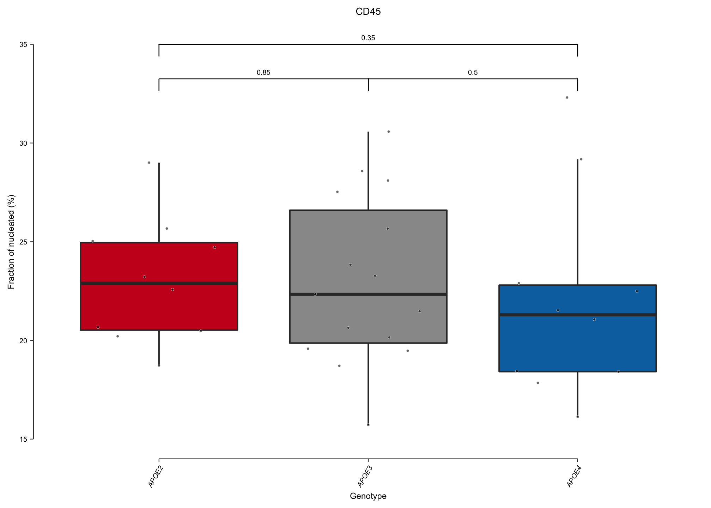

ED Fig 3p
================
Benjamin Ostendorf
2022-08-08

## Preamble

``` r
library(ggpubr)
library(tidyverse)

source("../auxiliary/helper_functions.R")
knitr::opts_chunk$set(fig.retina = 3)
```

## ED Fig 3p

``` r
df_IF <- read_tsv("../data/immunofluorescence.tsv")
```

    ## 
    ## ── Column specification ────────────────────────────────────────────────────────
    ## cols(
    ##   genotype = col_character(),
    ##   area_N1 = col_double(),
    ##   fraction_CD45 = col_double()
    ## )

``` r
IF_plot(df_IF, x = "genotype", 
        y = "fraction_CD45", fill = "genotype", 
        ylab = "Fraction of nucleated (%)", title = "CD45", 
        label.y = c(32.25, 32.25, 34), expand_limits = c(15, 35))
```



## Session info

``` r
devtools::session_info()
```

    ## ─ Session info ───────────────────────────────────────────────────────────────
    ##  setting  value                       
    ##  version  R version 4.1.0 (2021-05-18)
    ##  os       macOS Big Sur 10.16         
    ##  system   x86_64, darwin17.0          
    ##  ui       X11                         
    ##  language (EN)                        
    ##  collate  en_US.UTF-8                 
    ##  ctype    en_US.UTF-8                 
    ##  tz       Europe/Berlin               
    ##  date     2022-08-24                  
    ## 
    ## ─ Packages ───────────────────────────────────────────────────────────────────
    ##  package     * version date       lib source        
    ##  abind         1.4-5   2016-07-21 [1] CRAN (R 4.1.0)
    ##  assertthat    0.2.1   2019-03-21 [1] CRAN (R 4.1.0)
    ##  backports     1.2.1   2020-12-09 [1] CRAN (R 4.1.0)
    ##  beeswarm      0.3.1   2021-03-07 [1] CRAN (R 4.1.0)
    ##  broom         0.7.6   2021-04-05 [1] CRAN (R 4.1.0)
    ##  cachem        1.0.5   2021-05-15 [1] CRAN (R 4.1.0)
    ##  callr         3.7.0   2021-04-20 [1] CRAN (R 4.1.0)
    ##  car           3.0-10  2020-09-29 [1] CRAN (R 4.1.0)
    ##  carData       3.0-4   2020-05-22 [1] CRAN (R 4.1.0)
    ##  cellranger    1.1.0   2016-07-27 [1] CRAN (R 4.1.0)
    ##  cli           2.5.0   2021-04-26 [1] CRAN (R 4.1.0)
    ##  colorspace    2.0-1   2021-05-04 [1] CRAN (R 4.1.0)
    ##  crayon        1.4.1   2021-02-08 [1] CRAN (R 4.1.0)
    ##  curl          4.3.1   2021-04-30 [1] CRAN (R 4.1.0)
    ##  data.table    1.14.0  2021-02-21 [1] CRAN (R 4.1.0)
    ##  DBI           1.1.1   2021-01-15 [1] CRAN (R 4.1.0)
    ##  dbplyr        2.1.1   2021-04-06 [1] CRAN (R 4.1.0)
    ##  desc          1.3.0   2021-03-05 [1] CRAN (R 4.1.0)
    ##  devtools      2.4.1   2021-05-05 [1] CRAN (R 4.1.0)
    ##  digest        0.6.29  2021-12-01 [1] CRAN (R 4.1.0)
    ##  dplyr       * 1.0.6   2021-05-05 [1] CRAN (R 4.1.0)
    ##  ellipsis      0.3.2   2021-04-29 [1] CRAN (R 4.1.0)
    ##  evaluate      0.14    2019-05-28 [1] CRAN (R 4.1.0)
    ##  fansi         0.5.0   2021-05-25 [1] CRAN (R 4.1.0)
    ##  farver        2.1.0   2021-02-28 [1] CRAN (R 4.1.0)
    ##  fastmap       1.1.0   2021-01-25 [1] CRAN (R 4.1.0)
    ##  forcats     * 0.5.1   2021-01-27 [1] CRAN (R 4.1.0)
    ##  foreign       0.8-81  2020-12-22 [1] CRAN (R 4.1.0)
    ##  fs            1.5.0   2020-07-31 [1] CRAN (R 4.1.0)
    ##  generics      0.1.0   2020-10-31 [1] CRAN (R 4.1.0)
    ##  ggbeeswarm    0.6.0   2017-08-07 [1] CRAN (R 4.1.0)
    ##  ggplot2     * 3.3.5   2021-06-25 [1] CRAN (R 4.1.0)
    ##  ggpubr      * 0.4.0   2020-06-27 [1] CRAN (R 4.1.0)
    ##  ggsignif      0.6.1   2021-02-23 [1] CRAN (R 4.1.0)
    ##  glue          1.6.0   2021-12-17 [1] CRAN (R 4.1.0)
    ##  gridExtra     2.3     2017-09-09 [1] CRAN (R 4.1.0)
    ##  gtable        0.3.0   2019-03-25 [1] CRAN (R 4.1.0)
    ##  haven         2.4.1   2021-04-23 [1] CRAN (R 4.1.0)
    ##  highr         0.9     2021-04-16 [1] CRAN (R 4.1.0)
    ##  hms           1.1.0   2021-05-17 [1] CRAN (R 4.1.0)
    ##  htmltools     0.5.2   2021-08-25 [1] CRAN (R 4.1.0)
    ##  httr          1.4.2   2020-07-20 [1] CRAN (R 4.1.0)
    ##  jsonlite      1.7.2   2020-12-09 [1] CRAN (R 4.1.0)
    ##  knitr         1.37    2021-12-16 [1] CRAN (R 4.1.0)
    ##  labeling      0.4.2   2020-10-20 [1] CRAN (R 4.1.0)
    ##  lattice       0.20-44 2021-05-02 [1] CRAN (R 4.1.0)
    ##  lemon         0.4.5   2020-06-08 [1] CRAN (R 4.1.0)
    ##  lifecycle     1.0.0   2021-02-15 [1] CRAN (R 4.1.0)
    ##  lubridate     1.7.10  2021-02-26 [1] CRAN (R 4.1.0)
    ##  magrittr      2.0.1   2020-11-17 [1] CRAN (R 4.1.0)
    ##  memoise       2.0.0   2021-01-26 [1] CRAN (R 4.1.0)
    ##  modelr        0.1.8   2020-05-19 [1] CRAN (R 4.1.0)
    ##  munsell       0.5.0   2018-06-12 [1] CRAN (R 4.1.0)
    ##  openxlsx      4.2.3   2020-10-27 [1] CRAN (R 4.1.0)
    ##  pillar        1.6.1   2021-05-16 [1] CRAN (R 4.1.0)
    ##  pkgbuild      1.2.0   2020-12-15 [1] CRAN (R 4.1.0)
    ##  pkgconfig     2.0.3   2019-09-22 [1] CRAN (R 4.1.0)
    ##  pkgload       1.2.1   2021-04-06 [1] CRAN (R 4.1.0)
    ##  plyr          1.8.6   2020-03-03 [1] CRAN (R 4.1.0)
    ##  prettyunits   1.1.1   2020-01-24 [1] CRAN (R 4.1.0)
    ##  processx      3.5.2   2021-04-30 [1] CRAN (R 4.1.0)
    ##  ps            1.6.0   2021-02-28 [1] CRAN (R 4.1.0)
    ##  purrr       * 0.3.4   2020-04-17 [1] CRAN (R 4.1.0)
    ##  R6            2.5.1   2021-08-19 [1] CRAN (R 4.1.0)
    ##  Rcpp          1.0.7   2021-07-07 [1] CRAN (R 4.1.0)
    ##  readr       * 1.4.0   2020-10-05 [1] CRAN (R 4.1.0)
    ##  readxl        1.3.1   2019-03-13 [1] CRAN (R 4.1.0)
    ##  remotes       2.3.0   2021-04-01 [1] CRAN (R 4.1.0)
    ##  reprex        2.0.0   2021-04-02 [1] CRAN (R 4.1.0)
    ##  rio           0.5.26  2021-03-01 [1] CRAN (R 4.1.0)
    ##  rlang         0.4.12  2021-10-18 [1] CRAN (R 4.1.0)
    ##  rmarkdown     2.11    2021-09-14 [1] CRAN (R 4.1.0)
    ##  rprojroot     2.0.2   2020-11-15 [1] CRAN (R 4.1.0)
    ##  rstatix       0.7.0   2021-02-13 [1] CRAN (R 4.1.0)
    ##  rstudioapi    0.13    2020-11-12 [1] CRAN (R 4.1.0)
    ##  rvest         1.0.0   2021-03-09 [1] CRAN (R 4.1.0)
    ##  scales        1.1.1   2020-05-11 [1] CRAN (R 4.1.0)
    ##  sessioninfo   1.1.1   2018-11-05 [1] CRAN (R 4.1.0)
    ##  stringi       1.7.6   2021-11-29 [1] CRAN (R 4.1.0)
    ##  stringr     * 1.4.0   2019-02-10 [1] CRAN (R 4.1.0)
    ##  testthat      3.0.2   2021-02-14 [1] CRAN (R 4.1.0)
    ##  tibble      * 3.1.2   2021-05-16 [1] CRAN (R 4.1.0)
    ##  tidyr       * 1.1.3   2021-03-03 [1] CRAN (R 4.1.0)
    ##  tidyselect    1.1.1   2021-04-30 [1] CRAN (R 4.1.0)
    ##  tidyverse   * 1.3.1   2021-04-15 [1] CRAN (R 4.1.0)
    ##  usethis       2.0.1   2021-02-10 [1] CRAN (R 4.1.0)
    ##  utf8          1.2.1   2021-03-12 [1] CRAN (R 4.1.0)
    ##  vctrs         0.3.8   2021-04-29 [1] CRAN (R 4.1.0)
    ##  vipor         0.4.5   2017-03-22 [1] CRAN (R 4.1.0)
    ##  withr         2.4.2   2021-04-18 [1] CRAN (R 4.1.0)
    ##  xfun          0.29    2021-12-14 [1] CRAN (R 4.1.0)
    ##  xml2          1.3.2   2020-04-23 [1] CRAN (R 4.1.0)
    ##  yaml          2.2.1   2020-02-01 [1] CRAN (R 4.1.0)
    ##  zip           2.1.1   2020-08-27 [1] CRAN (R 4.1.0)
    ## 
    ## [1] /Library/Frameworks/R.framework/Versions/4.1/Resources/library
