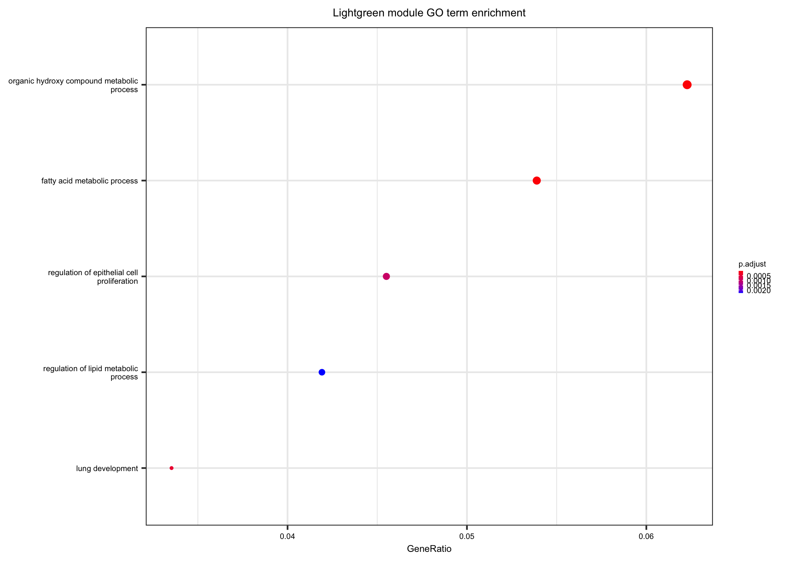

Bulk RNA-seq of dissociated lungs from APOE knock-in mice
================
Benjamin Ostendorf
2022-08-08

## Preamble

``` r
library(AnnotationDbi)
library(org.Mm.eg.db)
library(DESeq2)
library(ComplexHeatmap)
library(lemon)
library(ggpubr)
library(RColorBrewer)
library(clusterProfiler)
library(igraph)
library(WGCNA)
library(tidyverse)

source("../../auxiliary/helper_functions.R")
knitr::opts_chunk$set(fig.retina = 3)

cols_APOE_homo_samples <- c(rep(pal_APOE[1], 4), rep(pal_APOE[3], 3), 
                            rep(pal_APOE[1], 6), rep(pal_APOE[2], 4), rep(pal_APOE[3], 5), 
                            rep(pal_APOE[1], 7), rep(pal_APOE[2], 5), rep(pal_APOE[3], 5))

## Override ComplexHeatmap options
ht_opt("heatmap_row_names_gp" = gpar(fontsize = 5), 
       "heatmap_column_names_gp" = gpar(fontsize = 5), 
       "heatmap_row_title_gp" = gpar(fontsize = 6), 
       "heatmap_column_title_gp" = gpar(fontsize = 7), 
       "legend_title_gp" = gpar(fontsize = 6), 
       "legend_labels_gp" = gpar(fontsize = 5), 
       "legend_grid_height" = unit(2, "mm"), 
       "legend_grid_width" = unit(2, "mm"))

theme_dotplot <- 
  theme(
    axis.title = element_text(size = 6), 
    axis.text.x = element_text(size = 5), 
    axis.text.y = element_text(size = 5), 
    legend.text = element_text(size = 5), 
    legend.title = element_text(size = 5)
  )
```

## Import data

A DESeq2 object for import can be found
[here](https://www.ncbi.nlm.nih.gov/geo/query/acc.cgi?acc=GSE184287)
Place it into `../../data/RNAseq`

``` r
dds <- readRDS("../../data/RNAseq/dds_GSE184287.rds")

coldata <- as.data.frame(colData(dds))

## Get log2-transformed and scaled gene expression data
dds_vst <- vst(dds)
counts_norm <- counts(dds, normalized = TRUE)
counts_log2 <- log2(counts_norm + 1)
counts_scaled <- t(scale(t(counts_log2)))
```

## Prepare for WGCNA

``` r
metadata <- data.frame(genotype = dds$genotype, 
                       day = gsub("d(\\d)", "\\1", dds$timepoint), 
                       sample = colnames(dds))

## Get variance stabilized expression as input for WGCNA as recommended by package authors
df_vsd <- getVarianceStabilizedData(dds)
df_rv <- rowVars(df_vsd)

## Get top 30% variable genes
q70_cutoff <- quantile(rowVars(df_vsd), 0.7)
expr_normalized <- df_vsd[df_rv > q70_cutoff, ]
colnames(expr_normalized) <- metadata$sample

expr_normalized_df <- 
  data.frame(expr_normalized) |>
  mutate(Gene_id = row.names(expr_normalized)) |>
  pivot_longer(-Gene_id)

## Transpose for WGCNA
input_mat <- t(expr_normalized)
```

## Run WGCNA

``` r
## ----------------------------------------
## Set parameters for WGCNA
## ----------------------------------------

## Activate multithreading
allowWGCNAThreads() 
```

    ## Allowing multi-threading with up to 8 threads.

``` r
# Choose a set of soft-thresholding powers
powers <- c(c(1:10), seq(from = 12, to = 20, by = 2))

# Call the network topology analysis function
sft <- pickSoftThreshold(input_mat, 
                         powerVector = powers,
                         verbose = 5)
```

    ## pickSoftThreshold: will use block size 5456.
    ##  pickSoftThreshold: calculating connectivity for given powers...
    ##    ..working on genes 1 through 5456 of 8199
    ##    ..working on genes 5457 through 8199 of 8199
    ##    Power SFT.R.sq   slope truncated.R.sq mean.k. median.k. max.k.
    ## 1      1  0.54200  1.2400          0.829  2770.0   2850.00   4240
    ## 2      2  0.00835 -0.0736          0.596  1360.0   1340.00   2770
    ## 3      3  0.36200 -0.5630          0.717   782.0    717.00   1980
    ## 4      4  0.54200 -0.8310          0.779   496.0    413.00   1490
    ## 5      5  0.66700 -0.9750          0.840   334.0    251.00   1150
    ## 6      6  0.72600 -1.0900          0.871   236.0    166.00    926
    ## 7      7  0.76300 -1.1600          0.890   172.0    111.00    758
    ## 8      8  0.81100 -1.1900          0.919   130.0     76.40    630
    ## 9      9  0.86300 -1.2000          0.952    99.7     52.70    531
    ## 10    10  0.89500 -1.2200          0.974    78.3     37.00    459
    ## 11    12  0.91700 -1.2700          0.984    50.7     19.10    359
    ## 12    14  0.91800 -1.3200          0.983    34.7     10.50    294
    ## 13    16  0.92000 -1.3600          0.979    24.8      5.96    248
    ## 14    18  0.94000 -1.3700          0.986    18.3      3.48    213
    ## 15    20  0.95200 -1.3700          0.989    13.9      2.08    186

``` r
picked_power <- 10

# Force use of WGCNA cor function (fix a namespace conflict issue)
temp_cor <- cor
cor <- WGCNA::cor         

## ----------------------------------------
## Run WGCNA and tidy results
## ----------------------------------------
netwk <- blockwiseModules(input_mat,
                          power = picked_power,  
                          networkType = "signed",
                          maxBlockSize = 12000,
                          verbose = 3)
```

    ##  Calculating module eigengenes block-wise from all genes
    ##    Flagging genes and samples with too many missing values...
    ##     ..step 1
    ##  ..Working on block 1 .
    ##     TOM calculation: adjacency..
    ##     ..will use 8 parallel threads.
    ##      Fraction of slow calculations: 0.000000
    ##     ..connectivity..
    ##     ..matrix multiplication (system BLAS)..
    ##     ..normalization..
    ##     ..done.
    ##  ....clustering..
    ##  ....detecting modules..
    ##  ....calculating module eigengenes..
    ##  ....checking kME in modules..
    ##      ..removing 67 genes from module 1 because their KME is too low.
    ##      ..removing 153 genes from module 2 because their KME is too low.
    ##      ..removing 45 genes from module 3 because their KME is too low.
    ##      ..removing 12 genes from module 4 because their KME is too low.
    ##      ..removing 22 genes from module 5 because their KME is too low.
    ##      ..removing 43 genes from module 6 because their KME is too low.
    ##      ..removing 1 genes from module 7 because their KME is too low.
    ##      ..removing 1 genes from module 8 because their KME is too low.
    ##      ..removing 3 genes from module 12 because their KME is too low.
    ##      ..removing 1 genes from module 18 because their KME is too low.
    ##   ..reassigning 91 genes from module 1 to modules with higher KME.
    ##   ..reassigning 3 genes from module 2 to modules with higher KME.
    ##   ..reassigning 13 genes from module 3 to modules with higher KME.
    ##   ..reassigning 28 genes from module 4 to modules with higher KME.
    ##   ..reassigning 5 genes from module 6 to modules with higher KME.
    ##   ..reassigning 1 genes from module 7 to modules with higher KME.
    ##   ..reassigning 2 genes from module 8 to modules with higher KME.
    ##   ..reassigning 7 genes from module 10 to modules with higher KME.
    ##   ..reassigning 1 genes from module 11 to modules with higher KME.
    ##  ..merging modules that are too close..
    ##      mergeCloseModules: Merging modules whose distance is less than 0.15
    ##        Calculating new MEs...

``` r
# Convert labels to colors for plotting
mergedColors <- labels2colors(netwk$colors)

## Relate genes to modules
module_df <- data.frame(gene_id = names(netwk$colors),
                        colors = labels2colors(netwk$colors))

# Get Module eigengenes per cluster
MEs0 <- moduleEigengenes(input_mat, mergedColors)$eigengenes

# Reorder modules so similar modules are next to each other
MEs0 <- orderMEs(MEs0)
module_order <- gsub("ME","", names(MEs0))

# Add sample names
MEs0$sample <-  row.names(MEs0)
MEs_mtx <- MEs0[, !(colnames(MEs0) == "sample")]

# tidy & plot data
mME <- 
  MEs0 |>
  pivot_longer(-sample) |>
  mutate(name = gsub("ME", "", name),
         name = factor(name, levels = module_order))
```

## ED Fig 3a

``` r
## Prepare mtx for main heatmap
avg_ME <-
  mME |>
  mutate(group = gsub("^(\\d*_)", "", sample)) |>
  group_by(group, name) |>
  summarize(mean_value = mean(value)) |>
  pivot_wider(id_cols = group, names_from = name, values_from = mean_value)
```

    ## `summarise()` has grouped output by 'group'. You can override using the `.groups` argument.

``` r
avg_ME_mtx <- as.matrix(avg_ME[, -1])
rownames(avg_ME_mtx) <- avg_ME$group
avg_ME_mtx_t <- t(avg_ME_mtx)

## Generate top annotation
ha_avg_condition <- 
  HeatmapAnnotation(Day = ifelse(grepl("ctrl", avg_ME$group), 0, 
                                       ifelse(grepl("d2", avg_ME$group), 2, 4)), 
                    Genotype = gsub(".*_(E\\d)", paste0("APO", "\\1"), avg_ME$group),
                    col = 
                      list(
                      Day = c(
                        `0` = brewer.pal(8, "Accent")[1],
                        `2` = brewer.pal(8, "Accent")[2],
                        `4` = brewer.pal(8, "Accent")[3]), 
                      Genotype = c(
                        `APOE2` =  pal_APOE[1],
                        `APOE3` =  pal_APOE[2],
                        `APOE4` =  pal_APOE[3])),
                    annotation_name_side = "left", 
       annotation_name_gp = gpar(fontsize = 6), 
       annotation_legend_param = list(
         Genotype = list(
           at = c("APOE2", "APOE3", "APOE4"),
           labels_gp = gpar(fontface = "italic",
                            fontsize = 5))), 
       simple_anno_size = unit(2, "mm"))

hm_avg_ME <-
  Heatmap(avg_ME_mtx_t,
          top_annotation = ha_avg_condition,
          name = "Eigengene",
          column_title = "Module eigengene",
          cluster_columns = FALSE,
          column_split = c(rep("d0", 2), rep("d2", 3), rep("d4", 3)),
          column_gap = unit(0.5, "mm"), 
          heatmap_legend_param = list(
              labels_gp = gpar(fontsize = 5),
              legend_height = unit(1.5, "cm"), 
              legend_width = unit(0.5, "cm"),
              grid_width = unit(0.15, "cm"), 
              ncol = 1), 
          row_title = "Modules", 
          row_dend_width = unit(0.3, "cm"))

draw(hm_avg_ME, merge_legend = TRUE)
```


## Assess significance of module difference across conditions

``` r
## the following assesses the Pearson correlation between module eigengenes and traits, as encoded by APOE(APOE3 = 1, APOE2 = 3.51, APOE4 = 6.54 as determined by survival data in Fig 1) and timepoint (0, 2, 4)

## Encode genotype levels the same way as hazard ratios determined for APOE
genotype_levels <-
  metadata$genotype |>
  recode("APOE2" = "3.51",
         "APOE3" = "1",
         "APOE4" = "6.54") |>
  as.numeric()

day_levels <- 
  metadata$day |>
  as.numeric()

## Custom correlation function
cor_fun <- function(df, factor_levels) {
  cor.test(df, factor_levels, method = "pearson") |> 
    broom::tidy()
}

## Calculate correlation for genotype
genotype_cor <- map(MEs_mtx, cor_fun, genotype_levels)
genotype_cor_df <- bind_rows(genotype_cor, .id = "module")
genotype_cor_filt <- 
  genotype_cor_df |>
  mutate(trait = "genotype") |>
  dplyr::select(module, trait, estimate, p.value)

## Calculate correlation for day
day_cor <- map(MEs_mtx, cor_fun, day_levels)
day_cor_df <- bind_rows(day_cor, .id = "module")
day_cor_filt <- 
  day_cor_df |>
  mutate(trait = "day") |>
  select(module, trait, estimate, p.value)

## Get module order from average module plot
modules_in_order <- rownames(avg_ME_mtx_t)[row_order(hm_avg_ME)]
```

    ## Warning: The heatmap has not been initialized. You might have different results
    ## if you repeatedly execute this function, e.g. when row_km/column_km was
    ## set. It is more suggested to do as `ht = draw(ht); row_order(ht)`.

``` r
## Join results for trait correlations
trait_cors <- 
  bind_rows(day_cor_filt, genotype_cor_filt) |>
  mutate(sig = case_when(p.value < 0.05 ~ "sig", 
                         TRUE ~ "n.s."), 
         module = gsub("^ME", "", module)) |>
  mutate(module = forcats::fct_relevel(module, modules_in_order))

modules_sig_cor_APOE <- 
  trait_cors |>
  arrange(module, desc(module)) |>
  filter(p.value < 0.05, trait == "genotype") |>
  pull(module) |>
  as.character()

select_modules <- modules_sig_cor_APOE

trait_cors |>
  filter(module %in% select_modules, trait == "genotype") |>
  select(module, p.value)
```

    ## # A tibble: 5 x 2
    ##   module        p.value
    ##   <fct>           <dbl>
    ## 1 black        1.74e- 5
    ## 2 pink         1.43e-14
    ## 3 greenyellow  4.31e- 2
    ## 4 midnightblue 2.06e- 3
    ## 5 yellow       1.37e- 2

## Fig 3b

``` r
ggplot(trait_cors) +
  geom_tile(aes(x = trait, y = module, fill = estimate),
            size = 1) +
  geom_tile(data = filter(trait_cors, sig == "sig"),
            aes(x = trait, y = module),
            size = 0.25,
            colour = "black",
            fill = "transparent") +
  scale_fill_gradient2(
    low = "blue",
    high = "red",
    mid = "white",
    midpoint = 0,
    limit = c(-1,1)) +
  labs(x = "", y = "", fill = "Correlation", p.value = "", title = "Module-trait correlations") +
  guides(x = guide_axis(angle = 45)) +
  theme_minimal() +
  theme(panel.grid.major = element_blank(),
        panel.border = element_blank(),
        panel.background = element_blank(),
        axis.ticks = element_blank(), 
        axis.text = element_text(size = 5, color = "black"), 
        plot.title = element_text(size = 7, hjust = 0.5), 
        legend.text = element_text(size = 5), 
        legend.title = element_text(size = 5), 
        legend.key.height = unit(0.2, "cm"), 
        legend.key.width = unit(0.1, "cm")
        ) +
  coord_flip()
```


## Fig 3c

``` r
mME |>
  filter(name %in% select_modules) |>
  mutate(name = factor(name, levels = select_modules)) |>
  mutate(genotype = gsub("\\d*_\\w*_(E\\d)", paste0("APO", "\\1"), sample), 
         day = case_when(grepl("ctrl", sample) ~ "0",
                         grepl("d2", sample) ~ "2",
                         grepl("d4", sample) ~ "4")) |>
  ggplot(aes(x = day, y = value, fill = genotype)) +
  geom_boxplot(outlier.shape = NA, position = "dodge", size = 0.15, width = 0.6) +
  ggbeeswarm::geom_beeswarm(dodge.width = 0.6, size = 0.1, alpha = 0.5, show.legend = F) +
  theme_custom2 +
  scale_fill_manual(values = pal_APOE) +
  labs(title = "Module trajectories", x = "Day", y = "Module eigengene") +
  theme(legend.text = element_text(face = "italic"), 
        legend.background = element_blank(),
        legend.key = element_rect(fill = NA, colour = NA, size = 0.4), 
        legend.spacing.x = unit(0.1, "char"), 
        legend.spacing.y = unit(0.1, "char"),
        legend.position = "right",
        strip.text = element_text(size = 6, margin = margin(c(2,2, 2, 2)))) +
  lemon::coord_capped_cart(left = "bottom", bottom = "left") +
  facet_wrap(~ name, ncol = 5)
```


``` r
## Export gene lists for select modules
module_df_select_modules <- 
  module_df |>
  filter(colors %in% select_modules) |>
  arrange(desc(colors))
```

## ED Fig 3f, i, k, m, o

``` r
## Tweak chooseTopHubInEachModule function so that not only one top gene but instead a given number of genes is returned (returns a list instead of a named vector)
chooseNHubInEachModule <- function (datExpr, 
                                    colorh, 
                                    omitColors, 
                                    power = 10, 
                                    n_genes = 10, 
                                    type = "signed") {
    isIndex = FALSE
    modules = names(table(colorh))
    if (!is.na(omitColors)[1]) 
        modules = modules[!is.element(modules, omitColors)]
    if (is.null(colnames(datExpr))) {
        colnames(datExpr) = 1:dim(datExpr)[2]
        isIndex = TRUE
    }
    hubs = list()
    for (m in modules) {
        adj = adjacency(datExpr[, colorh == m], power = power, 
            type = type)
        hub = sort(rowSums(adj), decreasing = TRUE)
        hubs[[m]] = names(hub[1:n_genes])
    }
    if (isIndex) {
        hubs = as.numeric(hubs)
        names(hubs) = modules
    }
    return(hubs)
}

hub_genes <- 
  chooseNHubInEachModule(input_mat,
                         mergedColors,
                         omitColors = unique(mergedColors)[!(unique(mergedColors) %in% select_modules)],
                         power = 10,
                         n_genes = 10, 
                         type = "signed")

radian.rescale <- function(x, start=0, direction=1) {
  c.rotate <- function(x) (x + start) %% (2 * pi) * direction
  c.rotate(scales::rescale(x, c(0, 2 * pi), range(x)))
}
lab.locs <- radian.rescale(x=1:11, direction= -1, start=0)


for (m in select_modules) {
  
  ## Generate adjacency matrix to calculate edges between hubgenes
  correlation_mtx <-
    adjacency(input_mat[, colnames(input_mat) %in% hub_genes[[m]]],
              power = 2,
              type = "signed") |>
    as_tibble(rownames = "gene") |>
    pivot_longer(cols = -gene,
                 names_to = "partner",
                 values_to = "weight") |>
    filter(!(gene == partner))
  
  ## Build igraph object from adjacency matrix
  igraph_object <- 
    graph_from_data_frame(d = correlation_mtx,
                          vertices = data.frame(gene = unique(correlation_mtx$gene)),
                          directed = T) 

  igraph_layout <- layout_in_circle(igraph_object)
  
  ## Plot network from hubgenes with adjacency matrix
  par(mar=c(0, 0,0,0))
  plot(igraph_object, 
       edge.arrow.size = 0, 
       edge.color = m, 
       edge.width = E(igraph_object)$weight/1.75,
       vertex.color = m, 
       vertex.frame.color = "white",
       vertex.size = 20, 
       vertex.label.color = "black",
       vertex.label.font = 3, 
       vertex.label.family = "Helvetica", 
       vertex.label.cex = 0.4, 
       vertex.label.dist = 4.5,  
       vertex.label.degree = lab.locs,
       layout = igraph_layout
       )
  rect(-0.065 * nchar(m), -0.15, 0.065 * nchar(m), 0.15, border = NA, col = rgb(1, 1, 1, alpha = 0.8))
  text(x = 0, y = 0, label = m, font = 2, cex = 0.5)
}
```

    ## Warning in layout[, 1] + label.dist * cos(-label.degree) * (vertex.size + :
    ## longer object length is not a multiple of shorter object length

    ## Warning in layout[, 2] + label.dist * sin(-label.degree) * (vertex.size + :
    ## longer object length is not a multiple of shorter object length


    ## Warning in layout[, 1] + label.dist * cos(-label.degree) * (vertex.size + :
    ## longer object length is not a multiple of shorter object length

    ## Warning in layout[, 1] + label.dist * cos(-label.degree) * (vertex.size + :
    ## longer object length is not a multiple of shorter object length


    ## Warning in layout[, 1] + label.dist * cos(-label.degree) * (vertex.size + :
    ## longer object length is not a multiple of shorter object length

    ## Warning in layout[, 1] + label.dist * cos(-label.degree) * (vertex.size + :
    ## longer object length is not a multiple of shorter object length


    ## Warning in layout[, 1] + label.dist * cos(-label.degree) * (vertex.size + :
    ## longer object length is not a multiple of shorter object length

    ## Warning in layout[, 1] + label.dist * cos(-label.degree) * (vertex.size + :
    ## longer object length is not a multiple of shorter object length


    ## Warning in layout[, 1] + label.dist * cos(-label.degree) * (vertex.size + :
    ## longer object length is not a multiple of shorter object length

    ## Warning in layout[, 1] + label.dist * cos(-label.degree) * (vertex.size + :
    ## longer object length is not a multiple of shorter object length


## ED Fig 3h

``` r
## Generate df to hold eigengene scores and metadata
module_expr <-
  MEs_mtx |>
  as_tibble(rownames = "sample") |> 
  inner_join(metadata)
```

    ## Joining, by = "sample"

``` r
colnames(module_expr) <- gsub("ME", "", colnames(module_expr))

## Get genes of select modules
genes_select_modules <- 
  module_df_select_modules |>
  filter(colors %in% c("greenyellow", "midnightblue")) |>
  arrange(desc(colors)) |>
  pull(gene_id)

## Prepare df with gene expression per module
counts_hm_select <- counts_scaled[genes_select_modules, ]

## Prepare vector for splitting by module
select_mods_ls <- list(
  `midnightblue` = module_df_select_modules$gene_id[module_df_select_modules$colors == "midnightblue"], 
  `greenyellow` = module_df_select_modules$gene_id[module_df_select_modules$colors == "greenyellow"]
)

cluster_names <- 
  unlist(map(names(select_mods_ls), function(x) rep(x, length(select_mods_ls[[x]]))))

hubgenes_gene_idx <- which(rownames(counts_hm_select) %in% c(hub_genes$midnightblue, hub_genes$greenyellow))
hubgenes_gene_labels <- rownames(counts_hm_select)[hubgenes_gene_idx]

## Get genes for top enriched pathways (as calculated with GO enrichment in script 05_202104_GSA.Rmd)
source("subscripts/get_GO_genes.R")

if (!exists("GO_genes_B_cell_act")) GO_genes_B_cell_act <- get_GO_genes("B cell activation")
```

    ## Loading required package: GO.db

    ## Loading required package: biomaRt

    ## Ensembl site unresponsive, trying useast mirror

``` r
if (!exists("GO_genes_T_cell_act")) GO_genes_T_cell_act <- get_GO_genes("T cell activation")
```

    ## Ensembl site unresponsive, trying uswest mirror

``` r
B_cell_act_sig <- rownames(counts_hm_select) %in% GO_genes_B_cell_act
T_cell_act_sig <- rownames(counts_hm_select) %in% GO_genes_T_cell_act


## ----------------------------------------
## Create hm annotations
## ----------------------------------------
ha_condition <- 
  HeatmapAnnotation(Day = module_expr$day,
                    Genotype = module_expr$genotype,
                    col = list(
                      Day = c(
                        `0` = brewer.pal(8, "Accent")[1],
                        `2` = brewer.pal(8, "Accent")[2],
                        `4` = brewer.pal(8, "Accent")[3]
                      ), 
                      Genotype = c(
                        `APOE2` = pal_APOE[1],
                        `APOE3` = pal_APOE[2],
                        `APOE4` = pal_APOE[3]
                      )),
                    annotation_name_side = "left",
                    annotation_name_gp = gpar(fontsize = 6),
                    annotation_legend_param = list(
                      Genotype = list(
                        at = c("APOE2", "APOE3", "APOE4"),
                        labels_gp = gpar(fontface = "italic", fontsize = 5))),
                    simple_anno_size = unit(2, "mm"))

ha_module_expr <- 
  HeatmapAnnotation(
    greenyellow = anno_barplot(
      dplyr::select(module_expr, greenyellow),
      gp = gpar(fill = cols_APOE_homo_samples, lwd = 0),
      axis_param = list(gp = gpar(fontsize = 3)),
      height = unit(0.5, "cm")), 
    midnightblue = anno_barplot(
      dplyr::select(module_expr, midnightblue),
      gp = gpar(fill = cols_APOE_homo_samples, lwd = 0),
      axis_param = list(gp = gpar(fontsize = 3)),
      height = unit(0.5, "cm")),
    annotation_name_side = "left",
    annotation_name_gp = gpar(fontsize = 4))

## Plot hm
hm_select_modules <- 
  Heatmap(counts_hm_select,
          top_annotation = ha_condition,
          bottom_annotation = ha_module_expr, 
          cluster_columns = FALSE,
          split = cluster_names,
          name = "z-score",
          column_title = "Gene expression of select modules",
          column_split = dds$timepoint, 
          column_gap = unit(0.5, "mm"), 
          show_column_names = FALSE, 
          show_row_names = FALSE,
          row_dend_width = unit(0.3, "cm"), 
          heatmap_legend_param = list(
              labels_gp = gpar(fontsize = 5),
              legend_height = unit(0.4, "cm"), 
              grid_width = unit(0.15, "cm"), 
              ncol = 1)) +
  ## Heatmap to indicate B and T cell act genes
  Heatmap(B_cell_act_sig + 0, name = "GO: B cell act.", col = c("0" = "white", "1" = "greenyellow"), 
        show_heatmap_legend = FALSE, width = unit(2, "mm")) +
  Heatmap(T_cell_act_sig + 0, name = "GO: T cell act.", col = c("0" = "white", "1" = "midnightblue"), 
      show_heatmap_legend = FALSE, width = unit(2, "mm")) +
  rowAnnotation(link = anno_mark(at = hubgenes_gene_idx, 
                                 labels = hubgenes_gene_labels, #lymphocyte_gene_labels,
                                 labels_gp = gpar(fontsize = 5, fontface = "italic"),
                                 padding = unit(1, "mm")))

draw(hm_select_modules, merge_legend = TRUE)
```

    ## Warning: `legend_height` you specified is too small, use the default minimal
    ## height.

    ## Warning: `legend_height` you specified is too small, use the default minimal
    ## height.

    ## Warning: `legend_height` you specified is too small, use the default minimal
    ## height.


## ED Fig 3g, j, l, n

``` r
## Relate genes to modules
module_df <- 
  data.frame(gene_id = names(netwk$colors),
             colors = labels2colors(netwk$colors)) |>
  rename(module = colors, 
         gene = gene_id) |>
  mutate(entrez = mapIds(org.Mm.eg.db,
                         keys = gene,
                         keytype = "SYMBOL",
                         column = "ENTREZID")) |>
  filter(!(is.na(entrez)))
```

    ## 'select()' returned 1:1 mapping between keys and columns

``` r
gene_universe <- 
  as_tibble(rownames(dds)) |>
  rename(gene = value) |>
  mutate(entrez = mapIds(org.Mm.eg.db,
                         keys = gene,
                         keytype = "SYMBOL",
                         column = "ENTREZID")) |>
  filter(!(is.na(entrez)))
```

    ## 'select()' returned 1:1 mapping between keys and columns

``` r
modules <- unique(module_df$module)

for (module in modules){
  
  df_filt <- filter(module_df, module == {{module}})

  ego <- enrichGO(gene          = df_filt$entrez,
                  universe      = gene_universe$entrez,
                  OrgDb         = org.Mm.eg.db,
                  ont           = c("BP"), 
                  pAdjustMethod = "fdr",
                  pvalueCutoff  = 0.05,
                  qvalueCutoff  = 0.1)
  
  ego_simp <- clusterProfiler::simplify(ego, cutoff = 0.6, by = "p.adjust", select_fun = min)
  ego_simp <- setReadable(ego_simp, 'org.Mm.eg.db', 'ENTREZID')
  
  head(summary(ego_simp))
  results_GO <- summary(ego_simp)
  
  if (nrow(results_GO) > 0) {
    
    GO_dotplot <- 
      dotplot(ego_simp, 
              showCategory = 5) +
      theme_dotplot +
      scale_size_continuous(range = c(0.5, 2), 
                            breaks = c(5, 10, 15, 20)) +
      scale_y_discrete(labels = function(x) str_wrap(x, width = 35)) +
      labs(title = paste0(str_to_title(module), " module GO term enrichment")) +
      theme(legend.key.size = unit(.1, "cm"), 
            legend.position = "right", 
            axis.text.x = element_text(size = 5), 
            plot.title = element_text(size = 7, hjust = 0.5))

    print(GO_dotplot)
  }
}
```

    ## Warning in summary(ego_simp): summary method to convert the object to data.frame
    ## is deprecated, please use as.data.frame instead.

    ## Warning in summary(ego_simp): summary method to convert the object to data.frame
    ## is deprecated, please use as.data.frame instead.

    ## Scale for 'size' is already present. Adding another scale for 'size', which
    ## will replace the existing scale.

    ## Scale for 'y' is already present. Adding another scale for 'y', which will
    ## replace the existing scale.

    ## Warning in summary(ego_simp): summary method to convert the object to data.frame
    ## is deprecated, please use as.data.frame instead.

    ## Warning in summary(ego_simp): summary method to convert the object to data.frame
    ## is deprecated, please use as.data.frame instead.

    ## Scale for 'size' is already present. Adding another scale for 'size', which
    ## will replace the existing scale.
    ## Scale for 'y' is already present. Adding another scale for 'y', which will
    ## replace the existing scale.


    ## Warning in summary(ego_simp): summary method to convert the object to data.frame
    ## is deprecated, please use as.data.frame instead.

    ## Warning in summary(ego_simp): summary method to convert the object to data.frame
    ## is deprecated, please use as.data.frame instead.

    ## Scale for 'size' is already present. Adding another scale for 'size', which
    ## will replace the existing scale.
    ## Scale for 'y' is already present. Adding another scale for 'y', which will
    ## replace the existing scale.


    ## Warning in summary(ego_simp): summary method to convert the object to data.frame
    ## is deprecated, please use as.data.frame instead.

    ## Warning in summary(ego_simp): summary method to convert the object to data.frame
    ## is deprecated, please use as.data.frame instead.

    ## Scale for 'size' is already present. Adding another scale for 'size', which
    ## will replace the existing scale.
    ## Scale for 'y' is already present. Adding another scale for 'y', which will
    ## replace the existing scale.


    ## Warning in summary(ego_simp): summary method to convert the object to data.frame
    ## is deprecated, please use as.data.frame instead.

    ## Warning in summary(ego_simp): summary method to convert the object to data.frame
    ## is deprecated, please use as.data.frame instead.

    ## Scale for 'size' is already present. Adding another scale for 'size', which
    ## will replace the existing scale.
    ## Scale for 'y' is already present. Adding another scale for 'y', which will
    ## replace the existing scale.


    ## Warning in summary(ego_simp): summary method to convert the object to data.frame
    ## is deprecated, please use as.data.frame instead.

    ## Warning in summary(ego_simp): summary method to convert the object to data.frame
    ## is deprecated, please use as.data.frame instead.

    ## Scale for 'size' is already present. Adding another scale for 'size', which
    ## will replace the existing scale.
    ## Scale for 'y' is already present. Adding another scale for 'y', which will
    ## replace the existing scale.


    ## Warning in summary(ego_simp): summary method to convert the object to data.frame
    ## is deprecated, please use as.data.frame instead.

    ## Warning in summary(ego_simp): summary method to convert the object to data.frame
    ## is deprecated, please use as.data.frame instead.

    ## Warning in summary(ego_simp): summary method to convert the object to data.frame
    ## is deprecated, please use as.data.frame instead.

    ## Warning in summary(ego_simp): summary method to convert the object to data.frame
    ## is deprecated, please use as.data.frame instead.

    ## Scale for 'size' is already present. Adding another scale for 'size', which
    ## will replace the existing scale.
    ## Scale for 'y' is already present. Adding another scale for 'y', which will
    ## replace the existing scale.


    ## Warning in summary(ego_simp): summary method to convert the object to data.frame
    ## is deprecated, please use as.data.frame instead.

    ## Warning in summary(ego_simp): summary method to convert the object to data.frame
    ## is deprecated, please use as.data.frame instead.

    ## Scale for 'size' is already present. Adding another scale for 'size', which
    ## will replace the existing scale.
    ## Scale for 'y' is already present. Adding another scale for 'y', which will
    ## replace the existing scale.



    ## Warning in summary(ego_simp): summary method to convert the object to data.frame
    ## is deprecated, please use as.data.frame instead.

    ## Warning in summary(ego_simp): summary method to convert the object to data.frame
    ## is deprecated, please use as.data.frame instead.

    ## Scale for 'size' is already present. Adding another scale for 'size', which
    ## will replace the existing scale.
    ## Scale for 'y' is already present. Adding another scale for 'y', which will
    ## replace the existing scale.


    ## Warning in summary(ego_simp): summary method to convert the object to data.frame
    ## is deprecated, please use as.data.frame instead.

    ## Warning in summary(ego_simp): summary method to convert the object to data.frame
    ## is deprecated, please use as.data.frame instead.

    ## Scale for 'size' is already present. Adding another scale for 'size', which
    ## will replace the existing scale.
    ## Scale for 'y' is already present. Adding another scale for 'y', which will
    ## replace the existing scale.


    ## Warning in summary(ego_simp): summary method to convert the object to data.frame
    ## is deprecated, please use as.data.frame instead.

    ## Warning in summary(ego_simp): summary method to convert the object to data.frame
    ## is deprecated, please use as.data.frame instead.

    ## Scale for 'size' is already present. Adding another scale for 'size', which
    ## will replace the existing scale.
    ## Scale for 'y' is already present. Adding another scale for 'y', which will
    ## replace the existing scale.


    ## Warning in summary(ego_simp): summary method to convert the object to data.frame
    ## is deprecated, please use as.data.frame instead.

    ## Warning in summary(ego_simp): summary method to convert the object to data.frame
    ## is deprecated, please use as.data.frame instead.

    ## Scale for 'size' is already present. Adding another scale for 'size', which
    ## will replace the existing scale.
    ## Scale for 'y' is already present. Adding another scale for 'y', which will
    ## replace the existing scale.


    ## Warning in summary(ego_simp): summary method to convert the object to data.frame
    ## is deprecated, please use as.data.frame instead.

    ## Warning in summary(ego_simp): summary method to convert the object to data.frame
    ## is deprecated, please use as.data.frame instead.

    ## Scale for 'size' is already present. Adding another scale for 'size', which
    ## will replace the existing scale.
    ## Scale for 'y' is already present. Adding another scale for 'y', which will
    ## replace the existing scale.


    ## Warning in summary(ego_simp): summary method to convert the object to data.frame
    ## is deprecated, please use as.data.frame instead.

    ## Warning in summary(ego_simp): summary method to convert the object to data.frame
    ## is deprecated, please use as.data.frame instead.

    ## Scale for 'size' is already present. Adding another scale for 'size', which
    ## will replace the existing scale.
    ## Scale for 'y' is already present. Adding another scale for 'y', which will
    ## replace the existing scale.


    ## Warning in summary(ego_simp): summary method to convert the object to data.frame
    ## is deprecated, please use as.data.frame instead.

    ## Warning in summary(ego_simp): summary method to convert the object to data.frame
    ## is deprecated, please use as.data.frame instead.

    ## Scale for 'size' is already present. Adding another scale for 'size', which
    ## will replace the existing scale.
    ## Scale for 'y' is already present. Adding another scale for 'y', which will
    ## replace the existing scale.


    ## Warning in summary(ego_simp): summary method to convert the object to data.frame
    ## is deprecated, please use as.data.frame instead.

    ## Warning in summary(ego_simp): summary method to convert the object to data.frame
    ## is deprecated, please use as.data.frame instead.

    ## Warning in summary(ego_simp): summary method to convert the object to data.frame
    ## is deprecated, please use as.data.frame instead.

    ## Warning in summary(ego_simp): summary method to convert the object to data.frame
    ## is deprecated, please use as.data.frame instead.

    ## Scale for 'size' is already present. Adding another scale for 'size', which
    ## will replace the existing scale.
    ## Scale for 'y' is already present. Adding another scale for 'y', which will
    ## replace the existing scale.


## Session info

``` r
devtools::session_info()
```

    ## ─ Session info ───────────────────────────────────────────────────────────────
    ##  setting  value                       
    ##  version  R version 4.1.0 (2021-05-18)
    ##  os       macOS Big Sur 10.16         
    ##  system   x86_64, darwin17.0          
    ##  ui       X11                         
    ##  language (EN)                        
    ##  collate  en_US.UTF-8                 
    ##  ctype    en_US.UTF-8                 
    ##  tz       Europe/Berlin               
    ##  date     2022-08-24                  
    ## 
    ## ─ Packages ───────────────────────────────────────────────────────────────────
    ##  package              * version  date       lib source        
    ##  abind                  1.4-5    2016-07-21 [1] CRAN (R 4.1.0)
    ##  annotate               1.70.0   2021-05-19 [1] Bioconductor  
    ##  AnnotationDbi        * 1.54.0   2021-05-19 [1] Bioconductor  
    ##  ape                    5.5      2021-04-25 [1] CRAN (R 4.1.0)
    ##  aplot                  0.0.6    2020-09-03 [1] CRAN (R 4.1.0)
    ##  assertthat             0.2.1    2019-03-21 [1] CRAN (R 4.1.0)
    ##  backports              1.2.1    2020-12-09 [1] CRAN (R 4.1.0)
    ##  base64enc              0.1-3    2015-07-28 [1] CRAN (R 4.1.0)
    ##  beeswarm               0.3.1    2021-03-07 [1] CRAN (R 4.1.0)
    ##  Biobase              * 2.52.0   2021-05-19 [1] Bioconductor  
    ##  BiocFileCache          2.0.0    2021-05-19 [1] Bioconductor  
    ##  BiocGenerics         * 0.38.0   2021-05-19 [1] Bioconductor  
    ##  BiocManager            1.30.15  2021-05-11 [1] CRAN (R 4.1.0)
    ##  BiocParallel           1.26.0   2021-05-19 [1] Bioconductor  
    ##  biomaRt              * 2.48.0   2021-05-19 [1] Bioconductor  
    ##  Biostrings             2.60.0   2021-05-19 [1] Bioconductor  
    ##  bit                    4.0.4    2020-08-04 [1] CRAN (R 4.1.0)
    ##  bit64                  4.0.5    2020-08-30 [1] CRAN (R 4.1.0)
    ##  bitops                 1.0-7    2021-04-24 [1] CRAN (R 4.1.0)
    ##  blob                   1.2.1    2020-01-20 [1] CRAN (R 4.1.0)
    ##  broom                  0.7.6    2021-04-05 [1] CRAN (R 4.1.0)
    ##  cachem                 1.0.5    2021-05-15 [1] CRAN (R 4.1.0)
    ##  Cairo                  1.5-12.2 2020-07-07 [1] CRAN (R 4.1.0)
    ##  callr                  3.7.0    2021-04-20 [1] CRAN (R 4.1.0)
    ##  car                    3.0-10   2020-09-29 [1] CRAN (R 4.1.0)
    ##  carData                3.0-4    2020-05-22 [1] CRAN (R 4.1.0)
    ##  cellranger             1.1.0    2016-07-27 [1] CRAN (R 4.1.0)
    ##  checkmate              2.0.0    2020-02-06 [1] CRAN (R 4.1.0)
    ##  circlize               0.4.12   2021-01-08 [1] CRAN (R 4.1.0)
    ##  cli                    2.5.0    2021-04-26 [1] CRAN (R 4.1.0)
    ##  clue                   0.3-59   2021-04-16 [1] CRAN (R 4.1.0)
    ##  cluster                2.1.2    2021-04-17 [1] CRAN (R 4.1.0)
    ##  clusterProfiler      * 4.0.0    2021-05-19 [1] Bioconductor  
    ##  codetools              0.2-18   2020-11-04 [1] CRAN (R 4.1.0)
    ##  colorspace             2.0-1    2021-05-04 [1] CRAN (R 4.1.0)
    ##  ComplexHeatmap       * 2.8.0    2021-05-19 [1] Bioconductor  
    ##  cowplot                1.1.1    2020-12-30 [1] CRAN (R 4.1.0)
    ##  crayon                 1.4.1    2021-02-08 [1] CRAN (R 4.1.0)
    ##  curl                   4.3.1    2021-04-30 [1] CRAN (R 4.1.0)
    ##  data.table             1.14.0   2021-02-21 [1] CRAN (R 4.1.0)
    ##  DBI                    1.1.1    2021-01-15 [1] CRAN (R 4.1.0)
    ##  dbplyr                 2.1.1    2021-04-06 [1] CRAN (R 4.1.0)
    ##  DelayedArray           0.18.0   2021-05-19 [1] Bioconductor  
    ##  desc                   1.3.0    2021-03-05 [1] CRAN (R 4.1.0)
    ##  DESeq2               * 1.32.0   2021-05-19 [1] Bioconductor  
    ##  devtools               2.4.1    2021-05-05 [1] CRAN (R 4.1.0)
    ##  digest                 0.6.29   2021-12-01 [1] CRAN (R 4.1.0)
    ##  DO.db                  2.9      2021-05-27 [1] Bioconductor  
    ##  doParallel             1.0.16   2020-10-16 [1] CRAN (R 4.1.0)
    ##  DOSE                   3.18.0   2021-05-19 [1] Bioconductor  
    ##  downloader             0.4      2015-07-09 [1] CRAN (R 4.1.0)
    ##  dplyr                * 1.0.6    2021-05-05 [1] CRAN (R 4.1.0)
    ##  dynamicTreeCut       * 1.63-1   2016-03-11 [1] CRAN (R 4.1.0)
    ##  ellipsis               0.3.2    2021-04-29 [1] CRAN (R 4.1.0)
    ##  enrichplot             1.12.0   2021-05-19 [1] Bioconductor  
    ##  evaluate               0.14     2019-05-28 [1] CRAN (R 4.1.0)
    ##  fansi                  0.5.0    2021-05-25 [1] CRAN (R 4.1.0)
    ##  farver                 2.1.0    2021-02-28 [1] CRAN (R 4.1.0)
    ##  fastcluster          * 1.2.3    2021-05-24 [1] CRAN (R 4.1.0)
    ##  fastmap                1.1.0    2021-01-25 [1] CRAN (R 4.1.0)
    ##  fastmatch              1.1-0    2017-01-28 [1] CRAN (R 4.1.0)
    ##  fgsea                  1.18.0   2021-05-19 [1] Bioconductor  
    ##  filelock               1.0.2    2018-10-05 [1] CRAN (R 4.1.0)
    ##  forcats              * 0.5.1    2021-01-27 [1] CRAN (R 4.1.0)
    ##  foreach                1.5.1    2020-10-15 [1] CRAN (R 4.1.0)
    ##  foreign                0.8-81   2020-12-22 [1] CRAN (R 4.1.0)
    ##  Formula                1.2-4    2020-10-16 [1] CRAN (R 4.1.0)
    ##  fs                     1.5.0    2020-07-31 [1] CRAN (R 4.1.0)
    ##  genefilter             1.74.0   2021-05-19 [1] Bioconductor  
    ##  geneplotter            1.70.0   2021-05-19 [1] Bioconductor  
    ##  generics               0.1.0    2020-10-31 [1] CRAN (R 4.1.0)
    ##  GenomeInfoDb         * 1.28.0   2021-05-19 [1] Bioconductor  
    ##  GenomeInfoDbData       1.2.6    2021-05-23 [1] Bioconductor  
    ##  GenomicRanges        * 1.44.0   2021-05-19 [1] Bioconductor  
    ##  GetoptLong             1.0.5    2020-12-15 [1] CRAN (R 4.1.0)
    ##  ggbeeswarm             0.6.0    2017-08-07 [1] CRAN (R 4.1.0)
    ##  ggforce                0.3.3    2021-03-05 [1] CRAN (R 4.1.0)
    ##  ggplot2              * 3.3.5    2021-06-25 [1] CRAN (R 4.1.0)
    ##  ggpubr               * 0.4.0    2020-06-27 [1] CRAN (R 4.1.0)
    ##  ggraph                 2.0.5    2021-02-23 [1] CRAN (R 4.1.0)
    ##  ggrepel                0.9.1    2021-01-15 [1] CRAN (R 4.1.0)
    ##  ggsignif               0.6.1    2021-02-23 [1] CRAN (R 4.1.0)
    ##  ggtree                 3.0.1    2021-05-25 [1] Bioconductor  
    ##  GlobalOptions          0.1.2    2020-06-10 [1] CRAN (R 4.1.0)
    ##  glue                   1.6.0    2021-12-17 [1] CRAN (R 4.1.0)
    ##  GO.db                * 3.13.0   2021-05-24 [1] Bioconductor  
    ##  GOSemSim               2.18.0   2021-05-19 [1] Bioconductor  
    ##  graphlayouts           0.7.1    2020-10-26 [1] CRAN (R 4.1.0)
    ##  gridExtra              2.3      2017-09-09 [1] CRAN (R 4.1.0)
    ##  gtable                 0.3.0    2019-03-25 [1] CRAN (R 4.1.0)
    ##  haven                  2.4.1    2021-04-23 [1] CRAN (R 4.1.0)
    ##  highr                  0.9      2021-04-16 [1] CRAN (R 4.1.0)
    ##  Hmisc                  4.5-0    2021-02-28 [1] CRAN (R 4.1.0)
    ##  hms                    1.1.0    2021-05-17 [1] CRAN (R 4.1.0)
    ##  htmlTable              2.2.1    2021-05-18 [1] CRAN (R 4.1.0)
    ##  htmltools              0.5.2    2021-08-25 [1] CRAN (R 4.1.0)
    ##  htmlwidgets            1.5.3    2020-12-10 [1] CRAN (R 4.1.0)
    ##  httr                   1.4.2    2020-07-20 [1] CRAN (R 4.1.0)
    ##  igraph               * 1.2.6    2020-10-06 [1] CRAN (R 4.1.0)
    ##  impute                 1.66.0   2021-05-19 [1] Bioconductor  
    ##  IRanges              * 2.26.0   2021-05-19 [1] Bioconductor  
    ##  iterators              1.0.13   2020-10-15 [1] CRAN (R 4.1.0)
    ##  jpeg                   0.1-8.1  2019-10-24 [1] CRAN (R 4.1.0)
    ##  jsonlite               1.7.2    2020-12-09 [1] CRAN (R 4.1.0)
    ##  KEGGREST               1.32.0   2021-05-19 [1] Bioconductor  
    ##  knitr                  1.37     2021-12-16 [1] CRAN (R 4.1.0)
    ##  labeling               0.4.2    2020-10-20 [1] CRAN (R 4.1.0)
    ##  lattice                0.20-44  2021-05-02 [1] CRAN (R 4.1.0)
    ##  latticeExtra           0.6-29   2019-12-19 [1] CRAN (R 4.1.0)
    ##  lazyeval               0.2.2    2019-03-15 [1] CRAN (R 4.1.0)
    ##  lemon                * 0.4.5    2020-06-08 [1] CRAN (R 4.1.0)
    ##  lifecycle              1.0.0    2021-02-15 [1] CRAN (R 4.1.0)
    ##  locfit                 1.5-9.4  2020-03-25 [1] CRAN (R 4.1.0)
    ##  lubridate              1.7.10   2021-02-26 [1] CRAN (R 4.1.0)
    ##  magrittr               2.0.1    2020-11-17 [1] CRAN (R 4.1.0)
    ##  MASS                   7.3-54   2021-05-03 [1] CRAN (R 4.1.0)
    ##  Matrix                 1.3-3    2021-05-04 [1] CRAN (R 4.1.0)
    ##  MatrixGenerics       * 1.4.0    2021-05-19 [1] Bioconductor  
    ##  matrixStats          * 0.58.0   2021-01-29 [1] CRAN (R 4.1.0)
    ##  memoise                2.0.0    2021-01-26 [1] CRAN (R 4.1.0)
    ##  modelr                 0.1.8    2020-05-19 [1] CRAN (R 4.1.0)
    ##  munsell                0.5.0    2018-06-12 [1] CRAN (R 4.1.0)
    ##  nlme                   3.1-152  2021-02-04 [1] CRAN (R 4.1.0)
    ##  nnet                   7.3-16   2021-05-03 [1] CRAN (R 4.1.0)
    ##  openxlsx               4.2.3    2020-10-27 [1] CRAN (R 4.1.0)
    ##  org.Mm.eg.db         * 3.13.0   2021-05-23 [1] Bioconductor  
    ##  patchwork              1.1.1    2020-12-17 [1] CRAN (R 4.1.0)
    ##  pillar                 1.6.1    2021-05-16 [1] CRAN (R 4.1.0)
    ##  pkgbuild               1.2.0    2020-12-15 [1] CRAN (R 4.1.0)
    ##  pkgconfig              2.0.3    2019-09-22 [1] CRAN (R 4.1.0)
    ##  pkgload                1.2.1    2021-04-06 [1] CRAN (R 4.1.0)
    ##  plyr                   1.8.6    2020-03-03 [1] CRAN (R 4.1.0)
    ##  png                    0.1-7    2013-12-03 [1] CRAN (R 4.1.0)
    ##  polyclip               1.10-0   2019-03-14 [1] CRAN (R 4.1.0)
    ##  preprocessCore         1.54.0   2021-05-19 [1] Bioconductor  
    ##  prettyunits            1.1.1    2020-01-24 [1] CRAN (R 4.1.0)
    ##  processx               3.5.2    2021-04-30 [1] CRAN (R 4.1.0)
    ##  progress               1.2.2    2019-05-16 [1] CRAN (R 4.1.0)
    ##  ps                     1.6.0    2021-02-28 [1] CRAN (R 4.1.0)
    ##  purrr                * 0.3.4    2020-04-17 [1] CRAN (R 4.1.0)
    ##  qvalue                 2.24.0   2021-05-19 [1] Bioconductor  
    ##  R6                     2.5.1    2021-08-19 [1] CRAN (R 4.1.0)
    ##  rappdirs               0.3.3    2021-01-31 [1] CRAN (R 4.1.0)
    ##  RColorBrewer         * 1.1-2    2014-12-07 [1] CRAN (R 4.1.0)
    ##  Rcpp                   1.0.7    2021-07-07 [1] CRAN (R 4.1.0)
    ##  RCurl                  1.98-1.3 2021-03-16 [1] CRAN (R 4.1.0)
    ##  readr                * 1.4.0    2020-10-05 [1] CRAN (R 4.1.0)
    ##  readxl                 1.3.1    2019-03-13 [1] CRAN (R 4.1.0)
    ##  remotes                2.3.0    2021-04-01 [1] CRAN (R 4.1.0)
    ##  reprex                 2.0.0    2021-04-02 [1] CRAN (R 4.1.0)
    ##  reshape2               1.4.4    2020-04-09 [1] CRAN (R 4.1.0)
    ##  rio                    0.5.26   2021-03-01 [1] CRAN (R 4.1.0)
    ##  rjson                  0.2.20   2018-06-08 [1] CRAN (R 4.1.0)
    ##  rlang                  0.4.12   2021-10-18 [1] CRAN (R 4.1.0)
    ##  rmarkdown              2.11     2021-09-14 [1] CRAN (R 4.1.0)
    ##  rpart                  4.1-15   2019-04-12 [1] CRAN (R 4.1.0)
    ##  rprojroot              2.0.2    2020-11-15 [1] CRAN (R 4.1.0)
    ##  RSQLite                2.2.7    2021-04-22 [1] CRAN (R 4.1.0)
    ##  rstatix                0.7.0    2021-02-13 [1] CRAN (R 4.1.0)
    ##  rstudioapi             0.13     2020-11-12 [1] CRAN (R 4.1.0)
    ##  rvcheck                0.1.8    2020-03-01 [1] CRAN (R 4.1.0)
    ##  rvest                  1.0.0    2021-03-09 [1] CRAN (R 4.1.0)
    ##  S4Vectors            * 0.30.0   2021-05-19 [1] Bioconductor  
    ##  scales                 1.1.1    2020-05-11 [1] CRAN (R 4.1.0)
    ##  scatterpie             0.1.6    2021-04-23 [1] CRAN (R 4.1.0)
    ##  sessioninfo            1.1.1    2018-11-05 [1] CRAN (R 4.1.0)
    ##  shadowtext             0.0.8    2021-04-23 [1] CRAN (R 4.1.0)
    ##  shape                  1.4.6    2021-05-19 [1] CRAN (R 4.1.0)
    ##  stringi                1.7.6    2021-11-29 [1] CRAN (R 4.1.0)
    ##  stringr              * 1.4.0    2019-02-10 [1] CRAN (R 4.1.0)
    ##  SummarizedExperiment * 1.22.0   2021-05-19 [1] Bioconductor  
    ##  survival               3.2-11   2021-04-26 [1] CRAN (R 4.1.0)
    ##  testthat               3.0.2    2021-02-14 [1] CRAN (R 4.1.0)
    ##  tibble               * 3.1.2    2021-05-16 [1] CRAN (R 4.1.0)
    ##  tidygraph              1.2.0    2020-05-12 [1] CRAN (R 4.1.0)
    ##  tidyr                * 1.1.3    2021-03-03 [1] CRAN (R 4.1.0)
    ##  tidyselect             1.1.1    2021-04-30 [1] CRAN (R 4.1.0)
    ##  tidytree               0.3.4    2021-05-22 [1] CRAN (R 4.1.0)
    ##  tidyverse            * 1.3.1    2021-04-15 [1] CRAN (R 4.1.0)
    ##  treeio                 1.16.1   2021-05-23 [1] Bioconductor  
    ##  tweenr                 1.0.2    2021-03-23 [1] CRAN (R 4.1.0)
    ##  usethis                2.0.1    2021-02-10 [1] CRAN (R 4.1.0)
    ##  utf8                   1.2.1    2021-03-12 [1] CRAN (R 4.1.0)
    ##  vctrs                  0.3.8    2021-04-29 [1] CRAN (R 4.1.0)
    ##  vipor                  0.4.5    2017-03-22 [1] CRAN (R 4.1.0)
    ##  viridis                0.6.1    2021-05-11 [1] CRAN (R 4.1.0)
    ##  viridisLite            0.4.0    2021-04-13 [1] CRAN (R 4.1.0)
    ##  WGCNA                * 1.70-3   2021-02-28 [1] CRAN (R 4.1.0)
    ##  withr                  2.4.2    2021-04-18 [1] CRAN (R 4.1.0)
    ##  xfun                   0.29     2021-12-14 [1] CRAN (R 4.1.0)
    ##  XML                    3.99-0.6 2021-03-16 [1] CRAN (R 4.1.0)
    ##  xml2                   1.3.2    2020-04-23 [1] CRAN (R 4.1.0)
    ##  xtable                 1.8-4    2019-04-21 [1] CRAN (R 4.1.0)
    ##  XVector                0.32.0   2021-05-19 [1] Bioconductor  
    ##  yaml                   2.2.1    2020-02-01 [1] CRAN (R 4.1.0)
    ##  zip                    2.1.1    2020-08-27 [1] CRAN (R 4.1.0)
    ##  zlibbioc               1.38.0   2021-05-19 [1] Bioconductor  
    ## 
    ## [1] /Library/Frameworks/R.framework/Versions/4.1/Resources/library
