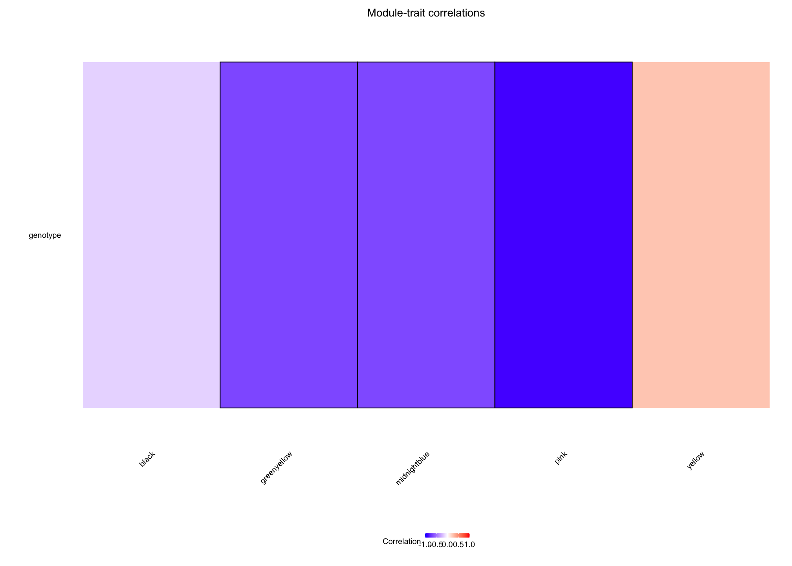
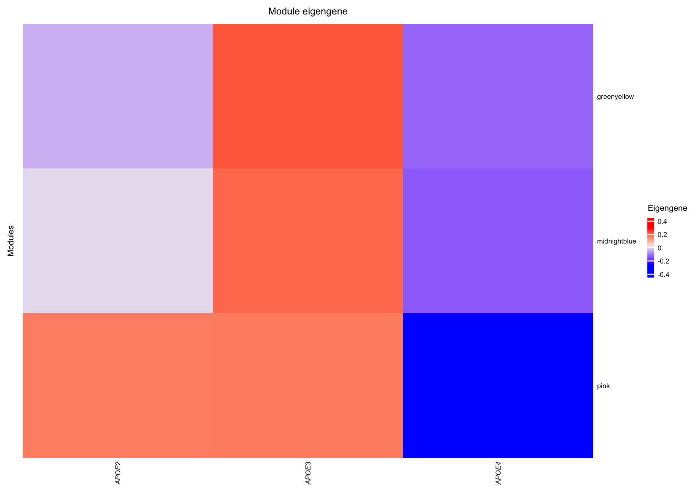

Validation cohort \#2 (young female mice) for dissociated lungs in
APOE-knock-in mice
================
Benjamin Ostendorf
2022-08-08

``` r
library(DESeq2)
library(ComplexHeatmap)
library(RColorBrewer)
library(WGCNA)
library(tidyverse)

source("../../auxiliary/helper_functions.R")
knitr::opts_chunk$set(fig.retina = 3)

## Set ComplexHeatmap options
ht_opt("heatmap_row_names_gp" = gpar(fontsize = 5), 
       "heatmap_column_names_gp" = gpar(fontsize = 5), 
       "heatmap_row_title_gp" = gpar(fontsize = 6), 
       "heatmap_column_title_gp" = gpar(fontsize = 7), 
       "legend_title_gp" = gpar(fontsize = 6), 
       "legend_labels_gp" = gpar(fontsize = 5), 
       "legend_grid_height" = unit(2, "mm"), 
       "legend_grid_width" = unit(2, "mm"))
```

## Import data

A DESeq2 object for import can be found
[here](https://www.ncbi.nlm.nih.gov/geo/query/acc.cgi?acc=GSE200132).  
Place it into `../../data/RNAseq`.

``` r
## ----------------------------------------
## Prepare data for WGCNA
## ----------------------------------------
dds <- readRDS("../../data/RNAseq/dds_GSE200132.rds")
metadata <- data.frame(genotype = dds$condition, 
                       sample = colnames(dds))

## Get log2-transformed and scaled gene expression data
counts_norm <- counts(dds, normalized = TRUE)
counts_log2 <- log2(counts_norm + 1)
counts_scaled <- t(scale(t(counts_log2)))

## Get variance stabilized expression as input for WGCNA as recommended by package authors
df_vsd <- getVarianceStabilizedData(dds)
df_rv <- rowVars(df_vsd)

## Get top 30% variable genes
q70_cutoff <- quantile(rowVars(df_vsd), 0.7)
expr_normalized <- df_vsd[df_rv > q70_cutoff, ]

expr_normalized_df <- 
  data.frame(expr_normalized) |>
  mutate(Gene_id = row.names(expr_normalized)) |>
  pivot_longer(-Gene_id)

## Transpose for WGCNA
input_mat <- t(expr_normalized)
```

## Calculate score of eigengenes as defined in GSE184287

``` r
## Get input matrix for manual calculation of eigengenes as defined in batch 01
expr_normalized_df_allquartiles <- 
  data.frame(df_vsd) |>
  mutate(Gene_id = row.names(df_vsd)) |>
  pivot_longer(-Gene_id)

## Transpose for WGCNA
input_mat_all_quartiles <- t(df_vsd)

gene_modules <-  read_tsv("../../data/RNAseq/gene_modules.txt")
```

    ## 
    ## ── Column specification ────────────────────────────────────────────────────────
    ## cols(
    ##   gene_id = col_character(),
    ##   colors = col_character()
    ## )

``` r
gene_modules_sorted <-  
  tibble(gene_id = colnames(input_mat_all_quartiles)) |>
  left_join(gene_modules)
```

    ## Joining, by = "gene_id"

``` r
gene_modules_sorted$colors[is.na(gene_modules_sorted$colors)] <- "grey"
  
colnames(input_mat_all_quartiles)[which(gene_modules_sorted$colors == "greenyellow")]
```

    ##  [1] "Fcmr"      "Kif21b"    "Fcrla"     "Cr2"       "Ptprj"     "Zfp831"   
    ##  [7] "Fcrl1"     "Lef1"      "Bank1"     "Pax5"      "Klb"       "Abcg3"    
    ## [13] "Dtx1"      "Nup210"    "Il5ra"     "Cd22"      "Siglecg"   "Spib"     
    ## [19] "Cd19"      "Tspan32"   "Fcer2a"    "Cxcr5"     "Pou2af1"   "Col6a5"   
    ## [25] "Bcl11a"    "Limd2"     "Cd79b"     "Gm11690"   "Bcl11b"    "Ero1b"    
    ## [31] "Serpinb1a" "Gm30054"   "Wdfy4"     "Blk"       "Tnfrsf13c" "Gm35545"  
    ## [37] "Btla"      "Ccr6"      "Tpsb2"     "Mzb1"      "Cd74"      "Cd226"    
    ## [43] "Ms4a1"     "BE692007"  "Srpk3"

``` r
MEs <- moduleEigengenes(input_mat_all_quartiles,
                        colors = gene_modules_sorted$colors)

MEs_df <- 
  tibble(sample = rownames(input_mat_all_quartiles),
         black = MEs$eigengenes$MEblack, 
         greenyellow = MEs$eigengenes$MEgreenyellow,
         midnightblue = MEs$eigengenes$MEmidnightblue, 
         pink = MEs$eigengenes$MEpink, 
         yellow = MEs$eigengenes$MEyellow) |>
  full_join(metadata)
```

    ## Joining, by = "sample"

## Assess significance of module difference across conditions (using MEs as defined in GSE184287)

``` r
## the following assess the Pearson correlation between module eigengenes and traits, as encoded by APOE(APOE3 = 1, APOE2 = 3.51, APOE4 = 6.54 as determined by survival data in fig.1) and timepoint (0, 2, 4)

## Encode genotype levels the same way as hazard ratios determined for APOE
genotype_levels <- 
  as.character(metadata$genotype) |>
  recode("APOE2" = "3.51", 
         "APOE3" = "1", 
         "APOE4" = "6.54") |>
  as.numeric()

## Custom correlation function
cor_fun <- function(df, factor_levels, ...) {
  cor.test(df, factor_levels, method = "pearson", ...) |> 
    broom::tidy()
}

MEs_mtx <- as.data.frame(MEs_df[, 2:6])
rownames(MEs_mtx) <- MEs_df$sample

## Calculate correlation for genotype
genotype_cor <- map(MEs_mtx, cor_fun, genotype_levels)
genotype_cor_df <- 
  bind_rows(genotype_cor, .id = "module") |>
  mutate(alternative = "one.sided", 
         p.value = p.value / 2)
genotype_cor_filt <- 
  genotype_cor_df |>
  mutate(trait = "genotype") |>
  dplyr::select(module, trait, estimate, p.value)

## Get module order from average module plot
modules_in_order <- c("black", "greenyellow", "midnightblue", "pink", "yellow")

## Join results for trait correlations
trait_cors <- 
  bind_rows(genotype_cor_filt) |>
  mutate(sig = case_when(p.value < 0.05 ~ "sig", 
                         TRUE ~ "n.s."), 
         module = gsub("^ME", "", module)) |>
  mutate(module = forcats::fct_relevel(module, modules_in_order))

modules_sig_cor_APOE <- 
  trait_cors |>
  arrange(module, desc(module)) |>
  filter(p.value < 0.05, trait == "genotype") |>
  pull(module) |>
  as.character()
```

## ED Fig 3d

``` r
p_module_trait_cors <-
  ggplot(trait_cors) +
  geom_tile(aes(x = trait, y = module, fill = estimate),
            size = 1) +
  geom_tile(data = filter(trait_cors, sig == "sig"),
            aes(x = trait, y = module),
            size = 0.25,
            colour = "black",
            fill = "transparent") +
  scale_fill_gradient2(
    low = "blue",
    high = "red",
    mid = "white",
    midpoint = 0,
    limit = c(-1,1)) +
  labs(x = "", y = "", fill = "Correlation", p.value = "", title = "Module-trait correlations") +
  guides(x = guide_axis(angle = 45)) +
  theme_minimal() +
  theme(panel.grid.major = element_blank(),
        panel.border = element_blank(),
        panel.background = element_blank(),
        axis.ticks = element_blank(), 
        axis.text = element_text(size = 5, color = "black"), 
        plot.title = element_text(size = 7, hjust = 0.5), 
        legend.text = element_text(size = 5), 
        legend.title = element_text(size = 5), 
        legend.key.height = unit(0.1, "cm"), 
        legend.key.width = unit(0.2, "cm"), 
        legend.position = "bottom"
        ) +
  coord_flip()

p_module_trait_cors
```



## ED Fig 3e

``` r
## Prepare mtx for main heatmap
avg_ME <-
  MEs_df |>
  pivot_longer(cols = !c(sample, genotype), names_to = "module", values_to = "value") |>
  group_by(genotype, module) |>
  summarize(mean_value = mean(value)) |>
  pivot_wider(id_cols = genotype, names_from = module, values_from = mean_value) |>
  select(greenyellow, midnightblue, pink, genotype) |>
  relocate(genotype, greenyellow, midnightblue, pink)
```

    ## `summarise()` has grouped output by 'genotype'. You can override using the `.groups` argument.

``` r
avg_ME_mtx <- as.matrix(avg_ME[, -1])
rownames(avg_ME_mtx) <- avg_ME$genotype
avg_ME_mtx_t <- t(avg_ME_mtx)

## Generate top annotation
ha_avg_condition <- 
  HeatmapAnnotation(Genotype = gsub(".*_(E\\d)", paste0("APO", "\\1"), avg_ME$genotype),
                    col = 
                      list(
                      Genotype = c(
                        `APOE2` =  pal_APOE[1],
                        `APOE3` =  pal_APOE[2],
                        `APOE4` =  pal_APOE[3])),
                    annotation_name_side = "left", 
       annotation_name_gp = gpar(fontsize = 6), 
       annotation_legend_param = list(
         Genotype = list(
           at = c("APOE2", "APOE3", "APOE4"),
           labels_gp = gpar(fontface = "italic",
                            fontsize = 5))), 
       simple_anno_size = unit(2, "mm"))

hm_avg_ME <-
  Heatmap(avg_ME_mtx_t,
          name = "Eigengene",
          column_title = "Module eigengene",
          cluster_columns = FALSE,
          cluster_rows = FALSE, 
          column_gap = unit(0.5, "mm"), 
          heatmap_legend_param = list(
              labels_gp = gpar(fontsize = 5), 
              legend_height = unit(1.5, "cm"), 
              legend_width = unit(0.5, "cm"),
              grid_width = unit(0.15, "cm"), 
              ncol = 1), 
          row_title = "Modules", 
          row_dend_width = unit(0.3, "cm"), 
          column_names_gp = gpar(fontface = "italic", fontsize = 5))

draw(hm_avg_ME, merge_legend = TRUE)
```



## Session info

``` r
devtools::session_info()
```

    ## ─ Session info ───────────────────────────────────────────────────────────────
    ##  setting  value                       
    ##  version  R version 4.1.0 (2021-05-18)
    ##  os       macOS Big Sur 10.16         
    ##  system   x86_64, darwin17.0          
    ##  ui       X11                         
    ##  language (EN)                        
    ##  collate  en_US.UTF-8                 
    ##  ctype    en_US.UTF-8                 
    ##  tz       Europe/Berlin               
    ##  date     2022-08-24                  
    ## 
    ## ─ Packages ───────────────────────────────────────────────────────────────────
    ##  package              * version  date       lib source        
    ##  annotate               1.70.0   2021-05-19 [1] Bioconductor  
    ##  AnnotationDbi          1.54.0   2021-05-19 [1] Bioconductor  
    ##  assertthat             0.2.1    2019-03-21 [1] CRAN (R 4.1.0)
    ##  backports              1.2.1    2020-12-09 [1] CRAN (R 4.1.0)
    ##  base64enc              0.1-3    2015-07-28 [1] CRAN (R 4.1.0)
    ##  Biobase              * 2.52.0   2021-05-19 [1] Bioconductor  
    ##  BiocGenerics         * 0.38.0   2021-05-19 [1] Bioconductor  
    ##  BiocParallel           1.26.0   2021-05-19 [1] Bioconductor  
    ##  Biostrings             2.60.0   2021-05-19 [1] Bioconductor  
    ##  bit                    4.0.4    2020-08-04 [1] CRAN (R 4.1.0)
    ##  bit64                  4.0.5    2020-08-30 [1] CRAN (R 4.1.0)
    ##  bitops                 1.0-7    2021-04-24 [1] CRAN (R 4.1.0)
    ##  blob                   1.2.1    2020-01-20 [1] CRAN (R 4.1.0)
    ##  broom                  0.7.6    2021-04-05 [1] CRAN (R 4.1.0)
    ##  cachem                 1.0.5    2021-05-15 [1] CRAN (R 4.1.0)
    ##  Cairo                  1.5-12.2 2020-07-07 [1] CRAN (R 4.1.0)
    ##  callr                  3.7.0    2021-04-20 [1] CRAN (R 4.1.0)
    ##  cellranger             1.1.0    2016-07-27 [1] CRAN (R 4.1.0)
    ##  checkmate              2.0.0    2020-02-06 [1] CRAN (R 4.1.0)
    ##  circlize               0.4.12   2021-01-08 [1] CRAN (R 4.1.0)
    ##  cli                    2.5.0    2021-04-26 [1] CRAN (R 4.1.0)
    ##  clue                   0.3-59   2021-04-16 [1] CRAN (R 4.1.0)
    ##  cluster                2.1.2    2021-04-17 [1] CRAN (R 4.1.0)
    ##  codetools              0.2-18   2020-11-04 [1] CRAN (R 4.1.0)
    ##  colorspace             2.0-1    2021-05-04 [1] CRAN (R 4.1.0)
    ##  ComplexHeatmap       * 2.8.0    2021-05-19 [1] Bioconductor  
    ##  crayon                 1.4.1    2021-02-08 [1] CRAN (R 4.1.0)
    ##  data.table             1.14.0   2021-02-21 [1] CRAN (R 4.1.0)
    ##  DBI                    1.1.1    2021-01-15 [1] CRAN (R 4.1.0)
    ##  dbplyr                 2.1.1    2021-04-06 [1] CRAN (R 4.1.0)
    ##  DelayedArray           0.18.0   2021-05-19 [1] Bioconductor  
    ##  desc                   1.3.0    2021-03-05 [1] CRAN (R 4.1.0)
    ##  DESeq2               * 1.32.0   2021-05-19 [1] Bioconductor  
    ##  devtools               2.4.1    2021-05-05 [1] CRAN (R 4.1.0)
    ##  digest                 0.6.29   2021-12-01 [1] CRAN (R 4.1.0)
    ##  doParallel             1.0.16   2020-10-16 [1] CRAN (R 4.1.0)
    ##  dplyr                * 1.0.6    2021-05-05 [1] CRAN (R 4.1.0)
    ##  dynamicTreeCut       * 1.63-1   2016-03-11 [1] CRAN (R 4.1.0)
    ##  ellipsis               0.3.2    2021-04-29 [1] CRAN (R 4.1.0)
    ##  evaluate               0.14     2019-05-28 [1] CRAN (R 4.1.0)
    ##  fansi                  0.5.0    2021-05-25 [1] CRAN (R 4.1.0)
    ##  farver                 2.1.0    2021-02-28 [1] CRAN (R 4.1.0)
    ##  fastcluster          * 1.2.3    2021-05-24 [1] CRAN (R 4.1.0)
    ##  fastmap                1.1.0    2021-01-25 [1] CRAN (R 4.1.0)
    ##  forcats              * 0.5.1    2021-01-27 [1] CRAN (R 4.1.0)
    ##  foreach                1.5.1    2020-10-15 [1] CRAN (R 4.1.0)
    ##  foreign                0.8-81   2020-12-22 [1] CRAN (R 4.1.0)
    ##  Formula                1.2-4    2020-10-16 [1] CRAN (R 4.1.0)
    ##  fs                     1.5.0    2020-07-31 [1] CRAN (R 4.1.0)
    ##  genefilter             1.74.0   2021-05-19 [1] Bioconductor  
    ##  geneplotter            1.70.0   2021-05-19 [1] Bioconductor  
    ##  generics               0.1.0    2020-10-31 [1] CRAN (R 4.1.0)
    ##  GenomeInfoDb         * 1.28.0   2021-05-19 [1] Bioconductor  
    ##  GenomeInfoDbData       1.2.6    2021-05-23 [1] Bioconductor  
    ##  GenomicRanges        * 1.44.0   2021-05-19 [1] Bioconductor  
    ##  GetoptLong             1.0.5    2020-12-15 [1] CRAN (R 4.1.0)
    ##  ggplot2              * 3.3.5    2021-06-25 [1] CRAN (R 4.1.0)
    ##  GlobalOptions          0.1.2    2020-06-10 [1] CRAN (R 4.1.0)
    ##  glue                   1.6.0    2021-12-17 [1] CRAN (R 4.1.0)
    ##  GO.db                  3.13.0   2021-05-24 [1] Bioconductor  
    ##  gridExtra              2.3      2017-09-09 [1] CRAN (R 4.1.0)
    ##  gtable                 0.3.0    2019-03-25 [1] CRAN (R 4.1.0)
    ##  haven                  2.4.1    2021-04-23 [1] CRAN (R 4.1.0)
    ##  highr                  0.9      2021-04-16 [1] CRAN (R 4.1.0)
    ##  Hmisc                  4.5-0    2021-02-28 [1] CRAN (R 4.1.0)
    ##  hms                    1.1.0    2021-05-17 [1] CRAN (R 4.1.0)
    ##  htmlTable              2.2.1    2021-05-18 [1] CRAN (R 4.1.0)
    ##  htmltools              0.5.2    2021-08-25 [1] CRAN (R 4.1.0)
    ##  htmlwidgets            1.5.3    2020-12-10 [1] CRAN (R 4.1.0)
    ##  httr                   1.4.2    2020-07-20 [1] CRAN (R 4.1.0)
    ##  impute                 1.66.0   2021-05-19 [1] Bioconductor  
    ##  IRanges              * 2.26.0   2021-05-19 [1] Bioconductor  
    ##  iterators              1.0.13   2020-10-15 [1] CRAN (R 4.1.0)
    ##  jpeg                   0.1-8.1  2019-10-24 [1] CRAN (R 4.1.0)
    ##  jsonlite               1.7.2    2020-12-09 [1] CRAN (R 4.1.0)
    ##  KEGGREST               1.32.0   2021-05-19 [1] Bioconductor  
    ##  knitr                  1.37     2021-12-16 [1] CRAN (R 4.1.0)
    ##  labeling               0.4.2    2020-10-20 [1] CRAN (R 4.1.0)
    ##  lattice                0.20-44  2021-05-02 [1] CRAN (R 4.1.0)
    ##  latticeExtra           0.6-29   2019-12-19 [1] CRAN (R 4.1.0)
    ##  lifecycle              1.0.0    2021-02-15 [1] CRAN (R 4.1.0)
    ##  locfit                 1.5-9.4  2020-03-25 [1] CRAN (R 4.1.0)
    ##  lubridate              1.7.10   2021-02-26 [1] CRAN (R 4.1.0)
    ##  magrittr               2.0.1    2020-11-17 [1] CRAN (R 4.1.0)
    ##  Matrix                 1.3-3    2021-05-04 [1] CRAN (R 4.1.0)
    ##  MatrixGenerics       * 1.4.0    2021-05-19 [1] Bioconductor  
    ##  matrixStats          * 0.58.0   2021-01-29 [1] CRAN (R 4.1.0)
    ##  memoise                2.0.0    2021-01-26 [1] CRAN (R 4.1.0)
    ##  modelr                 0.1.8    2020-05-19 [1] CRAN (R 4.1.0)
    ##  munsell                0.5.0    2018-06-12 [1] CRAN (R 4.1.0)
    ##  nnet                   7.3-16   2021-05-03 [1] CRAN (R 4.1.0)
    ##  pillar                 1.6.1    2021-05-16 [1] CRAN (R 4.1.0)
    ##  pkgbuild               1.2.0    2020-12-15 [1] CRAN (R 4.1.0)
    ##  pkgconfig              2.0.3    2019-09-22 [1] CRAN (R 4.1.0)
    ##  pkgload                1.2.1    2021-04-06 [1] CRAN (R 4.1.0)
    ##  png                    0.1-7    2013-12-03 [1] CRAN (R 4.1.0)
    ##  preprocessCore         1.54.0   2021-05-19 [1] Bioconductor  
    ##  prettyunits            1.1.1    2020-01-24 [1] CRAN (R 4.1.0)
    ##  processx               3.5.2    2021-04-30 [1] CRAN (R 4.1.0)
    ##  ps                     1.6.0    2021-02-28 [1] CRAN (R 4.1.0)
    ##  purrr                * 0.3.4    2020-04-17 [1] CRAN (R 4.1.0)
    ##  R6                     2.5.1    2021-08-19 [1] CRAN (R 4.1.0)
    ##  RColorBrewer         * 1.1-2    2014-12-07 [1] CRAN (R 4.1.0)
    ##  Rcpp                   1.0.7    2021-07-07 [1] CRAN (R 4.1.0)
    ##  RCurl                  1.98-1.3 2021-03-16 [1] CRAN (R 4.1.0)
    ##  readr                * 1.4.0    2020-10-05 [1] CRAN (R 4.1.0)
    ##  readxl                 1.3.1    2019-03-13 [1] CRAN (R 4.1.0)
    ##  remotes                2.3.0    2021-04-01 [1] CRAN (R 4.1.0)
    ##  reprex                 2.0.0    2021-04-02 [1] CRAN (R 4.1.0)
    ##  rjson                  0.2.20   2018-06-08 [1] CRAN (R 4.1.0)
    ##  rlang                  0.4.12   2021-10-18 [1] CRAN (R 4.1.0)
    ##  rmarkdown              2.11     2021-09-14 [1] CRAN (R 4.1.0)
    ##  rpart                  4.1-15   2019-04-12 [1] CRAN (R 4.1.0)
    ##  rprojroot              2.0.2    2020-11-15 [1] CRAN (R 4.1.0)
    ##  RSQLite                2.2.7    2021-04-22 [1] CRAN (R 4.1.0)
    ##  rstudioapi             0.13     2020-11-12 [1] CRAN (R 4.1.0)
    ##  rvest                  1.0.0    2021-03-09 [1] CRAN (R 4.1.0)
    ##  S4Vectors            * 0.30.0   2021-05-19 [1] Bioconductor  
    ##  scales                 1.1.1    2020-05-11 [1] CRAN (R 4.1.0)
    ##  sessioninfo            1.1.1    2018-11-05 [1] CRAN (R 4.1.0)
    ##  shape                  1.4.6    2021-05-19 [1] CRAN (R 4.1.0)
    ##  stringi                1.7.6    2021-11-29 [1] CRAN (R 4.1.0)
    ##  stringr              * 1.4.0    2019-02-10 [1] CRAN (R 4.1.0)
    ##  SummarizedExperiment * 1.22.0   2021-05-19 [1] Bioconductor  
    ##  survival               3.2-11   2021-04-26 [1] CRAN (R 4.1.0)
    ##  testthat               3.0.2    2021-02-14 [1] CRAN (R 4.1.0)
    ##  tibble               * 3.1.2    2021-05-16 [1] CRAN (R 4.1.0)
    ##  tidyr                * 1.1.3    2021-03-03 [1] CRAN (R 4.1.0)
    ##  tidyselect             1.1.1    2021-04-30 [1] CRAN (R 4.1.0)
    ##  tidyverse            * 1.3.1    2021-04-15 [1] CRAN (R 4.1.0)
    ##  usethis                2.0.1    2021-02-10 [1] CRAN (R 4.1.0)
    ##  utf8                   1.2.1    2021-03-12 [1] CRAN (R 4.1.0)
    ##  vctrs                  0.3.8    2021-04-29 [1] CRAN (R 4.1.0)
    ##  WGCNA                * 1.70-3   2021-02-28 [1] CRAN (R 4.1.0)
    ##  withr                  2.4.2    2021-04-18 [1] CRAN (R 4.1.0)
    ##  xfun                   0.29     2021-12-14 [1] CRAN (R 4.1.0)
    ##  XML                    3.99-0.6 2021-03-16 [1] CRAN (R 4.1.0)
    ##  xml2                   1.3.2    2020-04-23 [1] CRAN (R 4.1.0)
    ##  xtable                 1.8-4    2019-04-21 [1] CRAN (R 4.1.0)
    ##  XVector                0.32.0   2021-05-19 [1] Bioconductor  
    ##  yaml                   2.2.1    2020-02-01 [1] CRAN (R 4.1.0)
    ##  zlibbioc               1.38.0   2021-05-19 [1] Bioconductor  
    ## 
    ## [1] /Library/Frameworks/R.framework/Versions/4.1/Resources/library
