scRNAseq of dissociated lungs of APOE knock-in mice
================
Benjamin Ostendorf
2022-08-08

## Preamble

``` r
library(Seurat)
library(Matrix)
library(ggpubr)
library(clusterProfiler)
library(ReactomePA)
library(org.Mm.eg.db)
library(msigdbr)
library(ggrastr)
library(RColorBrewer)
library(ComplexHeatmap)
library(tidyverse)

source("../../auxiliary/helper_functions.R")
source("subscripts/scRNAseq_aux.R")
knitr::opts_chunk$set(fig.retina = 3)
```

## Load data (output from Parse Biosciences pipeline)

The required input files can be downloaded from GEO repository
[GSE199498](https://www.ncbi.nlm.nih.gov/geo/query/acc.cgi?acc=GSE199498).

``` r
if (!file.exists("../../data/scRNAseq/Seurat.RDS")) {
  
  ## Data import and wrangling
  source("subscripts/import_data.R")
 
  ## Seurat workflow
  source("subscripts/subset_Seurat.R")
}
df <- readRDS("../../data/scRNAseq/Seurat.RDS")
```

## Cell annotation and subclustering

``` r
## Rename clusters
source("subscripts/rename_clusters.R")

## Subclustering lymphocytes and reorder clusters
source("subscripts/subclustering_T_cells.R")
```

    ## Warning in simpleLoess(y, x, w, span, degree = degree, parametric =
    ## parametric, : pseudoinverse used at -3.204

    ## Warning in simpleLoess(y, x, w, span, degree = degree, parametric =
    ## parametric, : neighborhood radius 0.30103

    ## Warning in simpleLoess(y, x, w, span, degree = degree, parametric =
    ## parametric, : reciprocal condition number 1.6491e-14

    ## Warning in simpleLoess(y, x, w, span, degree = degree, parametric =
    ## parametric, : There are other near singularities as well. 0.22764

    ## Centering and scaling data matrix

    ## PC_ 1 
    ## Positive:  Il23r, Ccr7, Il2ra, Cd163l1, Myo3b, Ctla4, Ikzf2, Pdcd1, Il17rb, Ifngas1 
    ##     Neb, Il21r, Got1, Gm44174, Cd40lg, Nr4a3, Elovl6, 5830411N06Rik, Irf4, Rgcc 
    ##     Dnah8, Tnfsf11, Ar, Trdc, Ptpn13, Tagap, Car12, Blk, 1600014C10Rik, Kcnc1 
    ## Negative:  Ptprg, Galnt18, Adgrf5, Prickle2, Calcrl, Epas1, Bmpr2, Adgrl3, Ptprb, Ptprm 
    ##     Fendrr, Ldb2, Flt1, Slco2a1, Shank3, Nckap5, Cd93, Nfib, Clic4, Pard3b 
    ##     Cdk14, Cdh5, Tcf4, Tspan7, Pde3a, Rapgef5, Ace, Cyyr1, Cd36, Adgrl2 
    ## PC_ 2 
    ## Positive:  Prickle2, Rgs6, Ednrb, 4930554G24Rik, Rgs12, Tmem100, St5, Pde8b, Atp8a1, Tbx3os1 
    ##     Gnao1, Ncald, Scn7a, Aff3, Tmcc2, Fendrr, Car4, Cyp4b1, Sema3c, Grb14 
    ##     Galnt18, Smad6, Egflam, Psd3, Clec1a, Calcrl, Nckap5, Clic5, Afap1l1, Meis1 
    ## Negative:  Mki67, Top2a, Cenpf, Knl1, Kif15, Prc1, Aspm, Kif11, Diaph3, Cenpe 
    ##     Kif4, Neil3, Iqgap3, Anln, Ncapg2, Cit, Smc2, Kif14, Spag5, Incenp 
    ##     Ect2, Cenpp, Tpx2, Rad51b, Kntc1, Nusap1, Ccna2, Pclaf, Tubb5, Efcab11 
    ## PC_ 3 
    ## Positive:  Ptprb, Acer2, Cadm1, Hmcn1, Plcb1, Mctp1, Tek, Prex2, Ldb2, Vegfa 
    ##     Ntrk2, Adamts9, Vwf, Samd12, Cd93, Sema3c, Nckap5, Adgrl3, Ncald, Bmp6 
    ##     Egr1, Itga1, Atf3, Tmem2, Pde3a, Kit, Adamts1, Myrip, Mcf2l, Ntn1 
    ## Negative:  Rgs6, Ednrb, Pde8b, Igfbp7, Lmntd1, Emp2, Tmeff2, Egflam, Carmil1, Kdr 
    ##     2610203C22Rik, Grb14, Tbx3os1, Car4, Sema5a, D630045J12Rik, Slc22a23, Itga3, Kalrn, Chst1 
    ##     Ccdc68, Kitl, Dpysl5, Gnao1, Ampd3, Tln2, Tbx3, Cyp4b1, Dapk1, Mertk 
    ## PC_ 4 
    ## Positive:  Il1b, Nr4a3, St6galnac3, Mpp7, Il1r2, Ncf2, Nfkb1, Fosb, Ern1, Il2ra 
    ##     Furin, Pde7b, Hdc, Itgav, Antxr2, Il23r, Il1rl1, Tpd52, Lyn, Igf1r 
    ##     Fos, Gm49339, Alcam, Syk, Thbs1, Smox, Trem1, Litaf, Cers6, Csf2rb 
    ## Negative:  Hpgd, Nckap5, Hmcn1, Cenpf, Tmem100, Sema3c, Ccdc85a, Myzap, Samd12, Tspan18 
    ##     Fmo1, Calcrl, Mki67, Top2a, Fendrr, Scn7a, Clec1a, Aspm, Mcc, Kif4 
    ##     Cavin2, Cenpe, Cadps2, Prickle2, 9530026P05Rik, Pde3a, Tspan7, Neil3, Ncald, Knl1 
    ## PC_ 5 
    ## Positive:  Selp, Emp1, Adamts4, Prkcg, Il1b, Gda, Actn1, Serpine1, Tinagl1, Vcam1 
    ##     Nr2f2, Akap12, Lyve1, Adamts9, Cmss1, Adamts1, Tgm2, Col15a1, Cgnl1, Tm4sf1 
    ##     S100a9, Timp3, Osmr, Zfp423, Prss23, Ncf2, Ptgs2, Col4a1, Tmem252, Litaf 
    ## Negative:  St6galnac3, Il2ra, Il23r, Large1, Cd163l1, Pard3, Adam12, Blk, Igf1r, Il1rl1 
    ##     Gata3, Clnk, Il1r1, Mpp7, Myo1e, Nfkb1, Il17rb, Ret, Ern1, Fstl4 
    ##     Trdc, Ablim3, Nav2, Itgav, Furin, Abi3bp, Ptpn13, Pdcd1, Ikzf2, Dach2

    ## Warning: The default method for RunUMAP has changed from calling Python UMAP via reticulate to the R-native UWOT using the cosine metric
    ## To use Python UMAP via reticulate, set umap.method to 'umap-learn' and metric to 'correlation'
    ## This message will be shown once per session

    ## 21:55:47 UMAP embedding parameters a = 0.9922 b = 1.112

    ## 21:55:47 Read 3199 rows and found 20 numeric columns

    ## 21:55:47 Using Annoy for neighbor search, n_neighbors = 30

    ## 21:55:47 Building Annoy index with metric = cosine, n_trees = 50

    ## 0%   10   20   30   40   50   60   70   80   90   100%

    ## [----|----|----|----|----|----|----|----|----|----|

    ## **************************************************|
    ## 21:55:48 Writing NN index file to temp file /var/folders/xt/j3nnbk7d3674zfrqlsr5kx340000gn/T//RtmptzFhSH/file3e3c6845c539
    ## 21:55:48 Searching Annoy index using 1 thread, search_k = 3000
    ## 21:55:48 Annoy recall = 100%
    ## 21:55:49 Commencing smooth kNN distance calibration using 1 thread
    ## 21:55:50 Initializing from normalized Laplacian + noise
    ## 21:55:50 Commencing optimization for 500 epochs, with 146382 positive edges
    ## 21:55:55 Optimization finished
    ## Computing nearest neighbor graph
    ## Computing SNN

    ## Modularity Optimizer version 1.3.0 by Ludo Waltman and Nees Jan van Eck
    ## 
    ## Number of nodes: 3199
    ## Number of edges: 125333
    ## 
    ## Running Louvain algorithm...
    ## Maximum modularity in 10 random starts: 0.8277
    ## Number of communities: 10
    ## Elapsed time: 0 seconds

    ## Calculating cluster 0
    ## Calculating cluster 1
    ## Calculating cluster 2
    ## Calculating cluster 3
    ## Calculating cluster 4
    ## Calculating cluster 5
    ## Calculating cluster 6
    ## Calculating cluster 7
    ## Calculating cluster 8
    ## Calculating cluster 9

    ## Warning: The following arguments are not used: row.names

    ## Centering and scaling data matrix

``` r
saveRDS(df, "../../data/scRNAseq/seurat_processed.RDS")
```

## Determine DEGs

``` r
cluster.averages <- AverageExpression(object = df, return.seurat = TRUE)
```

    ## Warning: The following arguments are not used: row.names

    ## Centering and scaling data matrix

``` r
if (!file.exists("../../data/scRNAseq/diff_markers.RDS")) {
  markers <- FindAllMarkers(df, only.pos = TRUE, min.pct = 0.25)
  saveRDS(markers, "../../data/scRNAseq/diff_markers.RDS")
}
```

## Filter dataset and define subsets

``` r
if (!file.exists("../../data/scRNAseq/df_filt.RDS")){
  source("subscripts/filter_data.R")
}
df_filt <- readRDS("../../data/scRNAseq/df_filt.RDS")
df_filt.averages <- AverageExpression(df_filt, return.seurat = TRUE)
```

    ## Warning: The following arguments are not used: row.names

    ## Centering and scaling data matrix

``` r
## Define df subsets
source("subscripts/subset_data.R")
```

## ED Fig 5

``` r
## -----------------------------------------------
## ED Fig 5a
## -----------------------------------------------
tibble(sample = names(table(df_filt@meta.data$sample))) |>
  mutate(condition = case_when(grepl("ctrl", sample) ~ "Non-infected", 
                               grepl("inf", sample) ~ "Infected"), 
         genotype = case_when(grepl("E2", sample) ~ "APOE2", 
                              grepl("E3", sample) ~ "APOE3", 
                              grepl("E4", sample) ~ "APOE4")) |>
  mutate(condition = ordered(condition, levels = c("Non-infected", "Infected"))) |>
  ggplot(aes(x = condition, fill = genotype)) +
  geom_bar(position = position_dodge2(width = 0.7, preserve = "single")) +
  theme_custom2 +
  scale_fill_manual(values = pal_APOE) +
  guides(x = guide_axis(angle = 60)) +
  expand_limits(y = 8) +
  labs(title = "Samples for scRNA-seq", y = "Number of samples") +
  theme(legend.text = element_text(face = "italic"), 
        axis.title.x = element_blank(), 
        legend.spacing.x = unit(0.1, "char"), 
        legend.background = element_blank(), 
        legend.key = element_rect(fill = NA, colour = NA, size = 0.25), 
        legend.position = c(0.25, 0.92))
```

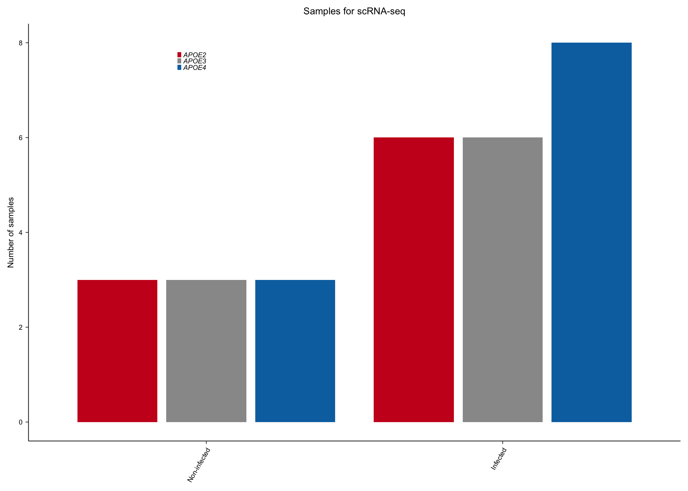

``` r
## -----------------------------------------------
## ED Fig 5b
## -----------------------------------------------
UMAP_df_filt |>
  ggplot(aes(x = UMAP_1, y = UMAP_2, color = celltype)) +
  geom_point_rast(size = 0.1, stroke = 0, shape = 16, raster.dpi = 600) +
  theme_minimal() +
  theme(panel.border = element_rect(size = custom_linewidth, fill = NA),
        panel.grid = element_blank(),
        axis.title = element_text(size = 6),
        axis.text = element_blank(),
        plot.title = element_text(size = 6),
        legend.title = element_blank(),
        legend.text = element_text(size = 5),
        legend.key.size = unit(0.4, "line"),
        strip.text.x = element_text(size = 6)) +
  scale_colour_manual(values =c(RColorBrewer::brewer.pal(7, "Greens"), # myeloid
                                "Blue",  # DCs
                                RColorBrewer::brewer.pal(6, "RdPu"), # lymphoid
                                RColorBrewer::brewer.pal(3, "Greys"), # Fibroblasts
                                RColorBrewer::brewer.pal(6, "Reds"), # ECs
                                RColorBrewer::brewer.pal(7, "Blues"),  
                                "black"), 
                      aesthetics = c("fill", "colour")) +
  guides(color = guide_legend(override.aes = list(size = 2.5))) +
  xlab("UMAP dim. 1") +
  ylab("UMAP dim. 2")
```

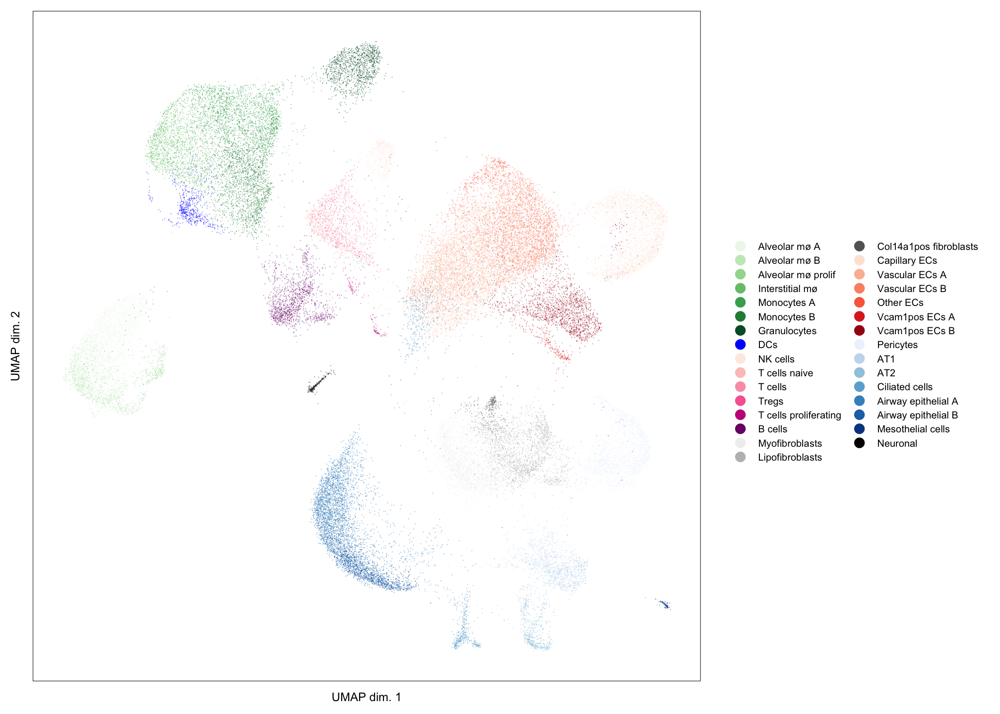

``` r
## -----------------------------------------------
## ED Fig 5c
## -----------------------------------------------
DoHeatmap(object = df_filt.averages, 
          features = unlist(lineage_markers_lung), draw.lines = FALSE, label = FALSE, 
          size = 2, raster = FALSE, group.bar = TRUE, group.bar.height = 0.005) +
  scale_fill_gradientn(colors = colorRampPalette(c("navy", "white", "firebrick3"))(50)) +
  xlab(label = colnames(cluster.averages)) +
  theme(axis.text.x = element_text(size = 5, angle = 45, hjust = 1, vjust = 1),
        axis.text.y = element_text(size = 5, face = "italic"),
        axis.title = element_blank(),
        legend.position = "none")
```

    ## Scale for 'fill' is already present. Adding another scale for 'fill', which
    ## will replace the existing scale.

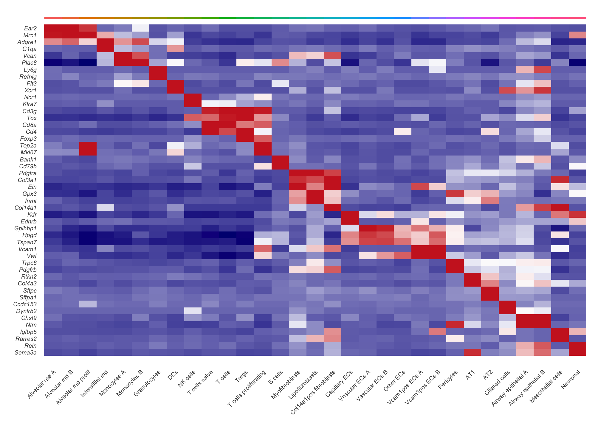

``` r
## -----------------------------------------------
## ED Fig 5d
## -----------------------------------------------
markers <-
  readRDS("../../data/scRNAseq/diff_markers.RDS") |> 
  slice(order(factor(cluster, levels = levels_clusters))) |>
  as_tibble()

markers_by_cluster_df_filt <- 
  markers |>
  group_by(cluster) |>
  filter(!grepl("misc", cluster)) |>
  slice_max(n = 3, order_by = avg_log2FC)

DoHeatmap(object = df_filt.averages, 
          features = markers_by_cluster_df_filt$gene, draw.lines = FALSE, 
          size = 2, raster = FALSE, group.bar = TRUE, group.bar.height = 0.005) +
  scale_fill_gradientn(colors = colorRampPalette(c("navy", "white", "firebrick3"))(50)) +
  xlab(label = colnames(df_filt.averages)) +
  theme(axis.text.x = element_text(size = 5, angle = 60, hjust = 1, vjust = 1),
        axis.text.y = element_text(size = 5, face = "italic"),
        axis.title = element_blank(),
        legend.position = "none")
```

    ## Scale for 'fill' is already present. Adding another scale for 'fill', which
    ## will replace the existing scale.

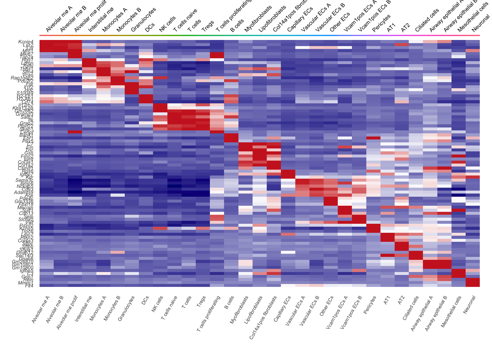

## ED Fig 6

``` r
## ----------------------------------------------------------
## ED Fig 6a
## ----------------------------------------------------------
subset_prop_all <- 
  as.data.frame(prop.table(x = table(df_filt$celltype_grouped, df_filt$sample), 
                           margin = 2) * 100) |>
  annotate_prop_df()

subset_prop_all |>
  plot_cell_prop(x = condition, y = Freq, fill = condition, facet_var = "celltype", 
                 comparisons = list(c("inf", "ctrl")), x_axis_face = "plain", 
                 fill_pal = RColorBrewer::brewer.pal(8, "Dark2")[1:2], nrow = 3)
```

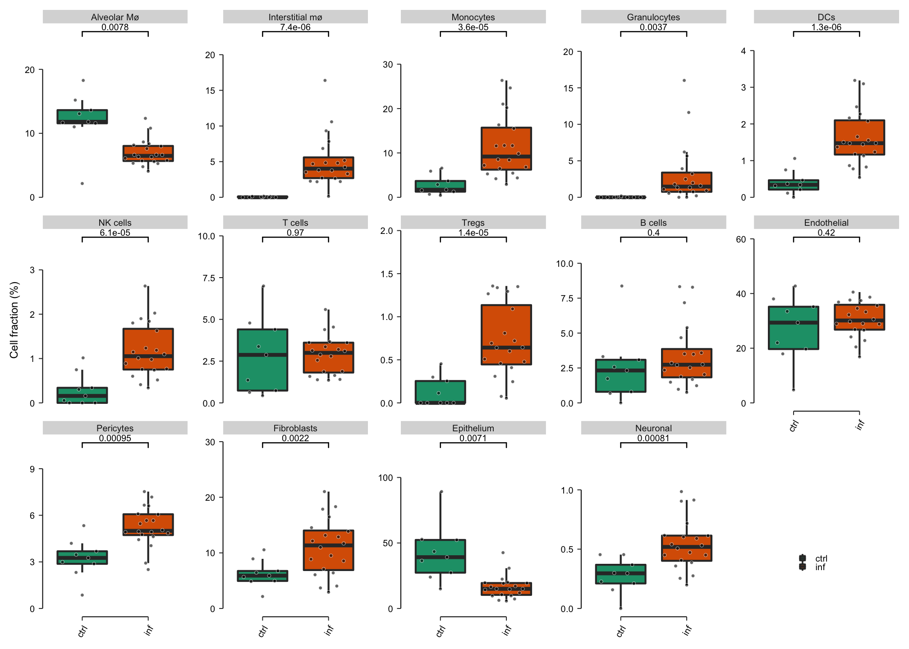

``` r
## ----------------------------------------------------------
## ED Fig 6b
## ----------------------------------------------------------
subset_prop_immune_inf <- 
  as.data.frame(prop.table(x = table(df_immune_inf$celltype_grouped, df_immune_inf$sample), 
                           margin = 2) * 100) |>
  annotate_prop_df()

subset_prop_immune_inf |>
  plot_cell_prop(x = genotype, y = Freq, fill = genotype, 
                 facet_var = "celltype", 
                 comparisons = APOE_contrasts_E3, 
                 ylab = "Fraction of immune cells (%)", nrow = 3)
```

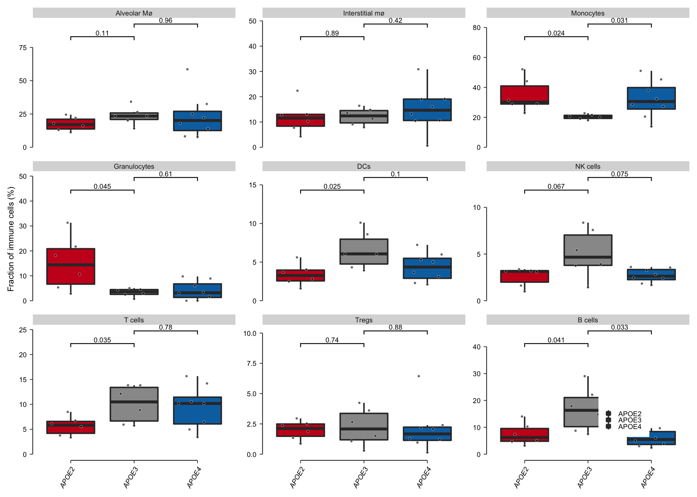

``` r
## ----------------------------------------------------------
## ED Fig 6c
## ----------------------------------------------------------
subset_prop_nonimmune_inf <- 
  as.data.frame(prop.table(x = table(df_nonimmune_inf$celltype_grouped, df_nonimmune_inf$sample), 
                           margin = 2) * 100) |>
  annotate_prop_df()

subset_prop_nonimmune_inf |>
  plot_cell_prop(x = genotype, y = Freq, fill = genotype, 
                 facet_var = "celltype", 
                 comparisons = APOE_contrasts_E3, 
                 ylab = "Fraction of non-immune cells (%)", nrow = 3)
```

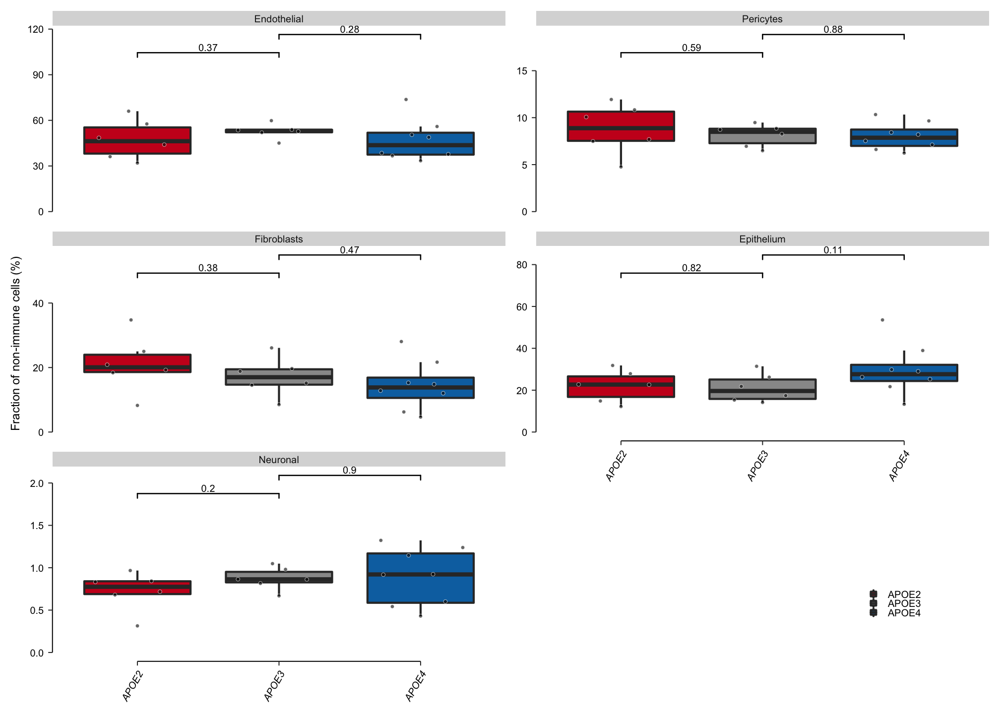

## Fig 3e-g

``` r
## ----------------------------------------------------------
## Fig 3e
## ----------------------------------------------------------
plot_density(UMAP_df_filt, "condition")
```

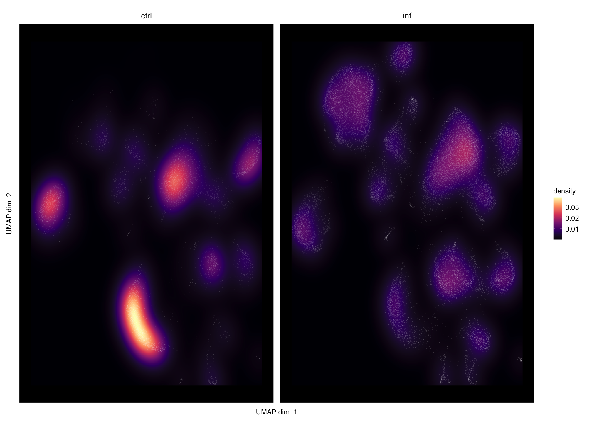

``` r
## ----------------------------------------------------------
## Fig 3f
## ----------------------------------------------------------
plot_density(UMAP_inf, "genotype")
```

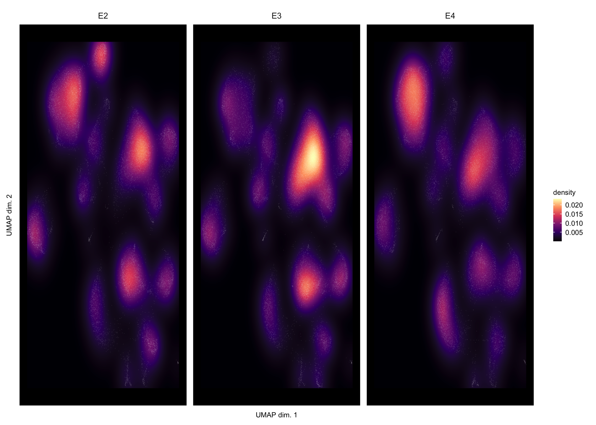

``` r
## ----------------------------------------------------------
## Fig 3g
## ----------------------------------------------------------
## Calculate DGEAs for grouped clusters
source("subscripts/DGEA.R")

## Perform GSEA and plot
source("subscripts/GSEA_analysis.R")
```

    ## Joining, by = "Description"

    ## Warning: `legend_height` you specified is too small, use the default minimal
    ## height.

    ## Warning: `legend_height` you specified is too small, use the default minimal
    ## height.

    ## Warning: `legend_height` you specified is too small, use the default minimal
    ## height.

    ## Joining, by = "Description"

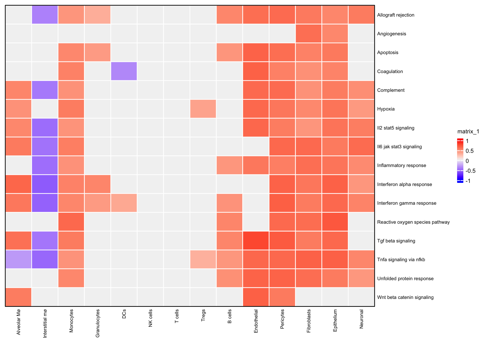

    ## Warning: `legend_height` you specified is too small, use the default minimal
    ## height.

    ## Warning: `legend_height` you specified is too small, use the default minimal
    ## height.

    ## Warning: `legend_height` you specified is too small, use the default minimal
    ## height.

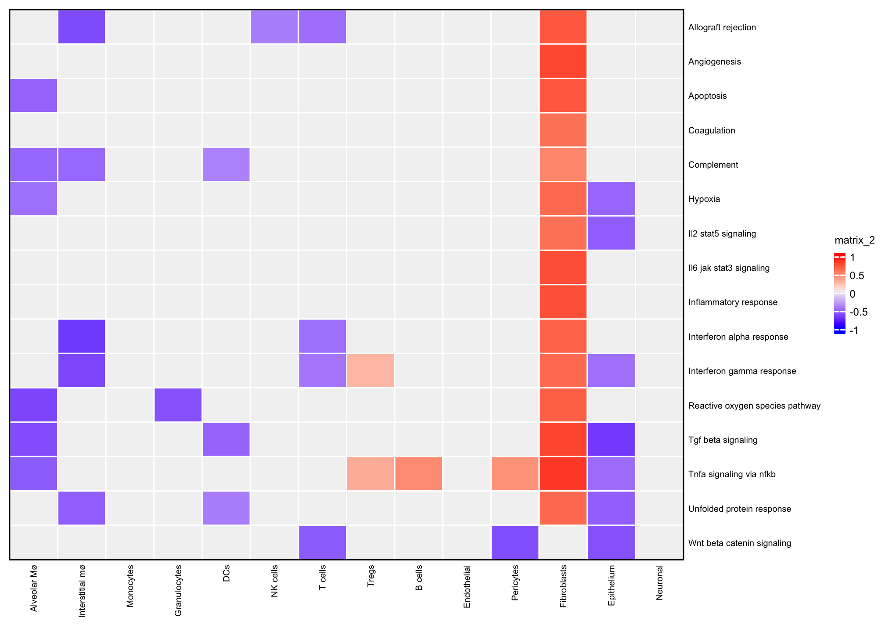

## Session info

``` r
devtools::session_info()
```

    ## ─ Session info ───────────────────────────────────────────────────────────────
    ##  setting  value                       
    ##  version  R version 4.1.0 (2021-05-18)
    ##  os       macOS Big Sur 10.16         
    ##  system   x86_64, darwin17.0          
    ##  ui       X11                         
    ##  language (EN)                        
    ##  collate  en_US.UTF-8                 
    ##  ctype    en_US.UTF-8                 
    ##  tz       Europe/Berlin               
    ##  date     2022-08-24                  
    ## 
    ## ─ Packages ───────────────────────────────────────────────────────────────────
    ##  package          * version  date       lib source        
    ##  abind              1.4-5    2016-07-21 [1] CRAN (R 4.1.0)
    ##  AnnotationDbi    * 1.54.0   2021-05-19 [1] Bioconductor  
    ##  ape                5.5      2021-04-25 [1] CRAN (R 4.1.0)
    ##  aplot              0.0.6    2020-09-03 [1] CRAN (R 4.1.0)
    ##  assertthat         0.2.1    2019-03-21 [1] CRAN (R 4.1.0)
    ##  babelgene          21.4     2021-04-26 [1] CRAN (R 4.1.0)
    ##  backports          1.2.1    2020-12-09 [1] CRAN (R 4.1.0)
    ##  beeswarm           0.3.1    2021-03-07 [1] CRAN (R 4.1.0)
    ##  Biobase          * 2.52.0   2021-05-19 [1] Bioconductor  
    ##  BiocGenerics     * 0.38.0   2021-05-19 [1] Bioconductor  
    ##  BiocManager        1.30.15  2021-05-11 [1] CRAN (R 4.1.0)
    ##  BiocParallel       1.26.0   2021-05-19 [1] Bioconductor  
    ##  Biostrings         2.60.0   2021-05-19 [1] Bioconductor  
    ##  bit                4.0.4    2020-08-04 [1] CRAN (R 4.1.0)
    ##  bit64              4.0.5    2020-08-30 [1] CRAN (R 4.1.0)
    ##  bitops             1.0-7    2021-04-24 [1] CRAN (R 4.1.0)
    ##  blob               1.2.1    2020-01-20 [1] CRAN (R 4.1.0)
    ##  broom              0.7.6    2021-04-05 [1] CRAN (R 4.1.0)
    ##  cachem             1.0.5    2021-05-15 [1] CRAN (R 4.1.0)
    ##  Cairo              1.5-12.2 2020-07-07 [1] CRAN (R 4.1.0)
    ##  callr              3.7.0    2021-04-20 [1] CRAN (R 4.1.0)
    ##  car                3.0-10   2020-09-29 [1] CRAN (R 4.1.0)
    ##  carData            3.0-4    2020-05-22 [1] CRAN (R 4.1.0)
    ##  cellranger         1.1.0    2016-07-27 [1] CRAN (R 4.1.0)
    ##  checkmate          2.0.0    2020-02-06 [1] CRAN (R 4.1.0)
    ##  circlize           0.4.12   2021-01-08 [1] CRAN (R 4.1.0)
    ##  cli                2.5.0    2021-04-26 [1] CRAN (R 4.1.0)
    ##  clue               0.3-59   2021-04-16 [1] CRAN (R 4.1.0)
    ##  cluster            2.1.2    2021-04-17 [1] CRAN (R 4.1.0)
    ##  clusterProfiler  * 4.0.0    2021-05-19 [1] Bioconductor  
    ##  codetools          0.2-18   2020-11-04 [1] CRAN (R 4.1.0)
    ##  colorspace         2.0-1    2021-05-04 [1] CRAN (R 4.1.0)
    ##  ComplexHeatmap   * 2.8.0    2021-05-19 [1] Bioconductor  
    ##  cowplot            1.1.1    2020-12-30 [1] CRAN (R 4.1.0)
    ##  crayon             1.4.1    2021-02-08 [1] CRAN (R 4.1.0)
    ##  curl               4.3.1    2021-04-30 [1] CRAN (R 4.1.0)
    ##  data.table         1.14.0   2021-02-21 [1] CRAN (R 4.1.0)
    ##  DBI                1.1.1    2021-01-15 [1] CRAN (R 4.1.0)
    ##  dbplyr             2.1.1    2021-04-06 [1] CRAN (R 4.1.0)
    ##  deldir             1.0-6    2021-10-23 [1] CRAN (R 4.1.0)
    ##  desc               1.3.0    2021-03-05 [1] CRAN (R 4.1.0)
    ##  devtools           2.4.1    2021-05-05 [1] CRAN (R 4.1.0)
    ##  digest             0.6.29   2021-12-01 [1] CRAN (R 4.1.0)
    ##  DO.db              2.9      2021-05-27 [1] Bioconductor  
    ##  doParallel         1.0.16   2020-10-16 [1] CRAN (R 4.1.0)
    ##  DOSE               3.18.0   2021-05-19 [1] Bioconductor  
    ##  downloader         0.4      2015-07-09 [1] CRAN (R 4.1.0)
    ##  dplyr            * 1.0.6    2021-05-05 [1] CRAN (R 4.1.0)
    ##  ellipsis           0.3.2    2021-04-29 [1] CRAN (R 4.1.0)
    ##  enrichplot         1.12.0   2021-05-19 [1] Bioconductor  
    ##  evaluate           0.14     2019-05-28 [1] CRAN (R 4.1.0)
    ##  fansi              0.5.0    2021-05-25 [1] CRAN (R 4.1.0)
    ##  farver             2.1.0    2021-02-28 [1] CRAN (R 4.1.0)
    ##  fastmap            1.1.0    2021-01-25 [1] CRAN (R 4.1.0)
    ##  fastmatch          1.1-0    2017-01-28 [1] CRAN (R 4.1.0)
    ##  fgsea              1.18.0   2021-05-19 [1] Bioconductor  
    ##  fitdistrplus       1.1-3    2020-12-05 [1] CRAN (R 4.1.0)
    ##  forcats          * 0.5.1    2021-01-27 [1] CRAN (R 4.1.0)
    ##  foreach            1.5.1    2020-10-15 [1] CRAN (R 4.1.0)
    ##  foreign            0.8-81   2020-12-22 [1] CRAN (R 4.1.0)
    ##  fs                 1.5.0    2020-07-31 [1] CRAN (R 4.1.0)
    ##  future             1.21.0   2020-12-10 [1] CRAN (R 4.1.0)
    ##  future.apply       1.7.0    2021-01-04 [1] CRAN (R 4.1.0)
    ##  generics           0.1.0    2020-10-31 [1] CRAN (R 4.1.0)
    ##  GenomeInfoDb       1.28.0   2021-05-19 [1] Bioconductor  
    ##  GenomeInfoDbData   1.2.6    2021-05-23 [1] Bioconductor  
    ##  GetoptLong         1.0.5    2020-12-15 [1] CRAN (R 4.1.0)
    ##  ggbeeswarm         0.6.0    2017-08-07 [1] CRAN (R 4.1.0)
    ##  ggforce            0.3.3    2021-03-05 [1] CRAN (R 4.1.0)
    ##  ggplot2          * 3.3.5    2021-06-25 [1] CRAN (R 4.1.0)
    ##  ggpubr           * 0.4.0    2020-06-27 [1] CRAN (R 4.1.0)
    ##  ggraph             2.0.5    2021-02-23 [1] CRAN (R 4.1.0)
    ##  ggrastr          * 0.2.3    2021-03-01 [1] CRAN (R 4.1.0)
    ##  ggrepel            0.9.1    2021-01-15 [1] CRAN (R 4.1.0)
    ##  ggridges           0.5.3    2021-01-08 [1] CRAN (R 4.1.0)
    ##  ggsignif           0.6.1    2021-02-23 [1] CRAN (R 4.1.0)
    ##  ggtree             3.0.1    2021-05-25 [1] Bioconductor  
    ##  GlobalOptions      0.1.2    2020-06-10 [1] CRAN (R 4.1.0)
    ##  globals            0.14.0   2020-11-22 [1] CRAN (R 4.1.0)
    ##  glue               1.6.0    2021-12-17 [1] CRAN (R 4.1.0)
    ##  GO.db              3.13.0   2021-05-24 [1] Bioconductor  
    ##  goftest            1.2-2    2019-12-02 [1] CRAN (R 4.1.0)
    ##  GOSemSim           2.18.0   2021-05-19 [1] Bioconductor  
    ##  graph              1.70.0   2021-05-19 [1] Bioconductor  
    ##  graphite           1.38.0   2021-05-19 [1] Bioconductor  
    ##  graphlayouts       0.7.1    2020-10-26 [1] CRAN (R 4.1.0)
    ##  gridExtra          2.3      2017-09-09 [1] CRAN (R 4.1.0)
    ##  gtable             0.3.0    2019-03-25 [1] CRAN (R 4.1.0)
    ##  haven              2.4.1    2021-04-23 [1] CRAN (R 4.1.0)
    ##  highr              0.9      2021-04-16 [1] CRAN (R 4.1.0)
    ##  hms                1.1.0    2021-05-17 [1] CRAN (R 4.1.0)
    ##  htmltools          0.5.2    2021-08-25 [1] CRAN (R 4.1.0)
    ##  htmlwidgets        1.5.3    2020-12-10 [1] CRAN (R 4.1.0)
    ##  httpuv             1.6.5    2022-01-05 [1] CRAN (R 4.1.2)
    ##  httr               1.4.2    2020-07-20 [1] CRAN (R 4.1.0)
    ##  ica                1.0-2    2018-05-24 [1] CRAN (R 4.1.0)
    ##  igraph             1.2.6    2020-10-06 [1] CRAN (R 4.1.0)
    ##  IRanges          * 2.26.0   2021-05-19 [1] Bioconductor  
    ##  irlba              2.3.3    2019-02-05 [1] CRAN (R 4.1.0)
    ##  iterators          1.0.13   2020-10-15 [1] CRAN (R 4.1.0)
    ##  jsonlite           1.7.2    2020-12-09 [1] CRAN (R 4.1.0)
    ##  KEGGREST           1.32.0   2021-05-19 [1] Bioconductor  
    ##  KernSmooth         2.23-20  2021-05-03 [1] CRAN (R 4.1.0)
    ##  knitr              1.37     2021-12-16 [1] CRAN (R 4.1.0)
    ##  labeling           0.4.2    2020-10-20 [1] CRAN (R 4.1.0)
    ##  later              1.3.0    2021-08-18 [1] CRAN (R 4.1.0)
    ##  lattice            0.20-44  2021-05-02 [1] CRAN (R 4.1.0)
    ##  lazyeval           0.2.2    2019-03-15 [1] CRAN (R 4.1.0)
    ##  leiden             0.3.8    2021-05-24 [1] CRAN (R 4.1.0)
    ##  lemon              0.4.5    2020-06-08 [1] CRAN (R 4.1.0)
    ##  lifecycle          1.0.0    2021-02-15 [1] CRAN (R 4.1.0)
    ##  limma              3.48.0   2021-05-19 [1] Bioconductor  
    ##  listenv            0.8.0    2019-12-05 [1] CRAN (R 4.1.0)
    ##  lmtest             0.9-38   2020-09-09 [1] CRAN (R 4.1.0)
    ##  lubridate          1.7.10   2021-02-26 [1] CRAN (R 4.1.0)
    ##  magrittr           2.0.1    2020-11-17 [1] CRAN (R 4.1.0)
    ##  MASS               7.3-54   2021-05-03 [1] CRAN (R 4.1.0)
    ##  Matrix           * 1.3-3    2021-05-04 [1] CRAN (R 4.1.0)
    ##  matrixStats        0.58.0   2021-01-29 [1] CRAN (R 4.1.0)
    ##  memoise            2.0.0    2021-01-26 [1] CRAN (R 4.1.0)
    ##  mgcv               1.8-35   2021-04-18 [1] CRAN (R 4.1.0)
    ##  mime               0.12     2021-09-28 [1] CRAN (R 4.1.0)
    ##  miniUI             0.1.1.1  2018-05-18 [1] CRAN (R 4.1.0)
    ##  modelr             0.1.8    2020-05-19 [1] CRAN (R 4.1.0)
    ##  msigdbr          * 7.4.1    2021-05-05 [1] CRAN (R 4.1.0)
    ##  munsell            0.5.0    2018-06-12 [1] CRAN (R 4.1.0)
    ##  nlme               3.1-152  2021-02-04 [1] CRAN (R 4.1.0)
    ##  openxlsx           4.2.3    2020-10-27 [1] CRAN (R 4.1.0)
    ##  org.Mm.eg.db     * 3.13.0   2021-05-23 [1] Bioconductor  
    ##  parallelly         1.25.0   2021-04-30 [1] CRAN (R 4.1.0)
    ##  patchwork          1.1.1    2020-12-17 [1] CRAN (R 4.1.0)
    ##  pbapply            1.4-3    2020-08-18 [1] CRAN (R 4.1.0)
    ##  pillar             1.6.1    2021-05-16 [1] CRAN (R 4.1.0)
    ##  pkgbuild           1.2.0    2020-12-15 [1] CRAN (R 4.1.0)
    ##  pkgconfig          2.0.3    2019-09-22 [1] CRAN (R 4.1.0)
    ##  pkgload            1.2.1    2021-04-06 [1] CRAN (R 4.1.0)
    ##  plotly             4.9.3    2021-01-10 [1] CRAN (R 4.1.0)
    ##  plyr               1.8.6    2020-03-03 [1] CRAN (R 4.1.0)
    ##  png                0.1-7    2013-12-03 [1] CRAN (R 4.1.0)
    ##  polyclip           1.10-0   2019-03-14 [1] CRAN (R 4.1.0)
    ##  prettyunits        1.1.1    2020-01-24 [1] CRAN (R 4.1.0)
    ##  processx           3.5.2    2021-04-30 [1] CRAN (R 4.1.0)
    ##  promises           1.2.0.1  2021-02-11 [1] CRAN (R 4.1.0)
    ##  ps                 1.6.0    2021-02-28 [1] CRAN (R 4.1.0)
    ##  purrr            * 0.3.4    2020-04-17 [1] CRAN (R 4.1.0)
    ##  qvalue             2.24.0   2021-05-19 [1] Bioconductor  
    ##  R6                 2.5.1    2021-08-19 [1] CRAN (R 4.1.0)
    ##  RANN               2.6.1    2019-01-08 [1] CRAN (R 4.1.0)
    ##  rappdirs           0.3.3    2021-01-31 [1] CRAN (R 4.1.0)
    ##  RColorBrewer     * 1.1-2    2014-12-07 [1] CRAN (R 4.1.0)
    ##  Rcpp               1.0.7    2021-07-07 [1] CRAN (R 4.1.0)
    ##  RcppAnnoy          0.0.18   2020-12-15 [1] CRAN (R 4.1.0)
    ##  RCurl              1.98-1.3 2021-03-16 [1] CRAN (R 4.1.0)
    ##  reactome.db        1.76.0   2021-05-27 [1] Bioconductor  
    ##  ReactomePA       * 1.36.0   2021-05-19 [1] Bioconductor  
    ##  readr            * 1.4.0    2020-10-05 [1] CRAN (R 4.1.0)
    ##  readxl             1.3.1    2019-03-13 [1] CRAN (R 4.1.0)
    ##  remotes            2.3.0    2021-04-01 [1] CRAN (R 4.1.0)
    ##  reprex             2.0.0    2021-04-02 [1] CRAN (R 4.1.0)
    ##  reshape2           1.4.4    2020-04-09 [1] CRAN (R 4.1.0)
    ##  reticulate         1.20     2021-05-03 [1] CRAN (R 4.1.0)
    ##  rio                0.5.26   2021-03-01 [1] CRAN (R 4.1.0)
    ##  rjson              0.2.20   2018-06-08 [1] CRAN (R 4.1.0)
    ##  rlang              0.4.12   2021-10-18 [1] CRAN (R 4.1.0)
    ##  rmarkdown          2.11     2021-09-14 [1] CRAN (R 4.1.0)
    ##  ROCR               1.0-11   2020-05-02 [1] CRAN (R 4.1.0)
    ##  rpart              4.1-15   2019-04-12 [1] CRAN (R 4.1.0)
    ##  rprojroot          2.0.2    2020-11-15 [1] CRAN (R 4.1.0)
    ##  RSpectra           0.16-0   2019-12-01 [1] CRAN (R 4.1.0)
    ##  RSQLite            2.2.7    2021-04-22 [1] CRAN (R 4.1.0)
    ##  rstatix            0.7.0    2021-02-13 [1] CRAN (R 4.1.0)
    ##  rstudioapi         0.13     2020-11-12 [1] CRAN (R 4.1.0)
    ##  Rtsne              0.15     2018-11-10 [1] CRAN (R 4.1.0)
    ##  rvcheck            0.1.8    2020-03-01 [1] CRAN (R 4.1.0)
    ##  rvest              1.0.0    2021-03-09 [1] CRAN (R 4.1.0)
    ##  S4Vectors        * 0.30.0   2021-05-19 [1] Bioconductor  
    ##  scales             1.1.1    2020-05-11 [1] CRAN (R 4.1.0)
    ##  scattermore        0.7      2020-11-24 [1] CRAN (R 4.1.0)
    ##  scatterpie         0.1.6    2021-04-23 [1] CRAN (R 4.1.0)
    ##  sctransform        0.3.2    2020-12-16 [1] CRAN (R 4.1.0)
    ##  sessioninfo        1.1.1    2018-11-05 [1] CRAN (R 4.1.0)
    ##  Seurat           * 4.0.2    2021-05-20 [1] CRAN (R 4.1.0)
    ##  SeuratObject     * 4.0.1    2021-05-08 [1] CRAN (R 4.1.0)
    ##  shadowtext         0.0.8    2021-04-23 [1] CRAN (R 4.1.0)
    ##  shape              1.4.6    2021-05-19 [1] CRAN (R 4.1.0)
    ##  shiny              1.6.0    2021-01-25 [1] CRAN (R 4.1.0)
    ##  spatstat.core      2.1-2    2021-04-18 [1] CRAN (R 4.1.0)
    ##  spatstat.data      2.1-0    2021-03-21 [1] CRAN (R 4.1.0)
    ##  spatstat.geom      2.4-0    2022-03-29 [1] CRAN (R 4.1.2)
    ##  spatstat.sparse    2.0-0    2021-03-16 [1] CRAN (R 4.1.0)
    ##  spatstat.utils     2.3-1    2022-05-06 [1] CRAN (R 4.1.2)
    ##  stringi            1.7.6    2021-11-29 [1] CRAN (R 4.1.0)
    ##  stringr          * 1.4.0    2019-02-10 [1] CRAN (R 4.1.0)
    ##  survival           3.2-11   2021-04-26 [1] CRAN (R 4.1.0)
    ##  tensor             1.5      2012-05-05 [1] CRAN (R 4.1.0)
    ##  testthat           3.0.2    2021-02-14 [1] CRAN (R 4.1.0)
    ##  tibble           * 3.1.2    2021-05-16 [1] CRAN (R 4.1.0)
    ##  tidygraph          1.2.0    2020-05-12 [1] CRAN (R 4.1.0)
    ##  tidyr            * 1.1.3    2021-03-03 [1] CRAN (R 4.1.0)
    ##  tidyselect         1.1.1    2021-04-30 [1] CRAN (R 4.1.0)
    ##  tidytree           0.3.4    2021-05-22 [1] CRAN (R 4.1.0)
    ##  tidyverse        * 1.3.1    2021-04-15 [1] CRAN (R 4.1.0)
    ##  treeio             1.16.1   2021-05-23 [1] Bioconductor  
    ##  tweenr             1.0.2    2021-03-23 [1] CRAN (R 4.1.0)
    ##  usethis            2.0.1    2021-02-10 [1] CRAN (R 4.1.0)
    ##  utf8               1.2.1    2021-03-12 [1] CRAN (R 4.1.0)
    ##  uwot               0.1.10   2020-12-15 [1] CRAN (R 4.1.0)
    ##  vctrs              0.3.8    2021-04-29 [1] CRAN (R 4.1.0)
    ##  vipor              0.4.5    2017-03-22 [1] CRAN (R 4.1.0)
    ##  viridis            0.6.1    2021-05-11 [1] CRAN (R 4.1.0)
    ##  viridisLite        0.4.0    2021-04-13 [1] CRAN (R 4.1.0)
    ##  withr              2.4.2    2021-04-18 [1] CRAN (R 4.1.0)
    ##  xfun               0.29     2021-12-14 [1] CRAN (R 4.1.0)
    ##  xml2               1.3.2    2020-04-23 [1] CRAN (R 4.1.0)
    ##  xtable             1.8-4    2019-04-21 [1] CRAN (R 4.1.0)
    ##  XVector            0.32.0   2021-05-19 [1] Bioconductor  
    ##  yaml               2.2.1    2020-02-01 [1] CRAN (R 4.1.0)
    ##  zip                2.1.1    2020-08-27 [1] CRAN (R 4.1.0)
    ##  zlibbioc           1.38.0   2021-05-19 [1] Bioconductor  
    ##  zoo                1.8-9    2021-03-09 [1] CRAN (R 4.1.0)
    ## 
    ## [1] /Library/Frameworks/R.framework/Versions/4.1/Resources/library
