Fig_04
================
Benjamin Ostendorf
2022-08-08

Data were downloaded from [UKB](https://www.ukbiobank.ac.uk) on June 22,
2021. To download, access rights need to be applied for. In addition to
the SNP array data and general phenotype data, the following
COVID19-specific tables need to be downloaded (further instructions for
downloads can be found
[here](http://biobank.ndph.ox.ac.uk/ukb/exinfo.cgi?src=COVID19) and
[here](http://biobank.ndph.ox.ac.uk/showcase/exinfo.cgi?src=COVID19_availability):

-   `death`  
-   `death_cause`  
-   `covid19_misc`  
-   `covid19_result`

## Preamble

``` r
library(survminer)
library(data.table)
library(oddsratio)
library(dtplyr)
library(ukbtools)
library(finalfit)
library(gtsummary)
library(huxtable)
library(survival)
library(survivalAnalysis)
library(forestmodel)
library(gt)
library(lemon)
library(patchwork)
library(tidymodels)
library(tidyverse)

APOE_variant_levels <- c("E2;E2", "E2;E3", "E3;E3", "E3;E4", "E4;E4")
pal_sex <- c("#EBBE94", "#0D775F")
pal_age <- as.character(yarrr::piratepal("southpark")[1:2])
pal_UKB <- c("#ca0020", "#f4a582", "gray75", "#92c5de", "#0571b0", "darkorchid")
source("../auxiliary/helper_functions.R")
source("subscripts/fm_plot_theme.R")
set_gtsummary_theme(theme_gtsummary_compact())
options("huxtable.knitr_output_format" = "md")
knitr::opts_chunk$set(fig.retina = 3)
```

## Import and wrangle data

``` r
source("subscripts/import_wrangle.R")
```

    ## 
    ## ── Column specification ────────────────────────────────────────────────────────
    ## cols(
    ##   eid = col_double(),
    ##   specdate = col_character(),
    ##   spectype = col_double(),
    ##   laboratory = col_double(),
    ##   origin = col_double(),
    ##   result = col_double(),
    ##   acute = col_double(),
    ##   hosaq = col_double(),
    ##   reqorg = col_double()
    ## )

    ## Joining, by = "eid"

    ## 
    ## ── Column specification ────────────────────────────────────────────────────────
    ## cols(
    ##   eid = col_double(),
    ##   ins_index = col_double(),
    ##   dsource = col_character(),
    ##   source = col_double(),
    ##   date_of_death = col_character()
    ## )

    ## 
    ## ── Column specification ────────────────────────────────────────────────────────
    ## cols(
    ##   eid = col_double(),
    ##   ins_index = col_double(),
    ##   arr_index = col_double(),
    ##   level = col_double(),
    ##   cause_icd10 = col_character()
    ## )

## ED Fig 7

``` r
## ------------------------------------------
## ED Fig 7a
## ------------------------------------------
df_all[, .(variant, sex, tested, result, origin)] %>%
  as_tibble() %>%
  tbl_summary() %>%
  as_hux_table()
```

    ## Warning in to_md.huxtable(structure(list(label = c("Characteristic",
    ## "variant", : Markdown cannot handle cells with colspan/rowspan > 1

| Characteristic |  N = 502,619  |
|---------------:|:-------------:|
|        variant |               |
|          E3;E3 | 242,715 (59%) |
|          E2;E2 | 2,336 (0.6%)  |
|          E2;E3 | 50,280 (12%)  |
|          E2;E4 | 10,456 (2.5%) |
|          E3;E4 | 97,598 (24%)  |
|          E4;E4 | 9,834 (2.4%)  |
|        Unknown |    89,400     |
|            sex |               |
|         Female | 273,382 (54%) |
|           Male | 229,122 (46%) |
|        Unknown |      115      |
|         tested | 77,221 (15%)  |
|         result |               |
|       negative | 60,659 (79%)  |
|       positive | 16,562 (21%)  |
|        Unknown |    425,398    |
|         origin |               |
|     outpatient | 32,668 (42%)  |
|      inpatient | 44,553 (58%)  |
|        Unknown |    425,398    |
|          n (%) |               |

``` r
## ------------------------------------------
## ED Fig 7b
## ------------------------------------------
df_genotypes_freqs %>%
  ggplot(aes(x = population, fill = variant)) +
  geom_bar(position = "fill") +
  scale_fill_manual(values = pal_UKB) +
  labs(title = "Study", 
       y = "Fraction") +
  guides(x = guide_axis(angle = 60)) +
  theme_custom2 +
  theme(legend.text = element_text(face = "italic"), 
        axis.line.x = element_blank(), 
        axis.ticks.x = element_blank(), 
        axis.title.x = element_blank(), 
        legend.spacing.x = unit(0.1, "char")
        ) +
  coord_capped_cart(left = "both")
```

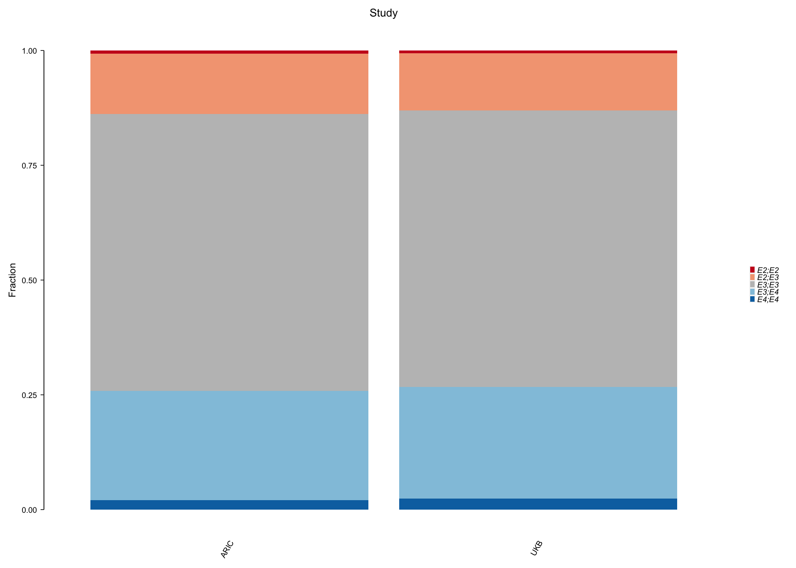

``` r
## Compare carrier abundances
chisq_test(population ~ variant, x = df_genotypes_freqs)
```

| **statistic** | **chisq_df** | **p_value** |
|--------------:|--------------|:------------|
|          6.39 | 4            | 0.172       |

``` r
## Table
df_genotypes_freqs %>%
  select(variant, population) %>%
  as_tibble() %>%
  tbl_summary(by = population) %>% 
  add_p() %>%
  as_hux_table()
```

    ## Warning in to_md.huxtable(structure(list(label = c("Characteristic",
    ## "variant", : Markdown cannot handle cells with colspan/rowspan > 1

|  Characteristic | ARIC, N = 6,43 | UKB, N = 402,763 | p-value |
|----------------:|----------------|------------------|:--------|
|         variant |                |                  | 0.2     |
|           E2;E2 | 41 (0.7%)      | 2,336 (0.6%)     |         |
|           E2;E3 | 793 (13%)      | 50,280 (12%)     |         |
|           E3;E3 | 3,648 (60%)    | 242,715 (60%)    |         |
|           E3;E4 | 1,434 (24%)    | 97,598 (24%)     |         |
|           E4;E4 | 127 (2.1%)     | 9,834 (2.4%)     |         |
|           n (%) |                |                  |         |
| Pearson’s Chi-s | quared test    |                  |         |

``` r
## ------------------------------------------
## ED Fig 7c
## ------------------------------------------
df_genotypes_freqs %>%
  filter(population == "UKB" & tested == "yes") %>%
  ggplot(aes(x = result, fill = variant)) +
  geom_bar(position = "fill") +
  scale_fill_manual(values = pal_UKB) +
  labs(title = "Test result", 
       y = "Fraction") +
  guides(x = guide_axis(angle = 60)) +
  theme_custom2 +
  theme(legend.text = element_text(face = "italic"), 
        axis.line.x = element_blank(), 
        axis.ticks.x = element_blank(), 
        axis.title.x = element_blank(), 
        legend.spacing.x = unit(0.1, "char")) +
  coord_capped_cart(left = "both")
```


``` r
## Compare carrier abundances
chisq_test(result ~ variant, 
           x = filter(df_genotypes_freqs, population == "UKB" & tested == "yes"))
```

| **statistic** | **chisq_df** | **p_value** |
|--------------:|--------------|:------------|
|          12.4 | 4            | 0.0145      |

``` r
## Table
fit_glm_res_variant <- glm(result ~ variant, data = df, family = "binomial")
fit_glm_res_variant %>%
  tbl_regression(exponentiate = TRUE) %>%
  as_hux_table()
```

    ## Warning in to_md.huxtable(structure(list(label = c("Characteristic",
    ## "variant", : Markdown cannot handle cells with colspan/rowspan > 1

|  Characteristic |      OR      |    95% CI    | p-value |
|----------------:|:------------:|:------------:|:-------:|
|         variant |              |              |         |
|           E3;E3 |      —       |      —       |         |
|           E2;E2 |     0.88     |  0.67, 1.15  |   0.4   |
|           E2;E3 |     0.98     |  0.92, 1.04  |   0.5   |
|           E3;E4 |     0.99     |  0.94, 1.04  |   0.6   |
|           E4;E4 |     1.21     |  1.08, 1.37  |  0.001  |
| OR = Odds Ratio | , CI = Confi | dence Interv |   al    |

``` r
## ------------------------------------------
## ED Fig 7d
## ------------------------------------------
df_genotypes_freqs %>%
  filter(population == "UKB") %>%
  ggplot(aes(x = pos_vs_all, fill = variant)) +
  geom_bar(position = "fill") +
  scale_fill_manual(values = pal_UKB) +
  labs(title = "Positive vs rest", 
       y = "Fraction") +
  guides(x = guide_axis(angle = 60)) +
  theme_custom2 +
  theme(legend.text = element_text(face = "italic"), 
        axis.line.x = element_blank(), 
        axis.ticks.x = element_blank(), 
        axis.title.x = element_blank(), 
        legend.spacing.x = unit(0.1, "char")) +
  coord_capped_cart(left = "both")
```

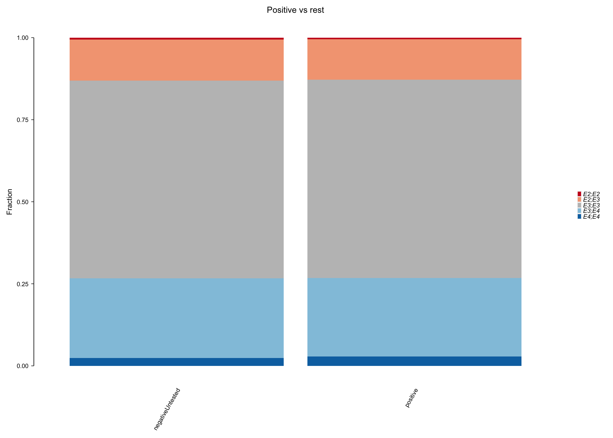

``` r
## Compare carrier abundances
chisq_test(pos_vs_all ~ variant, 
           x = filter(df_genotypes_freqs, population == "UKB"))
```

| **statistic** | **chisq_df** | **p_value** |
|--------------:|--------------|:------------|
|          12.7 | 4            | 0.0127      |

``` r
## Table
fit_glm_pos_vs_all_variant <- glm(pos_vs_all ~ variant, data = df, family = "binomial")
fit_glm_pos_vs_all_variant %>%
  tbl_regression(exponentiate = TRUE) %>%
  as_hux_table()
```

    ## Warning in to_md.huxtable(structure(list(label = c("Characteristic",
    ## "variant", : Markdown cannot handle cells with colspan/rowspan > 1

|  Characteristic |      OR      |    95% CI    | p-value |
|----------------:|:------------:|:------------:|:-------:|
|         variant |              |              |         |
|           E3;E3 |      —       |      —       |         |
|           E2;E2 |     0.84     |  0.65, 1.07  |   0.2   |
|           E2;E3 |     0.99     |  0.93, 1.04  |   0.6   |
|           E3;E4 |     0.99     |  0.94, 1.03  |   0.5   |
|           E4;E4 |     1.18     |  1.06, 1.31  |  0.002  |
| OR = Odds Ratio | , CI = Confi | dence Interv |   al    |

``` r
## ------------------------------------------
## ED Fig 7e
## ------------------------------------------
cov19_pos %>%
  .[, origin := factor(origin, levels = c("outpatient", "inpatient"))] %>%
  .[, variant := factor(variant, levels = APOE_variant_levels)] %>%
  ggplot(aes(x = origin, fill = variant)) +
  geom_bar(position = "fill") +
  scale_fill_manual(values = pal_UKB) +
  labs(title = "Hospitalization", 
       y = "Fraction") +
  guides(x = guide_axis(angle = 60)) +
  theme_custom2 +
  theme(legend.text = element_text(face = "italic"), 
        axis.line.x = element_blank(), 
        axis.ticks.x = element_blank(), 
        axis.title.x = element_blank(), 
        legend.spacing.x = unit(0.1, "char")) +
  coord_capped_cart(left = "both")
```

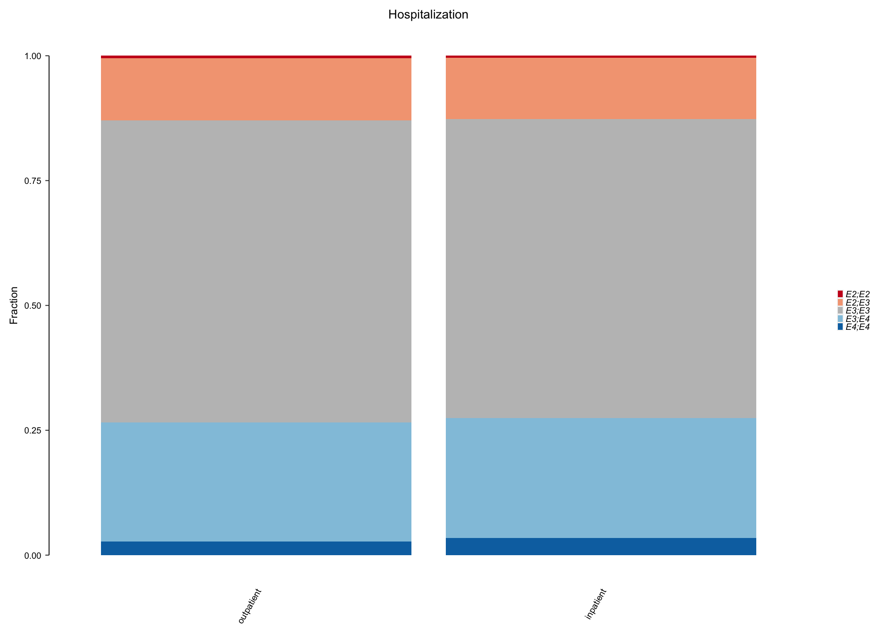

``` r
## Table
fit_glm_test_origin <- glm(origin ~ variant, data = df, family = "binomial")
fit_glm_test_origin %>%
  tbl_regression(exponentiate = TRUE) %>%
  as_hux_table()
```

    ## Warning in to_md.huxtable(structure(list(label = c("Characteristic",
    ## "variant", : Markdown cannot handle cells with colspan/rowspan > 1

|  Characteristic |      OR      |    95% CI    | p-value |
|----------------:|:------------:|:------------:|:-------:|
|         variant |              |              |         |
|           E3;E3 |      —       |      —       |         |
|           E2;E2 |     0.98     |  0.79, 1.22  |   0.8   |
|           E2;E3 |     0.99     |  0.94, 1.04  |   0.7   |
|           E3;E4 |     1.00     |  0.96, 1.04  |  \>0.9  |
|           E4;E4 |     1.06     |  0.96, 1.18  |   0.3   |
| OR = Odds Ratio | , CI = Confi | dence Interv |   al    |

## Fig 4

``` r
xlim_cov19_surv <- c(0, 40)
ylim_cov19_surv <- c(0.8, 1)

## ------------------------------------------------------
## Fig 3a
## ------------------------------------------------------
fm_APOE_all_df <- 
  cov19_pos %>%
  mutate(variant = relevel(factor(variant), ref = "E3;E3")) %>% 
  rename(Age = age_at_inf, 
         Sex = sex, 
         Genotype = variant)

fm_APOE_all <-
  forest_model(
    coxph(Surv(OS.time, OS.covid) ~ Age + Sex + Genotype, data = fm_APOE_all_df),
    format_options =
      forest_model_format_options(text_size = 1.66, point_size = 1, banded = TRUE), 
    factor_separate_line = TRUE, 
    panels = custom_fm_panels, 
    recalculate_width = FALSE)  +
  theme_custom2 +
  labs(title = "Multivariate analysis UK Biobank")

## ------------------------------------------------------
## Fig 3b
## ------------------------------------------------------
fit_age <- surv_fit(Surv(OS.time, OS.covid) ~ age_bin, data = cov19_pos)
  
plot_survival_age <- 
  ggsurvplot(fit_age,
             palette = pal_age,
             risk.table = TRUE, 
             ggtheme = theme_custom2, 
             fontsize = 1.75, risk.table.fontsize = 1.5, 
             xlim = xlim_cov19_surv, break.x.by = 10, 
             ylim = ylim_cov19_surv, break.y.by = 0.05, 
             legend.labs = gsub("age_bin=", "", names(fit_age$strata)), 
             pval = TRUE, pval.size = 1.75, pval.coord = c(28, 0.82), size = 0.5, 
             censor.size = 1.5
           )

## Modify aesthetics of survival plot
plot_survival_age$plot <- 
  plot_survival_age$plot +
  labs(title = "Age", x = "Day") +
  theme(legend.position = c(0.25, 0.2), 
        legend.background = element_blank(),
        legend.key = element_rect(fill = NA, colour = NA, size = 0.001)
        ) +
  guides(color = guide_legend(override.aes = list(shape = NA))) +
  coord_capped_cart(left = "both", bottom = "left", 
                    xlim = xlim_cov19_surv, ylim = ylim_cov19_surv)
```

    ## Coordinate system already present. Adding new coordinate system, which will replace the existing one.

``` r
# Modify aesthetics of risk table
plot_survival_age$table <-
  plot_survival_age$table +
  labs(x = "Day") +
  theme(axis.text.y.left  = element_text(face = "italic"), #size = 5),
        axis.title.y = element_blank(),
        plot.title = element_text(hjust = 0, size = 6)) +
  coord_capped_cart(left = "both", bottom = "left",
                    xlim = xlim_cov19_surv)
```

    ## Coordinate system already present. Adding new coordinate system, which will replace the existing one.

``` r
## Extract exact p value
surv_pvalue(fit_age)[2]
```

|           |
|:---------:|
| **pval**  |
| 5.95e-107 |

``` r
## ------------------------------------------------------
## Fig 3c
## ------------------------------------------------------
fit_sex <- surv_fit(Surv(OS.time, OS.covid) ~ sex, data = cov19_pos)
  
plot_survival_sex <- 
  ggsurvplot(fit_sex,
             palette = pal_sex,
             risk.table = TRUE, 
             ggtheme = theme_custom2, 
             fontsize = 1.75, risk.table.fontsize = 1.5, 
             xlim = xlim_cov19_surv, break.x.by = 10, 
             ylim = ylim_cov19_surv, break.y.by = 0.05, 
             legend.labs = gsub("sex=", "", names(fit_sex$strata)), 
             pval = TRUE, pval.size = 1.75, pval.coord = c(25, 0.82), size = 0.5, 
             censor.size = 1.5
           )

## Modify aesthetics of survival plot
plot_survival_sex$plot <- 
  plot_survival_sex$plot +
  labs(title = "Sex", x = "Day") +
  theme(legend.position = c(0.25, 0.2), 
        legend.background = element_blank(),
        legend.key = element_rect(fill = NA, colour = NA, size = 0.001)
        ) +
  guides(color = guide_legend(override.aes = list(shape = NA))) +
  coord_capped_cart(left = "both", bottom = "left", 
                    xlim = xlim_cov19_surv, ylim = ylim_cov19_surv)
```

    ## Coordinate system already present. Adding new coordinate system, which will replace the existing one.

``` r
# Modify aesthetics of risk table
plot_survival_sex$table <-
  plot_survival_sex$table +
  labs(x = "Day") +
  theme(axis.text.y.left  = element_text(face = "italic"), #size = 5),
        axis.title.y = element_blank(),
        plot.title = element_text(hjust = 0, size = 6)) +
  coord_capped_cart(left = "both", bottom = "left",
                    xlim = xlim_cov19_surv)
```

    ## Coordinate system already present. Adding new coordinate system, which will replace the existing one.

``` r
## Extract exact p value
surv_pvalue(fit_sex)[2]
```

|          |
|:--------:|
| **pval** |
| 3.23e-20 |

``` r
## ------------------------------------------
## Fig 3d
## ------------------------------------------
fit <- surv_fit(Surv(OS.time, OS.covid) ~ variant, 
                data = cov19_unordered)

plot_survival <- 
  ggsurvplot(fit,
             palette = pal_UKB,
             risk.table = TRUE, 
             ggtheme = theme_custom2, 
             fontsize = 1.75, risk.table.fontsize = 1.5, 
             xlim = xlim_cov19_surv, break.x.by = 10, 
             ylim = ylim_cov19_surv, break.y.by = 0.05, 
             legend.labs = gsub("variant=", "", names(fit$strata)), 
             pval = TRUE, pval.size = 1.75, pval.coord = c(30, 0.82), size = 0.5, 
             censor.size = 1.5, 
             tables.height = 0.32
           )

## Modify aesthetics of survival plot
plot_survival$plot <- 
  plot_survival$plot +
  labs(x = element_blank(), title = "APOE genotype") +
  theme(legend.position = c(0.2, 0.25), 
        legend.text = element_text(face = "italic"), 
        legend.background = element_blank(),
        legend.key = element_rect(fill = NA, colour = NA, size = 0.001)
        ) +
  guides(color = guide_legend(override.aes = list(shape = NA))) +
  coord_capped_cart(left = "both", bottom = "left", 
                    xlim = xlim_cov19_surv, ylim = ylim_cov19_surv)
```

    ## Coordinate system already present. Adding new coordinate system, which will replace the existing one.

``` r
## Modify aesthetics of risk table
plot_survival$table <-
  plot_survival$table +
  labs(x = "Day") +
  theme(axis.text.y.left  = element_text(face = "italic"), #size = 5),
        axis.title.y = element_blank(), 
        plot.title = element_text(hjust = 0, size = 6)) +
  coord_capped_cart(left = "both", bottom = "left", 
                    xlim = xlim_cov19_surv)
```

    ## Coordinate system already present. Adding new coordinate system, which will replace the existing one.

``` r
## Extract exact p value
format.pval(surv_pvalue(fit)[2], digits = 2)
```

    ## [1] "2.6e-07"

``` r
## ------------------------------------------
## Assemble Fig 3
## ------------------------------------------
layout_fig <-"
AABCD
AABCD
AABCD
AAEFG
"
fm_APOE_all + plot_survival_age$plot + plot_survival_sex$plot + plot_survival$plot +
  plot_survival_age$table + plot_survival_sex$table + plot_survival$table +
  plot_layout(design = layout_fig) &
  plot_annotation(tag_levels = 'a') &
  theme(plot.tag = element_text(size = 8, face = "bold"))
```

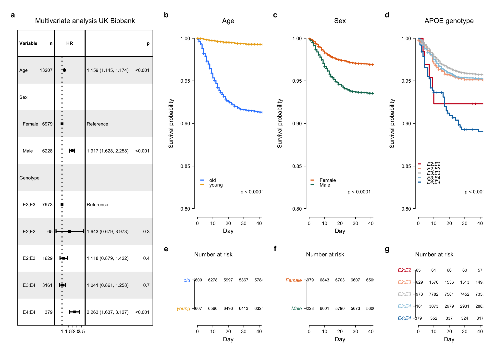

## ED Fig 8

``` r
## -----------------------------------------------
## ED Fig 8a
## -----------------------------------------------
fm_APOE_all_df <- 
  cov19_pos %>%
  mutate(variant = relevel(factor(variant), ref = "E3;E3")) %>% 
  rename(Age = age_at_inf, 
         Sex = sex, 
         Genotype = variant, 
         PC1 = genetic_principal_components_f22009_0_1, 
         PC2 = genetic_principal_components_f22009_0_2, 
         PC3 = genetic_principal_components_f22009_0_3, 
         PC4 = genetic_principal_components_f22009_0_4, 
         PC5 = genetic_principal_components_f22009_0_5, 
         PC6 = genetic_principal_components_f22009_0_6, 
         PC7 = genetic_principal_components_f22009_0_7, 
         PC8 = genetic_principal_components_f22009_0_8, 
         PC9 = genetic_principal_components_f22009_0_9, 
         PC10 = genetic_principal_components_f22009_0_10, 
         )

multivar_formula_PCs <- as.formula(paste0("Surv(OS.time, OS.covid) ~ Age + Sex + ",
                                      paste0("PC", 1:10, collapse = " + "), " + Genotype"))

fm_APOE_all_PCs <-
  forest_model(
    coxph(multivar_formula_PCs, data = fm_APOE_all_df),
    format_options =
      forest_model_format_options(text_size = 1.66, point_size = 1, banded = TRUE), 
    factor_separate_line = TRUE, 
    panels = custom_fm_panels, 
    recalculate_width = FALSE)  +
  theme_custom2 +
  labs(title = "Multivariate analysis UK Biobank")
print(fm_APOE_all_PCs)
```

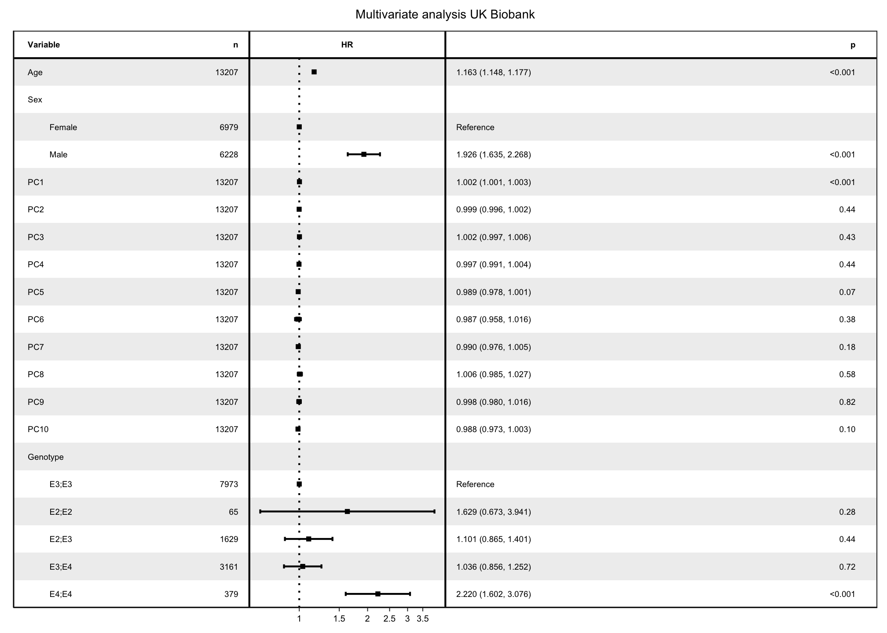

``` r
# -----------------------------------------------
# ED Fig 8b
# -----------------------------------------------
as_tibble(fm_APOE_all_df) |>
  mutate(Genotype = as.character(Genotype)) |>
  ggplot(aes(x = PC1, y = PC2, color = Genotype, shape = Genotype)) +
  ggrastr::geom_point_rast(size = 0.75, alpha = 0.5, stroke = 0, raster.dpi = 600) +
  scale_color_manual(values = pal_UKB) +
  guides(color = guide_legend(override.aes = list(size=1.25))) +
  scale_shape_manual(values = c(15, 15, 16, 17, 17)) +
  labs(title = "Principal components 1-2") +
  coord_fixed() +
  theme_bw() +
  theme(panel.border = element_rect(size = custom_linewidth, colour = "black"),
        panel.grid = element_blank(),
        panel.grid.major = element_line(size = (custom_linewidth), color = "grey85", linetype = "dotted"),
        legend.title = element_blank(),
        axis.text = element_text(size = 5, colour = "black"),
        axis.title = element_text(size = 6),
        axis.ticks = element_line(size = custom_linewidth),
        axis.ticks.length = unit(0.075, "cm"),
        axis.title.y = element_text(margin = margin(r = 3.2)),
        axis.title.x = element_text(margin = margin(t = 4)),
        plot.title = element_text(size = 7, hjust = 0.5),
        strip.text = element_text(size = 6, face = "bold"),
        panel.background = element_blank(),
        legend.text = element_text(size = 5, margin = margin(l = -10), face = "italic"),
        legend.margin =  margin(-10, 0, -10, -10),
        legend.key.height = unit(2, "mm"))
```

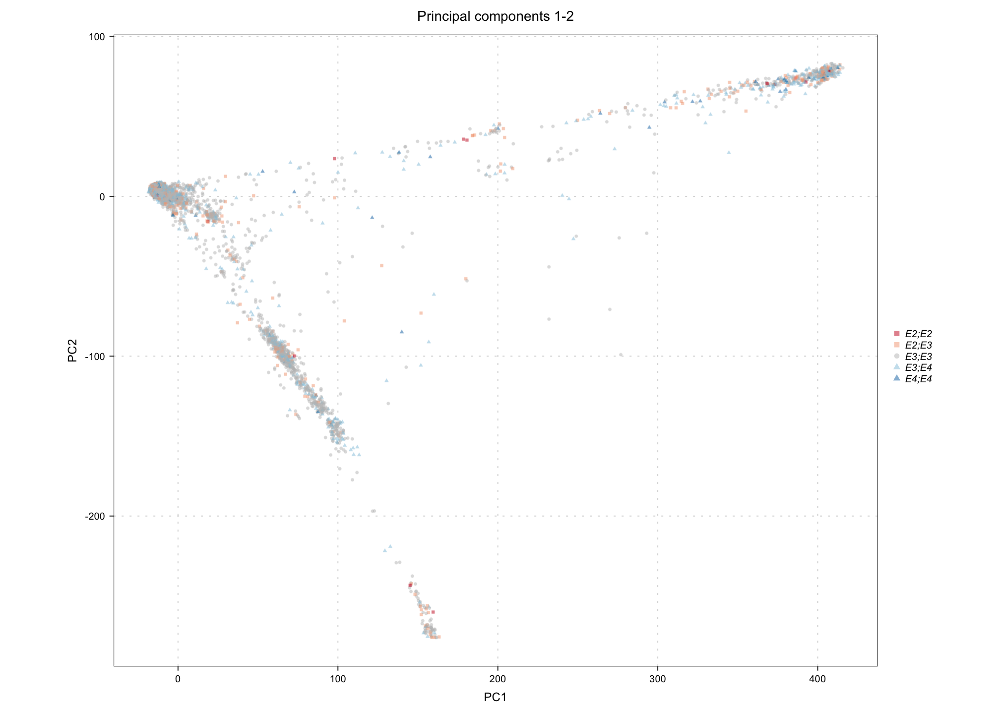

``` r
# -----------------------------------------------
# ED Fig 8c
# -----------------------------------------------
as_tibble(fm_APOE_all_df) |>
  mutate(Genotype = as.character(Genotype)) |>
  ggplot(aes(x = PC3, y = PC4, color = Genotype, shape = Genotype)) +
  ggrastr::geom_point_rast(size = 0.75, alpha = 0.5, stroke = 0, raster.dpi = 600) +
  scale_color_manual(values = pal_UKB) +
  scale_shape_manual(values = c(15, 15, 16, 17, 17)) +
  guides(color = guide_legend(override.aes = list(size=1.25))) +
  labs(title = "Principal components 3-4") +
  coord_fixed() +
  theme_bw() +
  theme(panel.border = element_rect(size = custom_linewidth, colour = "black"),
        panel.grid = element_blank(),
        panel.grid.major = element_line(size = (custom_linewidth), color = "grey85", linetype = "dotted"),
        legend.title = element_blank(),
        axis.text = element_text(size = 5, colour = "black"),
        axis.title = element_text(size = 6),
        axis.ticks = element_line(size = custom_linewidth),
        axis.ticks.length = unit(0.075, "cm"),
        axis.title.y = element_text(margin = margin(r = 3.2)),
        axis.title.x = element_text(margin = margin(t = 4)),
        plot.title = element_text(size = 7, hjust = 0.5),
        strip.text = element_text(size = 6, face = "bold"),
        panel.background = element_blank(),
        legend.text = element_text(size = 5, margin = margin(l = -10), face = "italic"),
        legend.margin =  margin(-10, 0, -10, -10),
        legend.key.height = unit(2, "mm"))
```

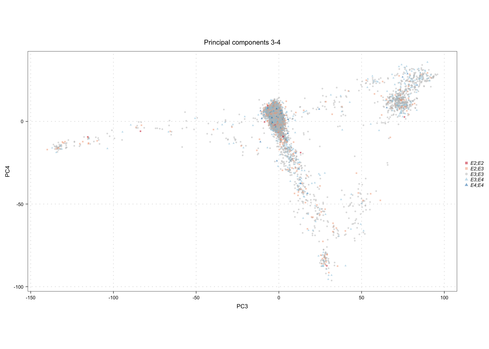

## ED Fig 8d-g

``` r
## Wrangle data
cov19_pos_european <-
  cov19_pos %>%
  .[, variant := factor(variant, ordered = FALSE, levels = APOE_variant_levels)] %>%
  .[genetic_ethnic_grouping_f22006_0_0 == "Caucasian"]

## ----------------------------------------------------
## ED Fig 8d
## ----------------------------------------------------
fm_APOE_all_df_europ <- 
  cov19_pos_european %>%
  mutate(variant = relevel(factor(variant), ref = "E3;E3")) %>% 
  rename(Age = age_at_inf, 
         Sex = sex, 
         Genotype = variant, 
         PC1 = genetic_principal_components_f22009_0_1, 
         PC2 = genetic_principal_components_f22009_0_2, 
         PC3 = genetic_principal_components_f22009_0_3, 
         PC4 = genetic_principal_components_f22009_0_4, 
         PC5 = genetic_principal_components_f22009_0_5, 
         PC6 = genetic_principal_components_f22009_0_6, 
         PC7 = genetic_principal_components_f22009_0_7, 
         PC8 = genetic_principal_components_f22009_0_8, 
         PC9 = genetic_principal_components_f22009_0_9, 
         PC10 = genetic_principal_components_f22009_0_10, 
  )

as_tibble(fm_APOE_all_df_europ) |>
  mutate(Genotype = as.character(Genotype)) |>
  ggplot(aes(x = PC1, y = PC2, color = Genotype, shape = Genotype)) +
  ggrastr::geom_point_rast(size = 0.75, alpha = 0.5, stroke = 0, raster.dpi = 600) +
  scale_color_manual(values = pal_UKB) +
  guides(color = guide_legend(override.aes = list(size=1.25))) +
  scale_shape_manual(values = c(15, 15, 16, 17, 17)) +
  labs(title = "Principal components 1-2") +
  coord_fixed() +
  theme_bw() +
  theme(panel.border = element_rect(size = custom_linewidth, colour = "black"),
        panel.grid = element_blank(),
        panel.grid.major = element_line(size = (custom_linewidth), color = "grey85", linetype = "dotted"),
        legend.title = element_blank(),
        axis.text = element_text(size = 5, colour = "black"),
        axis.title = element_text(size = 6),
        axis.ticks = element_line(size = custom_linewidth),
        axis.ticks.length = unit(0.075, "cm"),
        axis.title.y = element_text(margin = margin(r = 3.2)),
        axis.title.x = element_text(margin = margin(t = 4)),
        plot.title = element_text(size = 7, hjust = 0.5),
        strip.text = element_text(size = 6, face = "bold"),
        panel.background = element_blank(),
        legend.text = element_text(size = 5, margin = margin(l = -10), face = "italic"),
        legend.margin =  margin(-10, 0, -10, -10),
        legend.key.height = unit(2, "mm"))
```

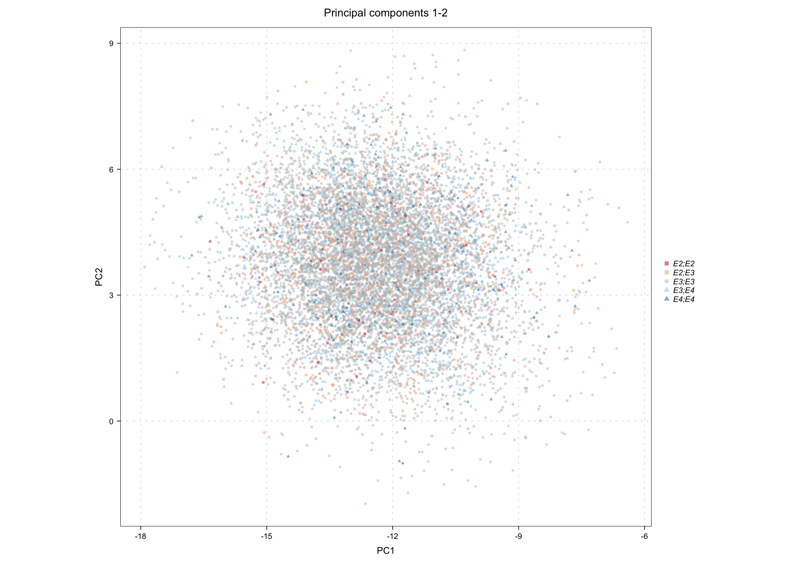

``` r
## ----------------------------------------------------
## ED Fig 8e
## ----------------------------------------------------
as_tibble(fm_APOE_all_df_europ) |>
  mutate(Genotype = as.character(Genotype)) |>
  ggplot(aes(x = PC4, y = PC3, color = Genotype, shape = Genotype)) +
  ggrastr::geom_point_rast(size = 0.75, alpha = 0.5, stroke = 0, raster.dpi = 600) +
  scale_color_manual(values = pal_UKB) +
  scale_shape_manual(values = c(15, 15, 16, 17, 17)) +
  guides(color = guide_legend(override.aes = list(size=1.25))) +
  labs(title = "Principal components 3-4") +
  coord_fixed() +
  theme_bw() +
  theme(panel.border = element_rect(size = custom_linewidth, colour = "black"),
        panel.grid = element_blank(),
        panel.grid.major = element_line(size = (custom_linewidth), color = "grey85", linetype = "dotted"),
        legend.title = element_blank(),
        axis.text = element_text(size = 5, colour = "black"),
        axis.title = element_text(size = 6),
        axis.ticks = element_line(size = custom_linewidth),
        axis.ticks.length = unit(0.075, "cm"),
        axis.title.y = element_text(margin = margin(r = 3.2)),
        axis.title.x = element_text(margin = margin(t = 4)),
        plot.title = element_text(size = 7, hjust = 0.5),
        strip.text = element_text(size = 6, face = "bold"),
        panel.background = element_blank(),
        legend.text = element_text(size = 5, margin = margin(l = -10), face = "italic"),
        legend.margin =  margin(-10, 0, -10, -10),
        legend.key.height = unit(2, "mm"))
```

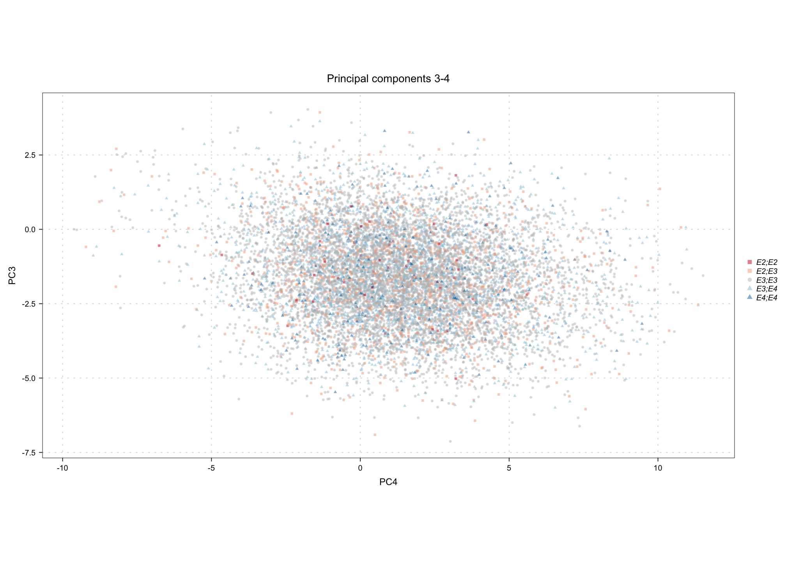

``` r
## ------------------------------------------------------
## ED Fig 8f
## ------------------------------------------------------
df_APOE_df_europ <- 
  cov19_pos_european %>%
  mutate(variant = relevel(factor(variant), ref = "E3;E3")) %>% 
  rename(Age = age_at_inf, 
         Sex = sex, 
         Genotype = variant)

forest_model(coxph(Surv(OS.time, OS.covid) ~ Age + Sex + Genotype,
                   data = df_APOE_df_europ),
             format_options =
               forest_model_format_options(text_size = 1.66,
                                           point_size = 1,
                                           banded = TRUE),
             factor_separate_line = TRUE,
             panels = custom_fm_panels,
             recalculate_width = FALSE)  +
  theme_custom2 +
  labs(title = "Multivariate analysis UK Biobank")

## ------------------------------------------------------
## ED Fig 8g
## ------------------------------------------------------
fit_europ <- surv_fit(Surv(OS.time, OS.covid) ~ variant, 
                data = cov19_pos_european)
xlim_cov19_surv <- c(0, 40)
ylim_cov19_surv <- c(0.8, 1)

plot_surv_europ <- 
  ggsurvplot(fit_europ,
             palette = pal_UKB,
             risk.table = TRUE, 
             ggtheme = theme_custom2, 
             fontsize = 1.75, risk.table.fontsize = 1.5, 
             xlim = xlim_cov19_surv, break.x.by = 10, 
             ylim = ylim_cov19_surv, break.y.by = 0.05, 
             legend.labs = gsub("variant=", "", names(fit_europ$strata)), 
             pval = TRUE, pval.size = 1.75, pval.coord = c(30, 0.82), size = 0.5, 
             censor.size = 1.5, 
             tables.height = 0.32
           )
## Extract exact p value
format.pval(surv_pvalue(fit_europ)[2], digits = 2)
```

    ## [1] "3e-07"

``` r
## Modify aesthetics of survival plot
plot_surv_europ$plot <- 
  plot_surv_europ$plot +
  labs(x = element_blank(), title = "APOE genotype") +
  theme(legend.position = c(0.2, 0.25), 
        legend.text = element_text(face = "italic"), 
        legend.background = element_blank(),
        legend.key = element_rect(fill = NA, colour = NA, size = 0.001)
        ) +
  guides(color = guide_legend(override.aes = list(shape = NA))) +
  coord_capped_cart(left = "both", bottom = "left", 
                    xlim = xlim_cov19_surv, ylim = ylim_cov19_surv)
```

    ## Coordinate system already present. Adding new coordinate system, which will replace the existing one.

``` r
## Modify aesthetics of risk table
plot_surv_europ$table <-
  plot_surv_europ$table +
  labs(x = "Day") +
  theme(axis.text.y.left  = element_text(face = "italic"), #size = 5),
        axis.title.y = element_blank(), 
        plot.title = element_text(hjust = 0, size = 6)) +
  coord_capped_cart(left = "both", bottom = "left", 
                    xlim = xlim_cov19_surv) 
```

    ## Coordinate system already present. Adding new coordinate system, which will replace the existing one.

``` r
print(plot_surv_europ, newpage = FALSE)
```

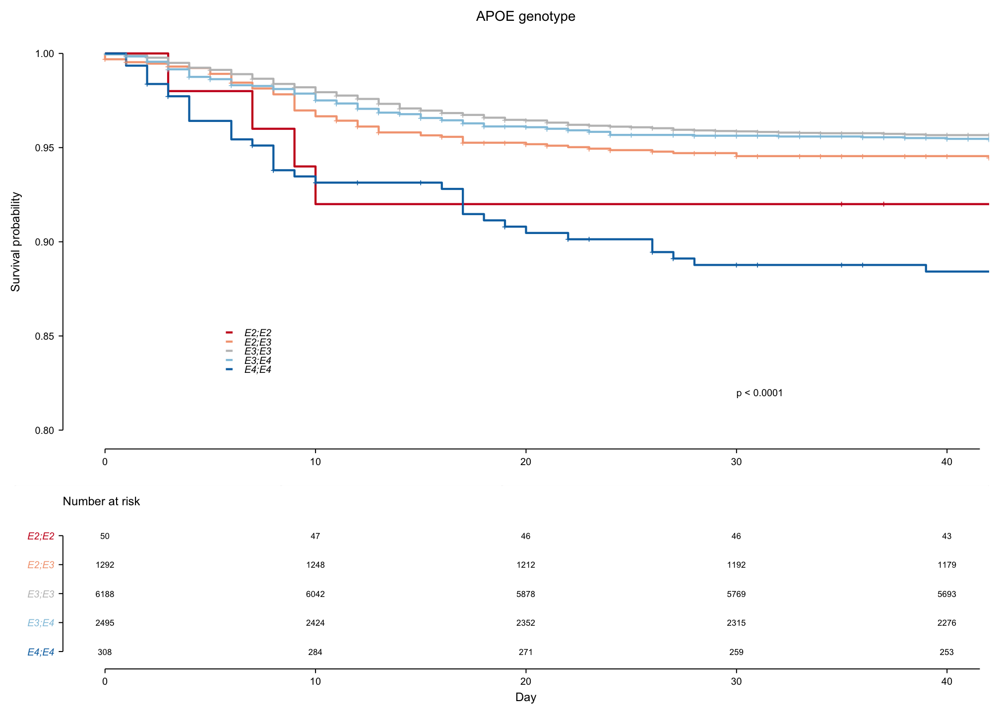

## ED Fig 8h

``` r
## Wrangle survival data for the first month of 2019 (30 days)
select_columns_2019 <- c("variant", "OS.time.other", "OS.other", "date_death_censor")
start_date_observation_period <- as.Date("2019-01-01")
end_date_observation_period <- as.Date("2019-01-31")

df_2019 <- 
  as_tibble(df[, ..select_columns_2019]) |>
  filter(date_death_censor > start_date_observation_period) |>
  mutate(OS.other = case_when(date_death_censor  > end_date_observation_period ~ 0, 
                              TRUE ~ OS.other)) |>
  mutate(date_death_censor = case_when(date_death_censor > end_date_observation_period ~ end_date_observation_period, 
                                       TRUE ~ date_death_censor)) |>
  mutate(OS.time.other = date_death_censor - start_date_observation_period) |>
  mutate(variant = factor(variant, ordered = FALSE, levels = APOE_variant_levels))

xlim_cov19_surv <- c(0, 30)
ylim_cov19_surv <- c(0.8, 1)
fit_2019 <- surv_fit(Surv(OS.time.other, OS.other) ~ variant, 
                data = df_2019)

plot_survival_2019 <- 
  ggsurvplot(fit_2019,
             palette = pal_UKB,
             risk.table = TRUE,
             ggtheme = theme_custom2,
             fontsize = 1.75, risk.table.fontsize = 1.5,
             xlim = xlim_cov19_surv, break.x.by = 10,
             ylim = ylim_cov19_surv, break.y.by = 0.05,
             legend.labs = gsub("variant=", "", names(fit_2019$strata)),
             pval = TRUE, pval.size = 1.75, pval.coord = c(25, 0.82), size = 0.5,
             censor.size = 1.5,
             tables.height = 0.32
  )

## Modify aesthetics of survival plot
plot_survival_2019$plot <- 
  plot_survival_2019$plot +
  labs(x = element_blank(), title = "Survival January 2019") +
  theme(legend.position = c(0.2, 0.25), 
        legend.text = element_text(face = "italic"), 
        legend.background = element_blank(),
        legend.key = element_rect(fill = NA, colour = NA, size = 0.001)
        ) +
  guides(color = guide_legend(override.aes = list(shape = NA))) +
  coord_capped_cart(left = "both", bottom = "left", 
                    xlim = xlim_cov19_surv, ylim = ylim_cov19_surv)
```

    ## Coordinate system already present. Adding new coordinate system, which will replace the existing one.

``` r
## Modify aesthetics of risk table
plot_survival_2019$table <-
  plot_survival_2019$table +
  labs(x = "Day") +
  theme(axis.text.y.left  = element_text(face = "italic"), 
        axis.title.y = element_blank(), 
        plot.title = element_text(hjust = 0, size = 6)) +
  coord_capped_cart(left = "both", bottom = "left", 
                    xlim = xlim_cov19_surv)
```

    ## Coordinate system already present. Adding new coordinate system, which will replace the existing one.

``` r
print(plot_survival_2019, newpage = FALSE)
```

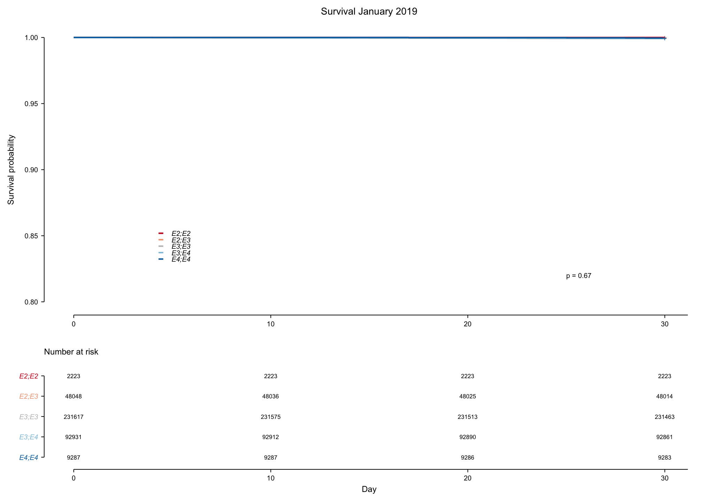

## Session info

``` r
devtools::session_info()
```

    ## ─ Session info ───────────────────────────────────────────────────────────────
    ##  setting  value                       
    ##  version  R version 4.1.0 (2021-05-18)
    ##  os       macOS Big Sur 10.16         
    ##  system   x86_64, darwin17.0          
    ##  ui       X11                         
    ##  language (EN)                        
    ##  collate  en_US.UTF-8                 
    ##  ctype    en_US.UTF-8                 
    ##  tz       Europe/Berlin               
    ##  date     2022-08-18                  
    ## 
    ## ─ Packages ───────────────────────────────────────────────────────────────────
    ##  package          * version    date       lib source        
    ##  abind              1.4-5      2016-07-21 [1] CRAN (R 4.1.0)
    ##  assertthat         0.2.1      2019-03-21 [1] CRAN (R 4.1.0)
    ##  backports          1.2.1      2020-12-09 [1] CRAN (R 4.1.0)
    ##  BayesFactor        0.9.12-4.2 2018-05-19 [1] CRAN (R 4.1.0)
    ##  beeswarm           0.3.1      2021-03-07 [1] CRAN (R 4.1.0)
    ##  boot               1.3-28     2021-05-03 [1] CRAN (R 4.1.0)
    ##  broom            * 0.7.6      2021-04-05 [1] CRAN (R 4.1.0)
    ##  broom.helpers      1.3.0      2021-04-10 [1] CRAN (R 4.1.0)
    ##  broom.mixed        0.2.7      2021-07-07 [1] CRAN (R 4.1.0)
    ##  cachem             1.0.5      2021-05-15 [1] CRAN (R 4.1.0)
    ##  Cairo              1.5-12.2   2020-07-07 [1] CRAN (R 4.1.0)
    ##  callr              3.7.0      2021-04-20 [1] CRAN (R 4.1.0)
    ##  car                3.0-10     2020-09-29 [1] CRAN (R 4.1.0)
    ##  carData            3.0-4      2020-05-22 [1] CRAN (R 4.1.0)
    ##  cellranger         1.1.0      2016-07-27 [1] CRAN (R 4.1.0)
    ##  circlize           0.4.12     2021-01-08 [1] CRAN (R 4.1.0)
    ##  class              7.3-19     2021-05-03 [1] CRAN (R 4.1.0)
    ##  cli                2.5.0      2021-04-26 [1] CRAN (R 4.1.0)
    ##  coda               0.19-4     2020-09-30 [1] CRAN (R 4.1.0)
    ##  codetools          0.2-18     2020-11-04 [1] CRAN (R 4.1.0)
    ##  colorspace         2.0-1      2021-05-04 [1] CRAN (R 4.1.0)
    ##  cowplot            1.1.1      2020-12-30 [1] CRAN (R 4.1.0)
    ##  crayon             1.4.1      2021-02-08 [1] CRAN (R 4.1.0)
    ##  curl               4.3.1      2021-04-30 [1] CRAN (R 4.1.0)
    ##  data.table       * 1.14.0     2021-02-21 [1] CRAN (R 4.1.0)
    ##  DBI                1.1.1      2021-01-15 [1] CRAN (R 4.1.0)
    ##  dbplyr             2.1.1      2021-04-06 [1] CRAN (R 4.1.0)
    ##  desc               1.3.0      2021-03-05 [1] CRAN (R 4.1.0)
    ##  devtools           2.4.1      2021-05-05 [1] CRAN (R 4.1.0)
    ##  dials            * 0.0.9      2020-09-16 [1] CRAN (R 4.1.0)
    ##  DiceDesign         1.9        2021-02-13 [1] CRAN (R 4.1.0)
    ##  digest             0.6.29     2021-12-01 [1] CRAN (R 4.1.0)
    ##  doParallel         1.0.16     2020-10-16 [1] CRAN (R 4.1.0)
    ##  dplyr            * 1.0.6      2021-05-05 [1] CRAN (R 4.1.0)
    ##  dtplyr           * 1.1.0      2021-02-20 [1] CRAN (R 4.1.0)
    ##  ellipsis           0.3.2      2021-04-29 [1] CRAN (R 4.1.0)
    ##  evaluate           0.14       2019-05-28 [1] CRAN (R 4.1.0)
    ##  fansi              0.5.0      2021-05-25 [1] CRAN (R 4.1.0)
    ##  farver             2.1.0      2021-02-28 [1] CRAN (R 4.1.0)
    ##  fastmap            1.1.0      2021-01-25 [1] CRAN (R 4.1.0)
    ##  finalfit         * 1.0.3      2021-06-11 [1] CRAN (R 4.1.0)
    ##  forcats          * 0.5.1      2021-01-27 [1] CRAN (R 4.1.0)
    ##  foreach            1.5.1      2020-10-15 [1] CRAN (R 4.1.0)
    ##  foreign            0.8-81     2020-12-22 [1] CRAN (R 4.1.0)
    ##  forestmodel      * 0.6.2      2020-07-19 [1] CRAN (R 4.1.0)
    ##  fs                 1.5.0      2020-07-31 [1] CRAN (R 4.1.0)
    ##  furrr              0.2.3      2021-06-25 [1] CRAN (R 4.1.0)
    ##  future             1.21.0     2020-12-10 [1] CRAN (R 4.1.0)
    ##  generics           0.1.0      2020-10-31 [1] CRAN (R 4.1.0)
    ##  ggbeeswarm         0.6.0      2017-08-07 [1] CRAN (R 4.1.0)
    ##  ggplot2          * 3.3.5      2021-06-25 [1] CRAN (R 4.1.0)
    ##  ggpubr           * 0.4.0      2020-06-27 [1] CRAN (R 4.1.0)
    ##  ggrastr            0.2.3      2021-03-01 [1] CRAN (R 4.1.0)
    ##  ggsignif           0.6.1      2021-02-23 [1] CRAN (R 4.1.0)
    ##  ggtext             0.1.1      2020-12-17 [1] CRAN (R 4.1.0)
    ##  GlobalOptions      0.1.2      2020-06-10 [1] CRAN (R 4.1.0)
    ##  globals            0.14.0     2020-11-22 [1] CRAN (R 4.1.0)
    ##  glue               1.6.0      2021-12-17 [1] CRAN (R 4.1.0)
    ##  gower              0.2.2      2020-06-23 [1] CRAN (R 4.1.0)
    ##  GPfit              1.0-8      2019-02-08 [1] CRAN (R 4.1.0)
    ##  gridExtra          2.3        2017-09-09 [1] CRAN (R 4.1.0)
    ##  gridtext           0.1.4      2020-12-10 [1] CRAN (R 4.1.0)
    ##  gt               * 0.3.0      2021-05-12 [1] CRAN (R 4.1.0)
    ##  gtable             0.3.0      2019-03-25 [1] CRAN (R 4.1.0)
    ##  gtools             3.8.2      2020-03-31 [1] CRAN (R 4.1.0)
    ##  gtsummary        * 1.4.1      2021-05-19 [1] CRAN (R 4.1.0)
    ##  haven              2.4.1      2021-04-23 [1] CRAN (R 4.1.0)
    ##  highr              0.9        2021-04-16 [1] CRAN (R 4.1.0)
    ##  hms                1.1.0      2021-05-17 [1] CRAN (R 4.1.0)
    ##  htmltools          0.5.2      2021-08-25 [1] CRAN (R 4.1.0)
    ##  httr               1.4.2      2020-07-20 [1] CRAN (R 4.1.0)
    ##  huxtable         * 5.5.0      2022-06-15 [1] CRAN (R 4.1.2)
    ##  infer            * 0.5.4      2021-01-13 [1] CRAN (R 4.1.0)
    ##  ipred              0.9-11     2021-03-12 [1] CRAN (R 4.1.0)
    ##  iterators          1.0.13     2020-10-15 [1] CRAN (R 4.1.0)
    ##  jpeg               0.1-8.1    2019-10-24 [1] CRAN (R 4.1.0)
    ##  jsonlite           1.7.2      2020-12-09 [1] CRAN (R 4.1.0)
    ##  km.ci              0.5-2      2009-08-30 [1] CRAN (R 4.1.0)
    ##  KMsurv             0.1-5      2012-12-03 [1] CRAN (R 4.1.0)
    ##  knitr              1.37       2021-12-16 [1] CRAN (R 4.1.0)
    ##  labeling           0.4.2      2020-10-20 [1] CRAN (R 4.1.0)
    ##  labelled           2.8.0      2021-03-08 [1] CRAN (R 4.1.0)
    ##  lattice            0.20-44    2021-05-02 [1] CRAN (R 4.1.0)
    ##  lava               1.6.9      2021-03-11 [1] CRAN (R 4.1.0)
    ##  lemon            * 0.4.5      2020-06-08 [1] CRAN (R 4.1.0)
    ##  lhs                1.1.1      2020-10-05 [1] CRAN (R 4.1.0)
    ##  lifecycle          1.0.0      2021-02-15 [1] CRAN (R 4.1.0)
    ##  listenv            0.8.0      2019-12-05 [1] CRAN (R 4.1.0)
    ##  lubridate          1.7.10     2021-02-26 [1] CRAN (R 4.1.0)
    ##  magrittr           2.0.1      2020-11-17 [1] CRAN (R 4.1.0)
    ##  MASS               7.3-54     2021-05-03 [1] CRAN (R 4.1.0)
    ##  Matrix             1.3-3      2021-05-04 [1] CRAN (R 4.1.0)
    ##  MatrixModels       0.5-0      2021-03-02 [1] CRAN (R 4.1.0)
    ##  memoise            2.0.0      2021-01-26 [1] CRAN (R 4.1.0)
    ##  mgcv               1.8-35     2021-04-18 [1] CRAN (R 4.1.0)
    ##  mice               3.13.0     2021-01-27 [1] CRAN (R 4.1.0)
    ##  modeldata        * 0.1.0      2020-10-22 [1] CRAN (R 4.1.0)
    ##  modelr             0.1.8      2020-05-19 [1] CRAN (R 4.1.0)
    ##  munsell            0.5.0      2018-06-12 [1] CRAN (R 4.1.0)
    ##  mvtnorm            1.1-1      2020-06-09 [1] CRAN (R 4.1.0)
    ##  nlme               3.1-152    2021-02-04 [1] CRAN (R 4.1.0)
    ##  nnet               7.3-16     2021-05-03 [1] CRAN (R 4.1.0)
    ##  oddsratio        * 2.0.1      2020-05-24 [1] CRAN (R 4.1.0)
    ##  openxlsx           4.2.3      2020-10-27 [1] CRAN (R 4.1.0)
    ##  parallelly         1.25.0     2021-04-30 [1] CRAN (R 4.1.0)
    ##  parsnip          * 0.1.6      2021-05-27 [1] CRAN (R 4.1.0)
    ##  patchwork        * 1.1.1      2020-12-17 [1] CRAN (R 4.1.0)
    ##  pbapply            1.4-3      2020-08-18 [1] CRAN (R 4.1.0)
    ##  pillar             1.6.1      2021-05-16 [1] CRAN (R 4.1.0)
    ##  pkgbuild           1.2.0      2020-12-15 [1] CRAN (R 4.1.0)
    ##  pkgconfig          2.0.3      2019-09-22 [1] CRAN (R 4.1.0)
    ##  pkgload            1.2.1      2021-04-06 [1] CRAN (R 4.1.0)
    ##  plyr               1.8.6      2020-03-03 [1] CRAN (R 4.1.0)
    ##  prettyunits        1.1.1      2020-01-24 [1] CRAN (R 4.1.0)
    ##  pROC               1.17.0.1   2021-01-13 [1] CRAN (R 4.1.0)
    ##  processx           3.5.2      2021-04-30 [1] CRAN (R 4.1.0)
    ##  prodlim            2019.11.13 2019-11-17 [1] CRAN (R 4.1.0)
    ##  ps                 1.6.0      2021-02-28 [1] CRAN (R 4.1.0)
    ##  purrr            * 0.3.4      2020-04-17 [1] CRAN (R 4.1.0)
    ##  R6                 2.5.1      2021-08-19 [1] CRAN (R 4.1.0)
    ##  Rcpp               1.0.7      2021-07-07 [1] CRAN (R 4.1.0)
    ##  readr            * 1.4.0      2020-10-05 [1] CRAN (R 4.1.0)
    ##  readxl             1.3.1      2019-03-13 [1] CRAN (R 4.1.0)
    ##  recipes          * 0.1.16     2021-04-16 [1] CRAN (R 4.1.0)
    ##  remotes            2.3.0      2021-04-01 [1] CRAN (R 4.1.0)
    ##  reprex             2.0.0      2021-04-02 [1] CRAN (R 4.1.0)
    ##  rio                0.5.26     2021-03-01 [1] CRAN (R 4.1.0)
    ##  rlang              0.4.12     2021-10-18 [1] CRAN (R 4.1.0)
    ##  rmarkdown          2.11       2021-09-14 [1] CRAN (R 4.1.0)
    ##  rpart              4.1-15     2019-04-12 [1] CRAN (R 4.1.0)
    ##  rprojroot          2.0.2      2020-11-15 [1] CRAN (R 4.1.0)
    ##  rsample          * 0.1.0      2021-05-08 [1] CRAN (R 4.1.0)
    ##  rstatix            0.7.0      2021-02-13 [1] CRAN (R 4.1.0)
    ##  rstudioapi         0.13       2020-11-12 [1] CRAN (R 4.1.0)
    ##  rvest              1.0.0      2021-03-09 [1] CRAN (R 4.1.0)
    ##  scales           * 1.1.1      2020-05-11 [1] CRAN (R 4.1.0)
    ##  sessioninfo        1.1.1      2018-11-05 [1] CRAN (R 4.1.0)
    ##  shape              1.4.6      2021-05-19 [1] CRAN (R 4.1.0)
    ##  stringi            1.7.6      2021-11-29 [1] CRAN (R 4.1.0)
    ##  stringr          * 1.4.0      2019-02-10 [1] CRAN (R 4.1.0)
    ##  survival         * 3.2-11     2021-04-26 [1] CRAN (R 4.1.0)
    ##  survivalAnalysis * 0.2.0      2021-04-24 [1] CRAN (R 4.1.0)
    ##  survminer        * 0.4.9      2021-03-09 [1] CRAN (R 4.1.0)
    ##  survMisc           0.5.5      2018-07-05 [1] CRAN (R 4.1.0)
    ##  testthat           3.0.2      2021-02-14 [1] CRAN (R 4.1.0)
    ##  tibble           * 3.1.2      2021-05-16 [1] CRAN (R 4.1.0)
    ##  tidymodels       * 0.1.3      2021-04-19 [1] CRAN (R 4.1.0)
    ##  tidyr            * 1.1.3      2021-03-03 [1] CRAN (R 4.1.0)
    ##  tidyselect         1.1.1      2021-04-30 [1] CRAN (R 4.1.0)
    ##  tidytidbits        0.2.3      2021-03-08 [1] CRAN (R 4.1.0)
    ##  tidyverse        * 1.3.1      2021-04-15 [1] CRAN (R 4.1.0)
    ##  timeDate           3043.102   2018-02-21 [1] CRAN (R 4.1.0)
    ##  tune             * 0.1.5      2021-04-23 [1] CRAN (R 4.1.0)
    ##  ukbtools         * 0.11.3     2019-05-15 [1] CRAN (R 4.1.0)
    ##  usethis            2.0.1      2021-02-10 [1] CRAN (R 4.1.0)
    ##  utf8               1.2.1      2021-03-12 [1] CRAN (R 4.1.0)
    ##  vctrs              0.3.8      2021-04-29 [1] CRAN (R 4.1.0)
    ##  vipor              0.4.5      2017-03-22 [1] CRAN (R 4.1.0)
    ##  withr              2.4.2      2021-04-18 [1] CRAN (R 4.1.0)
    ##  workflows        * 0.2.2      2021-03-10 [1] CRAN (R 4.1.0)
    ##  workflowsets     * 0.0.2      2021-04-16 [1] CRAN (R 4.1.0)
    ##  xfun               0.29       2021-12-14 [1] CRAN (R 4.1.0)
    ##  XML                3.99-0.6   2021-03-16 [1] CRAN (R 4.1.0)
    ##  xml2               1.3.2      2020-04-23 [1] CRAN (R 4.1.0)
    ##  xtable             1.8-4      2019-04-21 [1] CRAN (R 4.1.0)
    ##  yaml               2.2.1      2020-02-01 [1] CRAN (R 4.1.0)
    ##  yardstick        * 0.0.8      2021-03-28 [1] CRAN (R 4.1.0)
    ##  yarrr              0.1.5      2017-04-19 [1] CRAN (R 4.1.0)
    ##  zip                2.1.1      2020-08-27 [1] CRAN (R 4.1.0)
    ##  zoo                1.8-9      2021-03-09 [1] CRAN (R 4.1.0)
    ## 
    ## [1] /Library/Frameworks/R.framework/Versions/4.1/Resources/library
